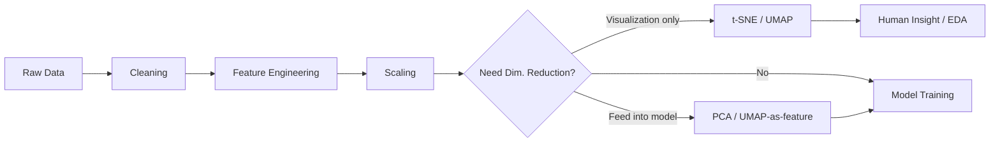
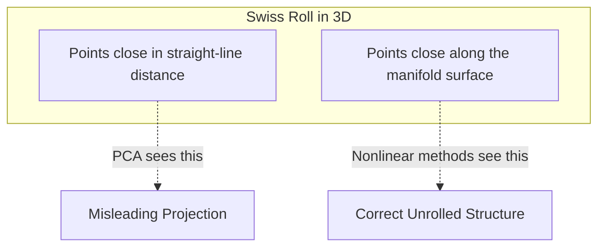
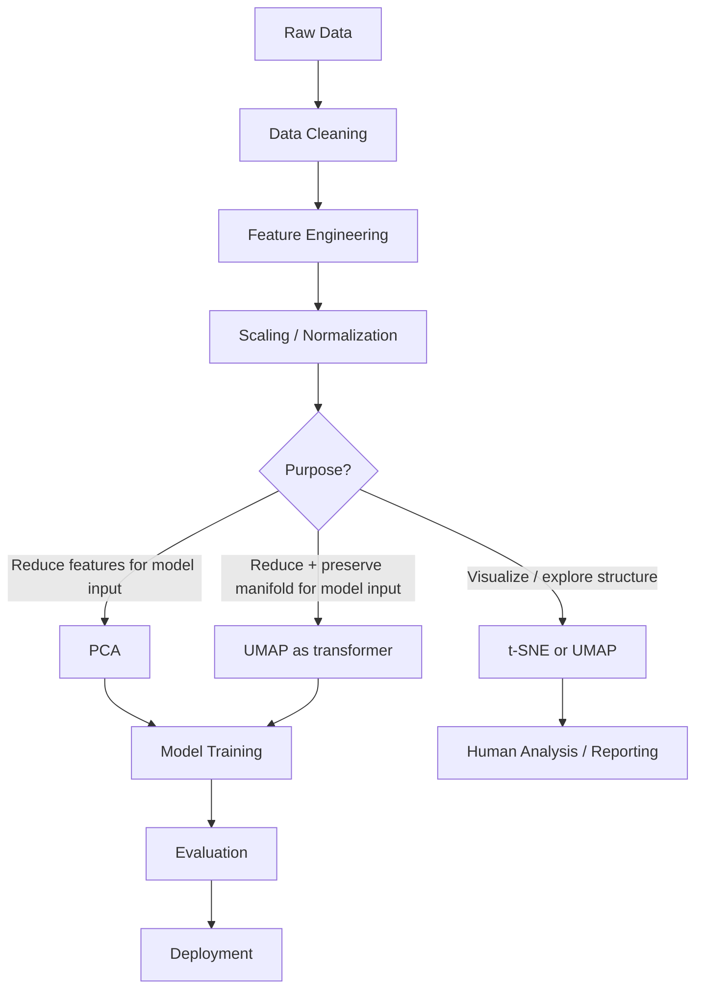
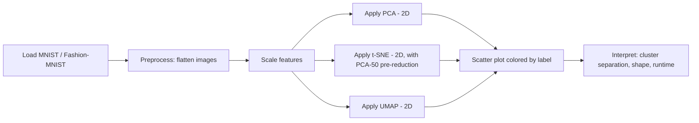
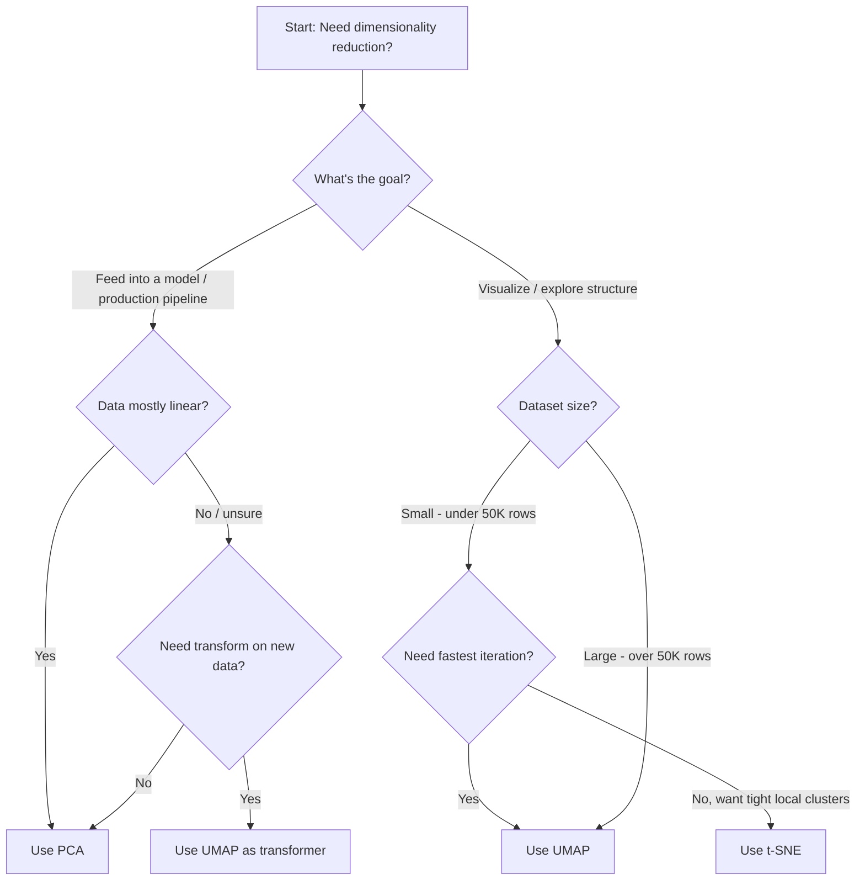

# Advanced Dimensionality Reduction

## 1. Learning Objectives

By the end of this chapter, you should be able to:

- Explain why linear methods like PCA break down on nonlinear data
- Describe the core intuition behind t-SNE and UMAP without needing the math
- Choose the correct dimensionality reduction technique for a given engineering problem
- Understand production trade-offs: speed, memory, determinism, transformability
- Avoid the most common mistakes engineers make when using these tools
- Confidently answer interview questions comparing PCA, t-SNE, and UMAP

---

## 2. Why Another Dimensionality Reduction Chapter?

PCA solves one very specific problem well: finding linear directions of maximum variance. Real-world high-dimensional data (images, text embeddings, user behavior vectors) rarely lies on a flat linear subspace — it lies on a **curved manifold**.

**Limitations of PCA that motivate this chapter:**

| Limitation | Impact |
|---|---|
| Only captures linear relationships | Fails on curved/nonlinear manifolds |
| Global variance-maximizing, not neighborhood-aware | Local structure (clusters, neighborhoods) can be destroyed |
| Components are hard to interpret visually beyond 2–3 | Poor for human-readable visualization of complex data |
| Assumes variance = importance | Low-variance directions can still carry meaningful structure |

**Two very different use cases get confused constantly — separate them clearly:**

| Use Case | Goal | Typical Tool |
|---|---|---|
| **Visualization** | Help a human see structure in 2D/3D | t-SNE, UMAP |
| **Feature Extraction / Preprocessing** | Feed reduced features into a downstream model | PCA (occasionally UMAP) |

This distinction is the single most important idea in this chapter. Most mistakes in production come from mixing the two.

**Where dimensionality reduction sits in the ML workflow:**



---

## 3. PCA Revision (No Math)

You already know the mechanics. Quick recap of engineering judgment only:

**Strengths**

- Fast, deterministic, exact linear algebra — no randomness
- Produces a reusable transform (`fit` once, `transform` on new data forever)
- Great as a general-purpose preprocessing step before models or before t-SNE/UMAP
- Interpretable in terms of variance explained

**Weaknesses**

- Cannot capture nonlinear structure (curved manifolds, clusters wrapped around each other)
- Components often mix multiple real-world concepts together — poor semantic interpretability
- Not designed for visualization of complex clusters (2D PCA plots often look like a blob)

**When PCA is still the correct choice**

- You need to preprocess features before a supervised model
- You need speed and determinism (real-time or large-scale pipelines)
- You need to transform new/unseen data consistently (inference time)
- Your data is approximately linear or you just need denoising/decorrelation

---

## 4. Nonlinear Dimensionality Reduction

**Motivation:** many real datasets lie on a manifold — a lower-dimensional curved surface embedded in high-dimensional space.

**Classic intuitive example — the Swiss Roll:**

Imagine a flat sheet of paper rolled into a spiral. In 3D coordinates, two points can be physically close (straight-line distance) but very far apart *along the surface* (geodesic distance). PCA only looks at straight-line distance — it would incorrectly project two "adjacent" ends of the roll into one blended region.



**Why PCA fails here:** it finds directions of global maximum variance — it has no concept of "follow the curve." Nonlinear methods instead try to preserve **neighborhood relationships** (who is near whom on the manifold), not straight-line distances.

This neighborhood-preservation idea is the shared foundation of both t-SNE and UMAP.

---

## 5. t-SNE Overview

**What it is:** a nonlinear technique that converts high-dimensional distances into probabilities of "being neighbors," then arranges points in 2D/3D so those neighbor probabilities are preserved as closely as possible.

**Core intuition**

- If two points are close in high-dimensional space, t-SNE tries hard to keep them close in the low-dimensional plot.
- It cares much less about preserving distances between far-apart clusters — global layout (cluster sizes, distances between clusters) is **not reliable**.

**Strengths**

- Excellent at revealing tight, well-separated local clusters
- Extremely popular for visualizing embeddings (e.g., MNIST digits, word embeddings)

**Limitations**

- Global structure (relative distances/sizes between clusters) is often meaningless
- No `transform()` for new data — must rerun on the full dataset (see §12)
- Computationally expensive on large datasets
- Results change with hyperparameters and random seed — not deterministic
- **Never used for prediction/preprocessing** — it's a visualization-only tool by design

**Why not use it for prediction:** t-SNE optimizes for a 2D/3D layout that "looks right" to humans, not for preserving distances in a way that's meaningful for a downstream model (like a classifier or clustering algorithm operating on the embedding). Feeding t-SNE output into a model is a well-known anti-pattern.

*(A dedicated t-SNE chapter covers the algorithm's mechanics in depth.)*

---

## 6. UMAP Overview

**What it is:** a nonlinear manifold-learning technique, conceptually similar in spirit to t-SNE (neighborhood preservation) but built on different theoretical foundations, resulting in major practical advantages.

**Core intuition**

- Builds a graph representing which points are neighbors in high-dimensional space
- Optimizes a low-dimensional layout so that graph structure is preserved
- Better at preserving **some** global structure alongside local structure compared to t-SNE

**Why it became popular**

- Significantly faster than t-SNE, scales to millions of points
- Supports transforming new/unseen data (`fit` + `transform`, similar to PCA) — huge advantage for pipelines
- Often produces more meaningful cluster separation and inter-cluster distances
- Works well both for visualization **and** as a general-purpose nonlinear feature reducer

**Limitations**

- Still stochastic (random seed matters) — needs `random_state` for reproducibility
- Hyperparameters (`n_neighbors`, `min_dist`) meaningfully change the output shape
- Like t-SNE, cluster distances should still be interpreted cautiously (better, but not perfect)

*(A dedicated UMAP chapter covers the algorithm's mechanics in depth.)*

---

## 7. Comparison Tables

### PCA vs t-SNE vs UMAP

| Dimension | PCA | t-SNE | UMAP |
|---|---|---|---|
| Primary purpose | Feature reduction / preprocessing | Visualization | Visualization + preprocessing |
| Linear or nonlinear | Linear | Nonlinear | Nonlinear |
| Speed | Very fast | Slow | Fast (much faster than t-SNE) |
| Scalability (large N) | Excellent | Poor | Good |
| Interpretability | High (variance explained) | Low | Low–Medium |
| Preserves local structure | Weak | Strong | Strong |
| Preserves global structure | Strong | Weak | Moderate |
| Transform unseen data | Yes | No (must rerun) | Yes |
| Suitable for preprocessing | Yes | No | Sometimes |
| Suitable for visualization | Limited | Excellent | Excellent |
| Deterministic | Yes | No | No (unless seeded) |
| Memory usage | Low | High | Moderate |
| Production suitability | Excellent | Poor | Good |
| Typical datasets | Tabular, numeric features | Small–medium embeddings | Embeddings, large-scale data |

### Additional Engineering Angle

| Question | PCA | t-SNE | UMAP |
|---|---|---|---|
| Can I cache the model and reuse it in production? | Yes | No | Yes |
| Can I run it on 10M+ rows? | Yes | No | With care |
| Will results be identical every run? | Yes | No | Only with fixed seed |
| Is it safe to feed output into a classifier? | Yes | No | Use caution |
| Does it need feature scaling first? | Yes | Yes | Yes |

---

## 8. Recommendation Table

| Problem | Recommended Algorithm | Reason |
|---|---|---|
| Exploratory Data Analysis (EDA) | UMAP (or t-SNE) | Reveals nonlinear cluster structure visually |
| Customer Segmentation | PCA → clustering, or UMAP for visualization | PCA for stable features; UMAP to visually inspect segments |
| Image Embeddings | UMAP | Scales well, preserves structure of high-dim embeddings |
| Text Embeddings | UMAP | Fast, handles high-dimensional embedding spaces well |
| Visualization for stakeholders | t-SNE or UMAP | Both produce visually compelling cluster plots |
| Production Pipeline (feature reduction) | PCA | Deterministic, fast, supports `transform()` on new data |
| Huge Dataset (millions of rows) | UMAP or PCA | t-SNE does not scale |
| Small Dataset | Any (PCA, t-SNE, UMAP) | All are computationally feasible |
| Feature Engineering before a supervised model | PCA | Deterministic, interpretable, safe for pipelines |
| Clustering prep (e.g., before k-means) | PCA or UMAP | Reduces noise/dimensionality while preserving structure |
| Model Preprocessing (real-time inference) | PCA | Only method with guaranteed fast, consistent transform |

---

## 9. Production ML Workflow



**Where each algorithm fits:**

| Stage | Appropriate Algorithm | Notes |
|---|---|---|
| Pre-modeling feature reduction | PCA | Default choice — stable and production-safe |
| Pre-modeling nonlinear reduction | UMAP | Only if PCA underperforms and nonlinearity is suspected |
| Debugging / sanity-checking embeddings | t-SNE, UMAP | Visual inspection only, never shipped to production |
| Reporting / dashboards | t-SNE, UMAP | For human consumption, not model consumption |

---

## 10. Hyperparameters (High-Level Intuition)

### PCA

| Parameter | Intuition |
|---|---|
| `n_components` | How many dimensions to keep. Choose via explained variance (e.g., 95%) or a fixed number for visualization (2–3). |

### t-SNE

| Parameter | Intuition |
|---|---|
| `perplexity` | Roughly "how many neighbors matter" for each point. Low = focus on very local structure; high = considers a broader neighborhood. Typical range: 5–50. |
| `learning_rate` | Controls step size during optimization. Too low → points collapse into a blob. Too high → points spread out randomly. |
| `max_iter` (formerly `n_iter`) | Number of optimization steps. Too few → unconverged, messy layout. |
| `random_state` | Fixes randomness for reproducibility — critical since t-SNE is stochastic. |

### UMAP

| Parameter | Intuition |
|---|---|
| `n_neighbors` | Controls local vs global balance. Low = focuses on very local structure (tight small clusters); high = considers broader structure (smoother, more global shape). |
| `min_dist` | Controls how tightly points are allowed to pack together. Low = tight clumps; high = more even spread. |
| `metric` | Distance function used to define "closeness" (e.g., `euclidean`, `cosine`) — choose based on data type (cosine is common for embeddings). |

---

## 11. Complexity & Scalability

| Algorithm | Time Complexity (approx.) | Memory Complexity | Scalability | Practical Implication |
|---|---|---|---|---|
| PCA | O(n·d²) or O(d³) depending on method | Low | Excellent — scales to millions of rows | Safe default for large production datasets |
| t-SNE | O(n²) naive, O(n log n) with tree-based approximations (Barnes-Hut) | High | Poor beyond ~10K–50K points without special implementations | Becomes painfully slow / memory-hungry at scale |
| UMAP | Approximately O(n^1.14) empirically (graph-based approximate nearest neighbors) | Moderate | Good — handles millions of points reasonably | Practical choice when t-SNE is too slow |

**Rule of thumb:** if your dataset has more than ~50,000 rows, don't reach for plain t-SNE — use UMAP, or subsample, or run PCA first to shrink dimensionality before t-SNE.

---

## 12. sklearn Implementation

### PCA

| Aspect | Detail |
|---|---|
| Library | `sklearn.decomposition.PCA` |
| Key params | `n_components`, `svd_solver`, `random_state` |
| Typical defaults | `n_components=None` (keeps all), `svd_solver='auto'` |
| Commonly tuned | `n_components` (set via explained variance target) |
| Common mistakes | Forgetting to scale features first; using PCA on sparse categorical data without care |

```python
from sklearn.decomposition import PCA
from sklearn.preprocessing import StandardScaler

X_scaled = StandardScaler().fit_transform(X)

pca = PCA(n_components=0.95, random_state=42)  # keep 95% variance
X_pca = pca.fit_transform(X_scaled)

print(f"Components kept: {pca.n_components_}")
print(f"Explained variance: {pca.explained_variance_ratio_.sum():.2f}")
```

### t-SNE

| Aspect | Detail |
|---|---|
| Library | `sklearn.manifold.TSNE` |
| Key params | `n_components`, `perplexity`, `learning_rate`, `max_iter`, `random_state` |
| Typical defaults | `n_components=2`, `perplexity=30`, `learning_rate='auto'` |
| Commonly tuned | `perplexity` (try multiple values: 5, 30, 50), `random_state` |
| Common mistakes | Running on unscaled raw high-dim data; using it for anything beyond 2D/3D visualization; feeding output to a model; comparing cluster *distances* directly |

```python
from sklearn.manifold import TSNE

# Best practice: reduce dimensionality with PCA first if features > ~50
X_reduced = PCA(n_components=50, random_state=42).fit_transform(X_scaled)

tsne = TSNE(
    n_components=2,
    perplexity=30,      # try 5–50 depending on dataset size
    learning_rate="auto",
    random_state=42
)
X_tsne = tsne.fit_transform(X_reduced)
```

### UMAP

| Aspect | Detail |
|---|---|
| Library | `umap-learn` (`import umap`) |
| Key params | `n_neighbors`, `min_dist`, `n_components`, `metric`, `random_state` |
| Typical defaults | `n_neighbors=15`, `min_dist=0.1`, `metric='euclidean'` |
| Commonly tuned | `n_neighbors` (local vs global balance), `min_dist` (cluster tightness) |
| Common mistakes | Forgetting `random_state` (irreproducible results); assuming inter-cluster distances are always meaningful; not scaling features first |

```python
import umap

reducer = umap.UMAP(
    n_neighbors=15,
    min_dist=0.1,
    n_components=2,
    metric="euclidean",
    random_state=42
)
X_umap = reducer.fit_transform(X_scaled)

# UMAP supports transforming new/unseen data — unlike t-SNE
X_new_umap = reducer.transform(X_new_scaled)
```

---

## 13. Practical Notebook (Description Only)

**Goal:** compare PCA, t-SNE, and UMAP visually on MNIST and Fashion-MNIST.

**Workflow:**



**What to observe when you run this yourself:**

- PCA plot: digits/classes overlap heavily — linear separation is weak
- t-SNE plot: tight, well-separated clusters per class, but relative cluster positions/sizes are not meaningful
- UMAP plot: similarly well-separated clusters, computed much faster, and cluster layout tends to be more stable across runs
- Runtime comparison: PCA finishes instantly, t-SNE takes noticeably longer, UMAP sits in between (closer to PCA at scale)

This exercise builds the intuition table in §7 from firsthand observation rather than just memorization.

---

## 14. Rules of Thumb

1. PCA is the default preprocessing method for production pipelines.
2. Never train a downstream model on t-SNE or UMAP visualization output without strong justification.
3. t-SNE is for visualization only — never for prediction or feature engineering.
4. UMAP is generally preferred over t-SNE for large datasets due to speed.
5. Always scale features before applying PCA, t-SNE, or UMAP.
6. Use PCA to pre-reduce extremely high-dimensional data before running t-SNE.
7. Always set `random_state` for t-SNE and UMAP to ensure reproducibility.
8. Don't trust distances between clusters in a t-SNE plot — only trust local neighborhoods.
9. UMAP preserves more global structure than t-SNE, but still not perfectly.
10. PCA is deterministic; t-SNE and UMAP are stochastic — expect run-to-run variation.
11. If you need to transform new/unseen data at inference time, use PCA or UMAP — never t-SNE.
12. Perplexity in t-SNE should scale roughly with dataset size — small datasets need smaller perplexity.
13. Try multiple perplexity/`n_neighbors` values — a single run can be misleading.
14. High explained variance in PCA does not guarantee good downstream model performance.
15. Dimensionality reduction is not always necessary — don't apply it reflexively.
16. Visualization plots are hypotheses, not conclusions — validate with metrics, not eyeballing.
17. UMAP's `n_neighbors` and `min_dist` dramatically change plot appearance — tune before concluding anything.
18. For clustering pipelines, PCA (or UMAP) before k-means often improves results by reducing noise.
19. Sparse, high-cardinality categorical data usually needs encoding before any of these methods.
20. Document the algorithm, parameters, and random seed used for any visualization shared with stakeholders.
21. Re-running t-SNE/UMAP with a different seed can produce a visually different (but not necessarily wrong) plot.
22. For image/text embeddings from deep models, UMAP is the modern default for exploratory visualization.

---

## 15. Common Mistakes

| Mistake | Why It's a Problem |
|---|---|
| Using t-SNE output as features for a classifier | t-SNE optimizes for visual layout, not distance preservation useful to models — leads to poor, unstable performance |
| Over-interpreting cluster distances in t-SNE plots | Global distances are not reliable — two "far apart" clusters may not actually be dissimilar |
| Ignoring randomness across runs | Without `random_state`, you can draw different conclusions from the same data on different runs |
| Choosing perplexity/`n_neighbors` blindly (always default) | Wrong neighborhood size can hide or fabricate cluster structure |
| Treating a visualization as statistical proof of clusters | A visually convincing plot is not a substitute for cluster validation metrics (e.g., silhouette score) |
| Assuming UMAP always beats t-SNE | UMAP is usually faster and more scalable, but t-SNE can still produce excellent local structure for smaller datasets |
| Skipping feature scaling | All three methods are distance-based (or variance-based) — unscaled features distort results |
| Running t-SNE directly on very high-dimensional raw data | Extremely slow and noisy — always pre-reduce with PCA first |
| Not fixing random seed before sharing results with a team | Leads to "I can't reproduce your plot" confusion |

---

## 16. Real-World Applications

| Domain | Application | Typical Approach |
|---|---|---|
| Recommendation Systems | Visualizing user/item embedding clusters for sanity checks | UMAP |
| Healthcare | Reducing high-dimensional genomic/clinical features before modeling | PCA for modeling, UMAP/t-SNE for exploratory patient clustering |
| Fraud Detection | Reducing noisy transaction features before anomaly detection models | PCA |
| Image Search | Visualizing embedding space of image encoders to debug quality | UMAP or t-SNE |
| NLP Embeddings | Visualizing word/sentence embedding neighborhoods | UMAP |
| Customer Analytics | Segmenting customers, then visualizing segments | PCA (features) + UMAP/t-SNE (visualization) |
| Anomaly Detection | Reducing dimensionality before distance-based anomaly scoring | PCA (safe, deterministic) |

---

## 17. Interview Questions

1. Why does PCA fail on data that lies on a nonlinear manifold?
2. What is the fundamental difference in objective between PCA and t-SNE?
3. Why is t-SNE unsuitable as a preprocessing step for a classifier?
4. Explain what "perplexity" intuitively controls in t-SNE.
5. Why can't t-SNE transform new, unseen data the way PCA can?
6. How does UMAP address some of t-SNE's scalability limitations?
7. What does `n_neighbors` control in UMAP, and how does it affect the output?
8. Why is it risky to compare distances between clusters in a t-SNE plot?
9. When would you choose PCA over UMAP for a production system?
10. When would you choose UMAP over PCA for a production system?
11. Why should you scale features before running PCA, t-SNE, or UMAP?
12. What is the practical benefit of running PCA before t-SNE on high-dimensional data?
13. Why are t-SNE and UMAP considered stochastic algorithms, and what's the engineering implication?
14. Describe a real scenario where a t-SNE plot led to a wrong conclusion about data clusters.
15. How would you validate that clusters seen in a UMAP plot are statistically meaningful?
16. What happens if you set `perplexity` much larger than the number of data points?
17. Compare the memory and time complexity trade-offs of t-SNE vs UMAP at scale.
18. Why is `min_dist` in UMAP important, and what does changing it do to the visualization?
19. If you had 5 million rows of embedding data, which reduction technique would you choose and why?
20. Explain why "UMAP always outperforms t-SNE" is a myth.

---

## 18. Myth vs Reality

| Myth | Reality |
|---|---|
| PCA always improves model accuracy | PCA reduces dimensionality/noise, but can also discard useful variance — accuracy impact is dataset-dependent |
| t-SNE is a preprocessing algorithm | t-SNE is a visualization tool only; it lacks a proper `transform()` for new data and isn't optimized for distance fidelity useful to models |
| UMAP always replaces PCA | UMAP is nonlinear and stochastic; PCA remains preferred for deterministic, fast, production-safe linear reduction |
| More dimensions always mean better performance | Extra dimensions can add noise, increase overfitting risk, and slow down training ("curse of dimensionality") |
| Cluster distances in t-SNE/UMAP plots reflect true similarity | Only *local* neighborhoods are reliably preserved — global distances can be misleading, especially in t-SNE |
| UMAP results are fully deterministic | UMAP is stochastic; results vary run-to-run unless `random_state` is fixed |
| A nice-looking 2D plot proves the clusters are "real" | Visual separation must be validated with quantitative metrics (silhouette score, downstream task performance) |

---

## 19. Decision Guide



**Quick scenario map:**

| Scenario | Choice |
|---|---|
| Real-time inference pipeline | PCA |
| One-off EDA notebook, small dataset | t-SNE or UMAP |
| Millions of embeddings to visualize | UMAP |
| Need reusable transform for streaming data | PCA or UMAP |
| Need the most classic, well-understood tool | PCA |

---

## 20. Chapter Summary

- PCA is linear, fast, deterministic, and production-safe — the default choice for feature reduction.
- t-SNE and UMAP are nonlinear, designed to preserve local neighborhood structure — primarily for visualization.
- t-SNE is powerful for local cluster visualization but slow, non-scalable, and cannot transform new data.
- UMAP is faster, more scalable, supports `transform()` on new data, and preserves more global structure than t-SNE.
- Never use t-SNE for preprocessing or feeding into downstream models.
- UMAP can sometimes be used for preprocessing, but PCA remains the safer production default.
- Always scale data first, always set `random_state`, and always validate visual clusters with metrics — not eyeballing alone.
- Choice of algorithm depends on the goal (visualization vs preprocessing), dataset size, and need for reproducibility/transformability.

---

## 21. Interview Cheat Sheet

| If asked... | Say this |
|---|---|
| "PCA vs t-SNE?" | PCA is linear and preserves global variance; t-SNE is nonlinear and preserves local neighborhoods — used for visualization, not modeling. |
| "Why not use t-SNE in production?" | No `transform()` for new data, stochastic, slow, and not designed to preserve distances meaningfully for models. |
| "Why is UMAP popular?" | Faster than t-SNE, scales better, supports transforming new data, and preserves more global structure. |
| "How do you choose `n_components` for PCA?" | Target a cumulative explained variance threshold (e.g., 95%) or use domain-specific fixed size (e.g., 2 for visualization). |
| "Can UMAP replace PCA?" | Sometimes for nonlinear feature reduction, but PCA remains preferred for determinism and production reliability. |
| "What's the biggest pitfall with t-SNE?" | Over-interpreting cluster distances/sizes — only local neighborhoods are reliable. |

---

## 22. Quick Revision

**Core idea:** PCA = linear, global, deterministic, production-friendly. t-SNE = nonlinear, local-structure visualization only, slow, non-deterministic, no transform. UMAP = nonlinear, local + some global structure, fast, scalable, supports transform.

**Default choices:**
- Preprocessing for a model → **PCA**
- Visualizing complex structure → **UMAP** (or t-SNE for small datasets)
- Huge datasets → **UMAP**, never plain t-SNE
- Need reproducible pipeline with new-data support → **PCA** or **UMAP**

**Golden rules:**
- Always scale before reducing.
- Always fix `random_state` for t-SNE/UMAP.
- Never train models on t-SNE embeddings.
- Never trust inter-cluster distances in t-SNE plots.
- Validate visual clusters with real metrics, not intuition alone.

**One-line comparison to remember:**
> PCA finds the best flat mirror. t-SNE and UMAP try to unroll the manifold — t-SNE for a beautiful local picture, UMAP for a faster, more global-aware, production-friendly picture.