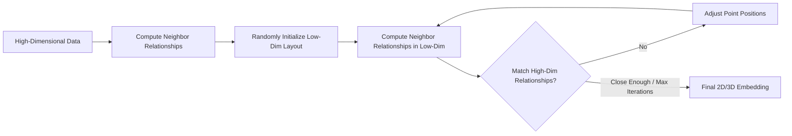
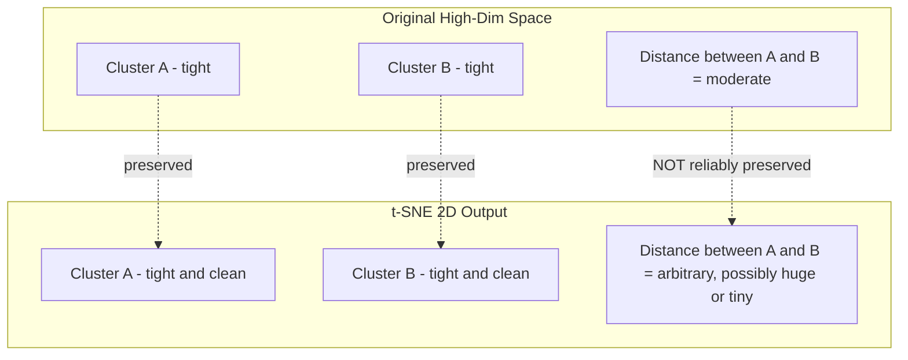
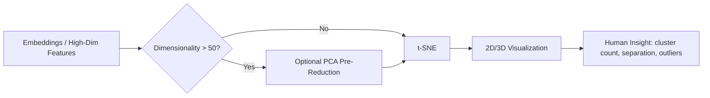
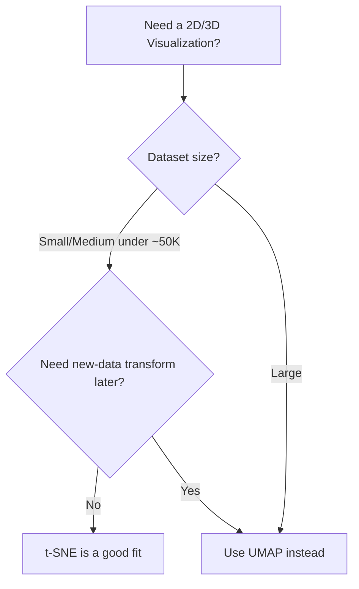

# t-SNE

## 1. Learning Objectives

By the end of this chapter, you should be able to:

- Explain what problem t-SNE was specifically designed to solve
- Describe how t-SNE preserves local neighborhoods without needing the underlying math
- Tune `perplexity`, `learning_rate`, and `max_iter` with correct intuition
- Recognize why t-SNE plots are excellent for exploration but dangerous to over-interpret
- Confidently answer t-SNE-specific interview questions beyond the general PCA/t-SNE/UMAP comparison

---

## 2. Why t-SNE Was Created

Earlier nonlinear reduction attempts (like classic manifold learning methods) were good at unrolling clean, smooth manifolds (e.g., Swiss Roll) but struggled badly on real-world high-dimensional data — especially data with many distinct clusters, like image or word embeddings.

**The specific gap t-SNE filled:**

| Problem with earlier methods | What t-SNE fixed |
|---|---|
| Struggled to separate multiple distinct clusters clearly in 2D | Explicitly optimizes to keep same-neighborhood points close and different-neighborhood points apart |
| "Crowding problem" — high-dimensional neighborhoods don't fit proportionally into 2D space | Uses a heavier-tailed distribution in low-dimensional space to give distant points room to spread out |
| Produced visually muddled, overlapping plots for complex data | Produces crisp, well-separated visual clusters, which is why it became the go-to visualization tool |

t-SNE's entire design goal is **one thing**: make a 2D/3D picture where points that were neighbors in high-dimensional space remain neighbors in the picture — as faithfully as a flat plot allows.

---

## 3. Core Intuition

Think of t-SNE as a **social seating arrangement problem**.

- In the original high-dimensional space, you know which people are close friends (similar data points) and which are strangers (dissimilar).
- t-SNE's job: seat everyone at a single big table (2D/3D space) such that close friends end up sitting near each other.
- It does **not** care about accurately preserving how far apart two friend groups are from each other — it only cares that within each friend group, the seating feels right.

**Analogy: unfolding a crumpled paper ball.**

- High-dimensional data is like a crumpled ball of paper where nearby regions of the sheet touch each other in unexpected ways.
- t-SNE tries to flatten it out on a table so that regions that were truly touching on the original sheet remain touching — but it doesn't guarantee the overall shape of the paper is preserved (corners might end up in strange relative places).

**Key intuition to remember:** t-SNE optimizes **local neighborhood fidelity**, sacrificing **global geometric accuracy** to do so.

---

## 4. High-Level Working (No Math)

Three conceptual steps:

**Step 1 — Measure neighborhood relationships in high-dimensional space**
For every point, t-SNE figures out "who are my close neighbors and how close are they" — converting distances into a notion of neighbor relationships (probabilities of being neighbors, not just raw distance).

**Step 2 — Define neighborhood relationships in low-dimensional space**
It does the same thing in the 2D/3D layout being built — but uses a distribution that's more forgiving of larger distances (this is the fix for the crowding problem mentioned in §2).

**Step 3 — Optimize the layout**
t-SNE nudges points around in the low-dimensional space, iteration by iteration, trying to make the low-dimensional neighborhood relationships match the high-dimensional ones as closely as possible. This is an iterative optimization — similar in spirit to gradient descent — that gradually pulls true neighbors together and pushes non-neighbors apart.



No distance formulas, no KL-divergence math needed to use this intuition productively in engineering conversations — but know that "matching neighbor relationships" is literally what the optimization is minimizing.

---

## 5. Local vs Global Structure



**What this means in practice:**

| Structure Type | Preserved by t-SNE? | Engineering Implication |
|---|---|---|
| Which points belong to the same cluster | Yes, reliably | Safe to trust cluster membership |
| Shape/tightness of a single cluster | Mostly yes | Reasonably safe to interpret cluster density |
| Distance between two different clusters | No | Never conclude "Cluster A is more similar to B than C" from plot distances |
| Relative size of clusters | No | A cluster looking "bigger" in the plot doesn't mean it has more real variance |

---

## 6. Hyperparameters

### `perplexity`

- **What it controls:** roughly, the effective number of neighbors considered for each point when building the neighborhood relationships.
- **Increase it:** the algorithm considers a broader neighborhood — better for capturing more global relationships, but can blur fine local clusters.
- **Decrease it:** focuses on very tight, local relationships — can fragment natural clusters into noisy sub-clusters.
- **Common values:** 5–50; **30** is the most common default/starting point.
- **Common mistake:** using one perplexity value and treating the resulting plot as ground truth. Always try at least 2–3 values (e.g., 5, 30, 50) before drawing conclusions.
- **Rule of thumb:** perplexity should be smaller than the number of points per cluster; for very small datasets (<100 points), use a small perplexity (5–10).

### `learning_rate`

- **What it controls:** the step size used while nudging points during optimization.
- **Too low:** points barely move — you get a dense, collapsed blob with no visible structure.
- **Too high:** points fly around erratically — you get a sparse, random-looking scatter with no meaningful clusters.
- **Common values:** 10–1000; sklearn's `"auto"` setting (scales with dataset size) is a safe modern default.
- **Common mistake:** manually setting a fixed learning rate copied from a tutorial without adjusting for dataset size — `"auto"` avoids this entirely in modern sklearn.

### `max_iter` (formerly `n_iter`)

- **What it controls:** how many optimization steps are run before stopping.
- **Too few:** the layout hasn't converged — clusters look messy or half-formed.
- **Too many:** diminishing returns, wasted compute time (though rarely harmful to quality).
- **Common values:** 1000 is a typical default; increase to 2000–5000 for stubborn/large datasets if plots look unconverged.
- **Common mistake:** assuming a bad-looking plot means "wrong algorithm" when it's actually just under-converged.

### `random_state`

- **What it controls:** the random seed used for initialization and stochastic optimization steps.
- **Effect:** without fixing it, every run produces a visually different (though not necessarily contradictory) layout.
- **Common mistake:** presenting a t-SNE plot to stakeholders without recording the seed — making the result impossible to reproduce later.
- **Rule:** always set `random_state` explicitly for any plot you intend to save, share, or write about.

### Initialization (`init`)

- **What it controls:** how the low-dimensional layout starts before optimization begins (e.g., random vs PCA-based).
- **Random initialization:** classic default, but more prone to poor local optima and run-to-run variability.
- **PCA-based initialization (`init="pca"`):** starts from a sensible linear layout, generally leading to more stable, faster-converging, and more globally-sensible results.
- **Modern best practice:** prefer `init="pca"` — it's now the recommended default in sklearn and most modern tutorials.

**Hyperparameter summary table:**

| Hyperparameter | Controls | Increase Effect | Decrease Effect | Typical Value |
|---|---|---|---|---|
| `perplexity` | Effective neighborhood size | Smoother, more global-ish | Finer, more local, noisier | 5–50 (default 30) |
| `learning_rate` | Optimization step size | Risk of erratic scatter | Risk of collapsed blob | `"auto"` |
| `max_iter` | Optimization steps | Better convergence, slower | Risk of unconverged plot | 1000+ |
| `random_state` | Reproducibility | N/A | N/A | Any fixed int |
| `init` | Starting layout | `"pca"` = more stable | `"random"` = more variable | `"pca"` |

---

## 7. Complexity

| Aspect | Complexity | Practical Implication |
|---|---|---|
| Time complexity (naive) | O(n²) | Becomes very slow beyond ~10,000 points |
| Time complexity (Barnes-Hut approximation, sklearn default for larger n) | O(n log n) | Usable up to ~50,000–100,000 points with patience |
| Memory complexity | O(n²) naive / lower with tree-based approximations | Pairwise distance storage can exhaust memory on large datasets |
| Scalability | Poor relative to UMAP | Not suitable as a default for large-scale production-adjacent workflows |

**Practical implications:**

- For datasets over ~10K–50K rows, always pre-reduce dimensionality with PCA (e.g., to 30–50 components) before running t-SNE — this shrinks both computation and noise.
- For datasets in the hundreds of thousands to millions, prefer UMAP outright rather than fighting t-SNE's scalability limits.
- t-SNE runtime does not parallelize as gracefully as many other ML algorithms — expect single-run wait times to dominate your iteration speed during EDA.

---

## 8. sklearn Implementation

| Aspect | Detail |
|---|---|
| Library | `sklearn.manifold.TSNE` |
| Key parameters | `n_components`, `perplexity`, `learning_rate`, `max_iter`, `init`, `random_state`, `metric` |
| Typical defaults (modern sklearn) | `n_components=2`, `perplexity=30`, `learning_rate="auto"`, `init="pca"` |
| Commonly tuned | `perplexity`, `random_state`, occasionally `metric` (e.g., `"cosine"` for text embeddings) |
| Common mistakes | Not scaling input features; skipping PCA pre-reduction on high-dim data; not fixing `random_state`; using `init="random"` unnecessarily |

```python
from sklearn.decomposition import PCA
from sklearn.manifold import TSNE
from sklearn.preprocessing import StandardScaler

# Step 1: Scale features
X_scaled = StandardScaler().fit_transform(X)

# Step 2: Pre-reduce dimensionality if features are high-dimensional
if X_scaled.shape[1] > 50:
    X_scaled = PCA(n_components=50, random_state=42).fit_transform(X_scaled)

# Step 3: Apply t-SNE
tsne = TSNE(
    n_components=2,
    perplexity=30,          # try 5, 30, 50 and compare
    learning_rate="auto",
    init="pca",             # more stable than random init
    max_iter=1000,
    random_state=42
)
X_tsne = tsne.fit_transform(X_scaled)
```

**Best practices checklist:**

- Always scale input features first.
- Pre-reduce with PCA if original dimensionality is large (>50 features).
- Use `init="pca"` over `"random"` for stability.
- Fix `random_state` for any result you plan to reuse or share.
- Run with 2–3 different `perplexity` values before drawing conclusions.
- Never call `.transform()` expecting new-data support — it doesn't exist; you must re-fit on the combined dataset.

---

## 9. Practical Workflow



**How ML engineers actually use this in practice:**

1. Generate embeddings from a model (e.g., sentence embeddings, CNN feature vectors, autoencoder latent space).
2. If embeddings are high-dimensional (hundreds+), apply PCA first to cut noise and speed things up.
3. Run t-SNE with a couple of `perplexity` values to get a 2D plot.
4. Visually inspect: How many clusters appear? Are known categories (e.g., labels) separating cleanly? Are there unexpected outliers or overlaps?
5. Use these visual insights to guide further investigation — e.g., "these two classes overlap heavily in embedding space, maybe the model confuses them" — but always validate with quantitative metrics before making decisions.

---

## 10. Common Mistakes

| Mistake | Consequence |
|---|---|
| Using t-SNE output as input features for a model | Poor, unstable model performance — t-SNE isn't designed to preserve distances usefully for prediction |
| Interpreting distances between clusters | Leads to false conclusions about relationships between groups |
| Running t-SNE once and trusting it | Stochastic algorithm — a single run can mislead; always sanity-check with multiple seeds/perplexities |
| Skipping PCA pre-reduction on very high-dimensional data | Extremely slow runtime, noisier results |
| Not scaling features first | Distorted neighborhood relationships due to feature magnitude dominance |
| Assuming cluster size in the plot reflects real-world group size | Cluster visual size is an artifact of the optimization, not a meaningful density measure |
| Comparing two t-SNE plots from different runs/seeds as if directly comparable | Layouts are not aligned across runs — apparent differences may just be randomness |

---

## 11. Rules of Thumb

1. t-SNE is for visualization only — never for feature engineering or model input.
2. Always scale your features before running t-SNE.
3. Pre-reduce with PCA if you have more than ~50 original features.
4. Try at least 2–3 perplexity values before trusting a plot.
5. Perplexity should generally be smaller than the number of points in your smallest expected cluster.
6. Always fix `random_state` for reproducible, shareable results.
7. Prefer `init="pca"` over `init="random"` for more stable results.
8. Use `learning_rate="auto"` unless you have a specific reason not to.
9. Never trust distances between clusters in a t-SNE plot.
10. Never trust the relative sizes of clusters in a t-SNE plot.
11. If your plot looks like an undifferentiated blob, suspect learning rate too low or iterations too few, not "there's no structure."
12. If your plot looks like random scattered noise, suspect learning rate too high.
13. Avoid t-SNE for datasets larger than ~50K rows without subsampling or switching to UMAP.
14. Treat a t-SNE plot as a hypothesis-generating tool, not a conclusion.
15. Always validate visually-observed clusters with quantitative methods (e.g., silhouette score, downstream task accuracy).
16. Document perplexity, learning rate, iterations, and seed alongside any shared t-SNE plot.
17. For text/embedding data, consider `metric="cosine"` instead of the default Euclidean distance.
18. Re-running t-SNE with a different seed is a good sanity check — stable structure should roughly persist.
19. Don't use t-SNE as a substitute for proper clustering — it's a visualization aid, not a clustering algorithm.

---

## 12. Real-World Applications

| Domain | Use Case |
|---|---|
| NLP Embeddings | Visualizing word/sentence embedding neighborhoods to sanity-check whether semantically similar terms cluster together |
| Image Embeddings | Visualizing CNN/vision-transformer feature spaces to inspect class separability before finalizing a model |
| Recommendation Systems | Exploring user/item embedding spaces to spot unexpected groupings or anomalies |
| Bioinformatics | Visualizing single-cell gene expression data (a classic, extremely popular t-SNE use case) to identify cell-type clusters |
| Model Debugging | Inspecting the penultimate layer activations of a neural network to see if the model has learned meaningful class separation |

---

## 13. Interview Questions

1. What specific problem does t-SNE solve that earlier manifold learning methods struggled with?
2. Why does t-SNE preserve local structure well but not global structure?
3. What does the "crowding problem" refer to, and how does t-SNE address it conceptually?
4. Explain the intuitive role of `perplexity` in plain English.
5. What happens if perplexity is set too low or too high?
6. Why is `learning_rate` important, and what do collapsed vs scattered plots each suggest?
7. Why doesn't t-SNE support transforming new/unseen data?
8. Why should you avoid feeding t-SNE output into a downstream ML model?
9. What role does `random_state` play, and why does it matter for reproducibility?
10. Why is PCA often applied before t-SNE on high-dimensional data?
11. What's the practical difference between `init="random"` and `init="pca"`?
12. How does t-SNE's time complexity affect its use on large datasets?
13. Why can two different t-SNE runs on the same data produce visually different plots?
14. If a t-SNE plot shows two clusters far apart, can you conclude they are very dissimilar? Why or why not?
15. How would you validate whether clusters seen in a t-SNE plot are meaningful?
16. Describe a scenario where t-SNE would mislead an engineer making a business decision.
17. Why is t-SNE popular in bioinformatics specifically (e.g., single-cell analysis)?
18. What's the effect of running too few optimization iterations?
19. How would you scale t-SNE usage for a dataset with 200,000 rows?
20. Compare when you would choose t-SNE vs UMAP for a given visualization task.

---

## 14. Myth vs Reality

| Myth | Reality |
|---|---|
| t-SNE clusters always reflect true underlying data groups | Clusters can also form from noise, hyperparameter choices, or optimization artifacts — always validate |
| A single t-SNE run is enough to draw conclusions | Being stochastic, results should be checked across multiple seeds/perplexities |
| t-SNE preserves overall data geometry | It only reliably preserves local neighborhoods, not global shape or distances |
| t-SNE can be used to reduce features for a model | It has no `transform()` method and isn't optimized for that purpose — visualization only |
| Bigger clusters in the plot mean more data/more importance | Cluster size in a t-SNE plot is a visual artifact, not a measure of real-world size or variance |
| t-SNE with default settings always works well | Default `perplexity`/`learning_rate` can produce misleading plots on datasets very different in size or density from typical benchmarks |

---

## 15. Decision Guide

**When to choose t-SNE:**

- You need a visualization for EDA or a report, and the dataset is small-to-medium (under ~10K–50K rows).
- You specifically want tight, well-separated local clusters for visual clarity (e.g., presenting distinct categories to stakeholders).
- You're working in a domain with established t-SNE conventions (e.g., single-cell bioinformatics).
- Compute time is not a major constraint (offline analysis, not a real-time pipeline).

**When to avoid t-SNE:**

- Dataset is large (100K+ rows) — use UMAP instead.
- You need to transform new, unseen data — use PCA or UMAP instead.
- You plan to feed the output into a downstream model — never do this with t-SNE.
- You need highly reproducible, deterministic results without careful seed management — consider UMAP or PCA.
- You need to compare relative distances or sizes between clusters meaningfully — t-SNE cannot guarantee this.



---

## 16. Chapter Summary

- t-SNE was built to fix the crowding problem and produce crisp, well-separated visual clusters that earlier manifold methods couldn't achieve.
- It works by preserving local neighborhood relationships between high-dimensional and low-dimensional space through iterative optimization.
- Local structure (who's near whom) is reliable; global structure (distances/sizes between clusters) is not.
- Key hyperparameters: `perplexity` (neighborhood size), `learning_rate` (step size), `max_iter` (convergence), `random_state` (reproducibility), `init` (stability).
- t-SNE does not scale well (O(n²) naive) and has no `transform()` for new data — visualization only, never preprocessing.
- Always scale data, pre-reduce with PCA on high-dimensional inputs, and test multiple perplexity values before trusting a plot.
- Widely used in NLP, computer vision, recommendation systems, and especially bioinformatics for exploratory visualization.

---

## 17. Interview Cheat Sheet

| If asked... | Say this |
|---|---|
| "What is t-SNE in one sentence?" | A nonlinear technique that arranges high-dimensional points in 2D/3D so that points close in the original space stay close in the visualization. |
| "Why can't you use t-SNE for preprocessing?" | It has no `transform()` for new data, is stochastic, and optimizes for visual layout rather than distance fidelity useful to models. |
| "What does perplexity control?" | Roughly, how many neighbors are considered when defining local structure for each point. |
| "Why do t-SNE plots vary between runs?" | It's a stochastic optimization — random initialization and steps mean different runs converge to different (not necessarily wrong) layouts. |
| "Biggest pitfall of t-SNE?" | Over-interpreting distances or sizes between clusters — only local neighborhoods are trustworthy. |
| "How do you make t-SNE scale better?" | Pre-reduce dimensionality with PCA, use Barnes-Hut approximation (sklearn default for larger n), or switch to UMAP for very large datasets. |

---

## 18. Quick Revision

**What it is:** nonlinear technique that preserves local neighborhoods for 2D/3D visualization.

**What it's NOT:** a preprocessing tool, a clustering algorithm, or something that preserves global structure.

**Core hyperparameters:**
- `perplexity` — effective neighborhood size (try 5, 30, 50)
- `learning_rate` — use `"auto"`
- `max_iter` — 1000+ for convergence
- `random_state` — always fix it
- `init="pca"` — more stable than random

**Golden rules:**
- Scale features first.
- PCA pre-reduce if features > 50.
- Never feed t-SNE output into a model.
- Never trust inter-cluster distances or relative sizes.
- Always test multiple perplexities/seeds before concluding anything.
- Doesn't scale — switch to UMAP beyond ~50K rows.

**One-line memory hook:**
> t-SNE draws a beautiful local picture of your data's neighborhoods — but the overall map's scale and layout between neighborhoods can't be trusted.