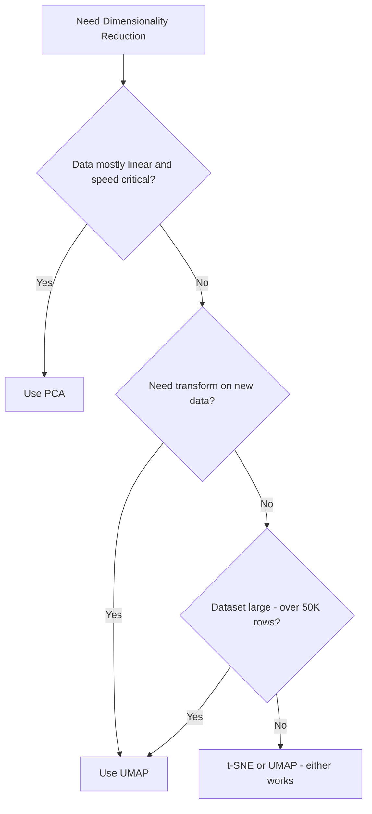

# UMAP

## 1. Learning Objectives

By the end of this chapter, you should be able to:

- Explain what problem UMAP was built to solve, beyond "a faster t-SNE"
- Describe UMAP's neighborhood-graph intuition without needing topology math
- Tune `n_neighbors`, `min_dist`, and `metric` with correct engineering intuition
- Justify when UMAP is production-safe (and when it isn't)
- Confidently compare UMAP against PCA and t-SNE in interviews and system design discussions

---

## 2. Why UMAP Was Developed

t-SNE proved that preserving local neighborhoods produces excellent visualizations — but it came with real engineering costs: poor scalability, no `transform()` for new data, and non-trivial global structure distortion.

**The specific gaps UMAP set out to close:**

| Limitation in t-SNE | What UMAP improved |
|---|---|
| O(n²)-ish scaling, painfully slow beyond tens of thousands of points | Graph-based approximate nearest-neighbor search scales to millions of points |
| No way to embed new/unseen data | Learns a reusable mapping — supports `fit()` + `transform()` like PCA |
| Weak global structure preservation | Better (not perfect) preservation of relative cluster placement and density |
| Visualization-only design | Flexible enough to be used as a general-purpose nonlinear dimensionality reducer, not just a plotting tool |

UMAP's underlying theory comes from manifold learning and topology, but you don't need any of that math to use it well — the engineering-relevant idea is simple: **build a graph of who's connected to whom in high-dimensional space, then find a low-dimensional layout that preserves that graph as faithfully as possible.**

---

## 3. Core Intuition

**Analogy: a social network graph, not just a seating chart.**

Where t-SNE thinks in terms of "how similar is every pair of points," UMAP thinks in terms of **a connectivity graph**:

- Each point connects to its nearest neighbors, forming a web of local connections (like a social graph — you're directly connected to close friends, indirectly connected to friends-of-friends).
- UMAP then tries to lay this entire graph out in 2D/3D space such that connected points stay close, while still respecting the broader graph structure (friend-of-friend chains help preserve some sense of the "shape" of the whole network).

**Manifold intuition (kept simple):**

- UMAP assumes your high-dimensional data actually lives on a lower-dimensional curved surface (a manifold) embedded in high-dimensional space — same assumption as t-SNE.
- Instead of only measuring pairwise closeness, UMAP tries to estimate the manifold's local shape at each point, then stitches these local pieces together into a consistent global layout.
- The practical benefit: because UMAP reasons about a **connected graph** rather than isolated pairwise comparisons, it naturally retains more of the "big picture" — how clusters relate to each other, not just what's inside each cluster.


---

## 4. High-Level Working

Three conceptual stages — no math required:

**Stage 1 — Build a neighborhood graph**
For every point, UMAP finds its nearest neighbors (using efficient approximate search, not brute-force) and connects them with weighted edges — stronger edges for closer points, weaker for more distant ones.

**Stage 2 — Construct a fuzzy global structure**
These local neighbor graphs are merged into one connected graph representing the entire dataset's structure — this step is what allows UMAP to retain a sense of global shape, since far-apart clusters are still connected through chains of intermediate points.

**Stage 3 — Optimize a low-dimensional layout**
Similar in spirit to t-SNE's optimization step: UMAP starts with an initial low-dimensional layout and iteratively adjusts it so that the graph structure (who's connected to whom, and how strongly) is preserved as closely as possible in the final 2D/3D space.

**Key engineering distinction from t-SNE:** because the graph-building and layout-optimization steps are decoupled and reuse well-understood approximate nearest-neighbor techniques, UMAP can learn a **reusable transformation** — the same reason PCA supports `transform()` on new data.

---

## 5. Why UMAP Is Replacing t-SNE

| Factor | t-SNE | UMAP | Practical Impact |
|---|---|---|---|
| Speed | Slow (especially beyond ~10K points) | Significantly faster | UMAP enables fast iteration during EDA |
| Scalability | Poor beyond tens of thousands of rows | Good — handles millions of rows | UMAP is viable for large-scale embedding visualization |
| `transform()` on new data | Not supported | Supported | UMAP can be embedded in real production pipelines |
| Global structure preservation | Weak | Moderate | UMAP plots are somewhat safer to interpret at the cluster-relationship level |
| Use as a preprocessing step | Not appropriate | Sometimes appropriate | UMAP can be used as a genuine feature reducer, not just a plotting tool |

**Important caveat:** "replacing" doesn't mean "always superior." For small, static datasets where you only need a one-off visualization, t-SNE's tighter local clustering can still look more visually crisp. UMAP wins on **engineering grounds** — speed, scalability, and reusability — which is why it has become the default choice in production-adjacent ML workflows.

---

## 6. Hyperparameters

### `n_neighbors`

- **Intuition:** controls how many neighboring points are considered when building the local neighborhood graph — directly controls the local vs. global structure trade-off.
- **Increase it:** the algorithm considers a broader neighborhood, producing a layout that captures more global structure but smooths over fine local detail.
- **Decrease it:** focuses tightly on very local relationships, revealing fine-grained clusters but potentially fragmenting the data into overly granular, noisy groups.
- **Common values:** 5–50; **15** is the typical default and a reasonable starting point.
- **Common mistake:** using the default blindly on a very large or very small dataset — `n_neighbors` should scale roughly with dataset size and expected cluster granularity.

### `min_dist`

- **Intuition:** controls how tightly points are allowed to be packed together in the final low-dimensional layout.
- **Increase it:** points spread out more evenly, producing a "looser," more uniform-looking plot — better for seeing overall shape/density variation.
- **Decrease it:** points are allowed to pack tightly together, producing visually tighter, more clearly separated clusters.
- **Common values:** 0.0–0.5; **0.1** is the typical default.
- **Common mistake:** setting `min_dist` too low when the goal is to study within-cluster density — overly tight packing can hide meaningful internal structure.

### `metric`

- **Intuition:** the distance function used to define "closeness" between points before any graph-building happens.
- **Effect:** choosing the right metric for your data type matters more than most other hyperparameters — it changes what "similar" even means.
- **Common values:** `"euclidean"` (default, general-purpose numeric data), `"cosine"` (common for text/embedding vectors where direction matters more than magnitude), `"manhattan"`, `"hamming"` (for binary/categorical data).
- **Common mistake:** using default Euclidean distance on high-dimensional embedding vectors (e.g., from language models) where cosine similarity is usually more semantically meaningful.

### `n_components`

- **Intuition:** the number of output dimensions for the final embedding.
- **Effect:** `2` or `3` for visualization; higher values (e.g., 10–50) when using UMAP as a preprocessing/feature-reduction step before a downstream model.
- **Common mistake:** assuming UMAP is only for 2D visualization — it can just as validly output higher-dimensional embeddings for modeling purposes.

### `random_state`

- **Intuition:** fixes the randomness in initialization and stochastic optimization steps, just like in t-SNE.
- **Effect:** without it, results vary run-to-run — important to fix for reproducibility, debugging, and any shared/reported result.
- **Common mistake:** forgetting to set it, then being unable to reproduce a plot or a downstream model's behavior that depended on a specific UMAP embedding.
- **Engineering note:** setting `random_state` in UMAP disables some internal parallelization optimizations — a deliberate speed-vs-reproducibility trade-off worth knowing about in performance-sensitive contexts.

**Hyperparameter summary table:**

| Hyperparameter | Controls | Increase Effect | Decrease Effect | Typical Value |
|---|---|---|---|---|
| `n_neighbors` | Local vs global balance | More global, smoother | More local, finer-grained | 15 |
| `min_dist` | Point packing tightness | Looser, more even spread | Tighter, more compact clusters | 0.1 |
| `metric` | Definition of "closeness" | N/A | N/A | `"euclidean"` or `"cosine"` |
| `n_components` | Output dimensionality | Higher-dim embedding for modeling | Lower-dim for visualization | 2 (viz) / 10–50 (modeling) |
| `random_state` | Reproducibility | N/A | N/A | Any fixed int |

---

## 7. Complexity

| Aspect | Complexity | Practical Implication |
|---|---|---|
| Time complexity | Approximately O(n^1.14) empirically, thanks to approximate nearest-neighbor search | Scales far better than t-SNE's near-quadratic behavior |
| Memory complexity | Moderate — proportional to dataset size and `n_neighbors` graph structure | More memory-efficient than storing full pairwise distance matrices |
| Scalability | Good — comfortably handles hundreds of thousands to millions of points | Practical choice for large embedding datasets (e.g., LLM output vectors, large image corpora) |

**Engineering implications:**

- UMAP is one of the few nonlinear reduction techniques you can realistically run on large production-scale embedding sets without heavy infrastructure.
- Because it supports `transform()`, you pay the expensive graph-construction cost once during `fit()`, then reuse the learned mapping cheaply for new data — a major advantage for pipelines that need to embed new data over time (e.g., new users, new documents).
- Still more expensive than PCA — if pure speed and determinism matter more than nonlinear structure capture, PCA remains the cheaper default.

---

## 8. sklearn Implementation

UMAP is not part of core scikit-learn — it ships as a separate, sklearn-API-compatible library.

| Aspect | Detail |
|---|---|
| Library | `umap-learn` (`import umap`) |
| Key parameters | `n_neighbors`, `min_dist`, `n_components`, `metric`, `random_state` |
| Typical defaults | `n_neighbors=15`, `min_dist=0.1`, `n_components=2`, `metric="euclidean"` |
| Commonly tuned | `n_neighbors` (local/global trade-off), `min_dist` (cluster tightness), `metric` (data-type appropriate) |
| Common mistakes | Not scaling input features; forgetting `random_state`; using Euclidean metric on embedding vectors where cosine is more appropriate; treating output as fully interpretable global geometry |

```python
import umap
from sklearn.preprocessing import StandardScaler

# Step 1: Scale features (skip if input is already normalized embeddings)
X_scaled = StandardScaler().fit_transform(X)

# Step 2: Fit UMAP
reducer = umap.UMAP(
    n_neighbors=15,       # local vs global balance
    min_dist=0.1,         # cluster tightness
    n_components=2,       # 2D for visualization; higher for modeling use
    metric="cosine",      # good default for embedding vectors
    random_state=42
)
X_umap = reducer.fit_transform(X_scaled)

# Step 3: Transform new/unseen data using the fitted reducer
X_new_umap = reducer.transform(X_new_scaled)
```

**Best practices checklist:**

- Scale features first, unless input is already a normalized embedding space.
- Choose `metric` deliberately based on data type — don't default blindly to Euclidean for embeddings.
- Set `random_state` for any result you plan to reuse or report (accepting the parallelization trade-off).
- Try 2–3 `n_neighbors` values to understand the local/global sensitivity of your specific dataset.
- Save the fitted `reducer` object (e.g., via `pickle`/`joblib`) if you need to transform new data downstream — this is a genuine production capability UMAP offers.

---

## 9. Practical Workflow

UMAP supports two genuinely distinct workflows — know which one you're in.

**Workflow A — Visualization only**


Use this when the goal is purely exploratory — understanding cluster structure, debugging embedding quality, presenting to stakeholders. Treat the output the same cautious way you'd treat a t-SNE plot: great for hypotheses, not proof.

**Workflow B — Feature reduction for modeling**


Use this when nonlinear structure genuinely matters and PCA underperforms — e.g., highly nonlinear feature interactions that a linear projection can't capture. This is UMAP's unique advantage over t-SNE: it's stable and reusable enough to sit inside an actual model pipeline.

**Decision point between the two:** if you only need a picture for a human, use Workflow A and don't overthink `n_components` beyond 2–3. If the output feeds a model, use Workflow B, validate with cross-validation against a PCA baseline, and always persist the fitted reducer alongside the model artifact.

---

## 10. Common Mistakes

| Mistake | Consequence |
|---|---|
| Assuming UMAP always beats PCA for preprocessing | PCA is often just as good and far cheaper/more deterministic for genuinely linear relationships |
| Using default Euclidean metric on text/LLM embeddings | Cosine similarity usually captures semantic similarity far better |
| Forgetting `random_state` on a production pipeline | Non-reproducible embeddings for new data, causing silent inconsistencies over time |
| Not persisting the fitted `reducer` object | Loses the ability to transform new data consistently — forces expensive refitting |
| Treating UMAP cluster distances as fully reliable | Global structure is *better* than t-SNE but still not perfectly faithful — over-trusting it leads to wrong conclusions |
| Skipping feature scaling before UMAP | Distorted neighborhood graph due to feature magnitude dominance |
| Using UMAP output blindly as final "ground truth" for cluster count | Should be validated with clustering metrics, not just eyeballed |
| Ignoring `n_neighbors` sensitivity | A dataset can look drastically different with `n_neighbors=5` vs `50` — single-run conclusions are risky |

---

## 11. Rules of Thumb

1. UMAP is the default choice over t-SNE for large datasets or when new-data transform is needed.
2. PCA remains the default choice for simple, fast, deterministic linear preprocessing.
3. Always scale features before running UMAP, unless the input is already a normalized embedding.
4. Persist the fitted UMAP `reducer` object if you'll need to transform new data later.
5. Set `random_state` for any UMAP result that will be shared, reported, or reused.
6. Use `metric="cosine"` for text/LLM embeddings; use `"euclidean"` for general numeric features.
7. Try multiple `n_neighbors` values before trusting a single plot's structure.
8. Lower `n_neighbors` reveals fine local clusters; higher reveals broader, smoother structure.
9. Lower `min_dist` for tighter, more visually separated clusters; higher for a more even, spread-out view.
10. UMAP's global structure is better than t-SNE's, but still not fully reliable — validate before concluding relationships between clusters.
11. UMAP can be used as a genuine preprocessing step for models — t-SNE cannot.
12. Don't default to `n_components=2` if your goal is modeling, not visualization — use 10–50 for feature reduction.
13. Benchmark UMAP-reduced features against a PCA baseline before committing to it in a pipeline.
14. UMAP scales to millions of rows — but still costs more than PCA; don't reach for it if PCA already works.
15. UMAP is stochastic — expect minor variation between runs unless `random_state` is fixed.
16. Fixing `random_state` disables some parallelization — be aware of the speed trade-off in performance-critical settings.
17. Don't assume UMAP's visual cluster separation directly measures real-world class separability — validate with a classifier or clustering metric.

---

## 12. Real-World Applications

| Domain | Application |
|---|---|
| LLM Embeddings | Visualizing sentence/document embedding spaces to inspect semantic clustering and debug retrieval quality |
| Vector Databases | Reducing high-dimensional embedding vectors for exploratory analysis before indexing/tuning similarity search |
| Recommendation Systems | Visualizing user/item embedding spaces to inspect segment structure and validate embedding quality |
| Image Search | Reducing image embedding vectors (from CNNs/ViTs) to explore visual similarity clusters |
| Customer Segmentation | Reducing customer feature vectors nonlinearly before clustering, or visualizing existing segments for stakeholder review |

---

## 13. Interview Questions

1. What core engineering limitations of t-SNE did UMAP set out to solve?
2. Explain UMAP's neighborhood-graph intuition without using mathematical terms.
3. Why does UMAP support `transform()` on new data while t-SNE does not?
4. What does `n_neighbors` control, and how does changing it affect the resulting embedding?
5. What does `min_dist` control, and what visual effect does increasing it have?
6. Why might `metric="cosine"` be preferred over `"euclidean"` for embedding vectors?
7. Why is UMAP generally faster and more scalable than t-SNE?
8. In what sense does UMAP preserve "more global structure" than t-SNE — and what are the limits of that claim?
9. When would you use UMAP as a preprocessing step versus purely for visualization?
10. Why might you still prefer PCA over UMAP in a production pipeline?
11. What is the practical benefit of persisting a fitted UMAP `reducer` object?
12. What trade-off occurs when you set `random_state` in UMAP?
13. How would you validate that a cluster observed in a UMAP plot is statistically meaningful?
14. Describe how you would choose an appropriate `n_neighbors` value for a new dataset.
15. Why is it risky to fully trust distances between clusters in a UMAP plot, even though it's better than t-SNE?
16. How does UMAP's approximate nearest-neighbor search contribute to its scalability advantage?
17. In what situations would UMAP be a poor choice compared to PCA?
18. How would you use UMAP for a real-time inference system where new data arrives continuously?
19. Compare the appropriate `n_components` choice for a visualization task versus a modeling task.
20. Explain a scenario in which UMAP's output would mislead an engineer analyzing customer segments.

---

## 14. Myth vs Reality

| Myth | Reality |
|---|---|
| UMAP always replaces PCA | PCA remains preferable for linear, deterministic, low-cost preprocessing needs |
| UMAP fully preserves global structure | It preserves *more* global structure than t-SNE, but not perfectly — still requires cautious interpretation |
| UMAP is only a visualization tool | It genuinely supports use as a feature-reduction preprocessing step, unlike t-SNE |
| UMAP is deterministic by default | It's stochastic; reproducibility requires explicitly setting `random_state` |
| UMAP is always faster and better in every way | It's slower and more complex than PCA; the "better" trade-off only applies relative to t-SNE and only when nonlinearity is genuinely present |
| Default hyperparameters work for any dataset | `n_neighbors` and `min_dist` are highly dataset-dependent and should be tuned/tested |

---

## 15. Decision Guide

**When UMAP should be preferred:**

- Dataset is large (tens of thousands to millions of rows) — t-SNE becomes impractical.
- You need to transform new/unseen data using a previously learned embedding.
- Data has genuine nonlinear structure that PCA visibly fails to capture.
- You want both a usable visualization and a potentially reusable feature reducer from the same tool.

**When PCA should still be preferred:**

- Data is approximately linear, or speed/determinism is paramount.
- You need a fully interpretable transform (explained variance, component loadings).
- You're building a real-time, low-latency inference pipeline with tight compute budgets.

**When UMAP should be avoided:**

- Dataset is tiny and a simple PCA or even raw features already work fine — added complexity isn't justified.
- You need guaranteed deterministic, audit-friendly transformations (e.g., regulated environments where reproducibility must be exact and simple to explain).
- Stakeholders need a fully interpretable, mathematically transparent reduction (UMAP's inner workings are much harder to explain than PCA's variance-based logic).



---

## 16. Chapter Summary

- UMAP was built to overcome t-SNE's scalability limits and lack of support for transforming new data, while also improving (not perfecting) global structure preservation.
- It works by building a neighborhood graph in high-dimensional space, then optimizing a low-dimensional layout that preserves that graph's connectivity.
- Key hyperparameters: `n_neighbors` (local/global balance), `min_dist` (cluster tightness), `metric` (distance definition), `n_components` (output dimensionality), `random_state` (reproducibility).
- UMAP scales to millions of points and supports genuine `fit()`/`transform()` usage — making it viable for both visualization and production feature reduction, unlike t-SNE.
- PCA still wins on speed, determinism, and interpretability for linear problems — UMAP is not a universal replacement.
- Always scale inputs, choose `metric` deliberately, fix `random_state` for reproducibility, and validate visual clusters with quantitative checks before drawing conclusions.

---

## 17. Interview Cheat Sheet

| If asked... | Say this |
|---|---|
| "What is UMAP in one sentence?" | A nonlinear dimensionality reduction technique that builds a neighborhood graph and optimizes a low-dimensional layout to preserve it — faster and more scalable than t-SNE, with support for transforming new data. |
| "Why choose UMAP over t-SNE?" | Better scalability, faster runtime, supports `transform()` on unseen data, and preserves more global structure. |
| "Why choose PCA over UMAP?" | When data is linear, speed/determinism matter, or you need a fully interpretable transform. |
| "What does `n_neighbors` control?" | The local-vs-global balance — small values focus on fine local structure, large values capture broader relationships. |
| "What does `min_dist` control?" | How tightly points are packed together in the final embedding — low values produce tighter, more separated clusters. |
| "Biggest caveat of UMAP?" | Global structure is better preserved than t-SNE, but still not fully reliable — don't over-trust inter-cluster distances. |

---

## 18. Quick Revision

**What it is:** graph-based nonlinear dimensionality reduction — faster, more scalable, and more production-friendly than t-SNE.

**What makes it different from t-SNE:** supports `fit()`/`transform()` on new data, scales to millions of rows, and preserves more global structure.

**Core hyperparameters:**
- `n_neighbors` — local vs global balance (default 15)
- `min_dist` — cluster packing tightness (default 0.1)
- `metric` — distance definition (`"cosine"` for embeddings, `"euclidean"` for general numeric data)
- `n_components` — 2–3 for visualization, 10–50 for modeling
- `random_state` — always fix for reproducibility (trades off some parallelization speed)
 
**Golden rules:**
- Scale features first.
- Choose `metric` deliberately based on data type.
- Persist the fitted reducer if you need to transform new data later.
- Validate visual clusters with real metrics, not eyeballing alone.
- Prefer PCA when data is linear and speed/determinism matter more than nonlinear fidelity.

**One-line memory hook:**
> UMAP builds a connectivity graph of your data and lays it out faithfully — faster and more reusable than t-SNE, but still not a full replacement for PCA's speed and interpretability.