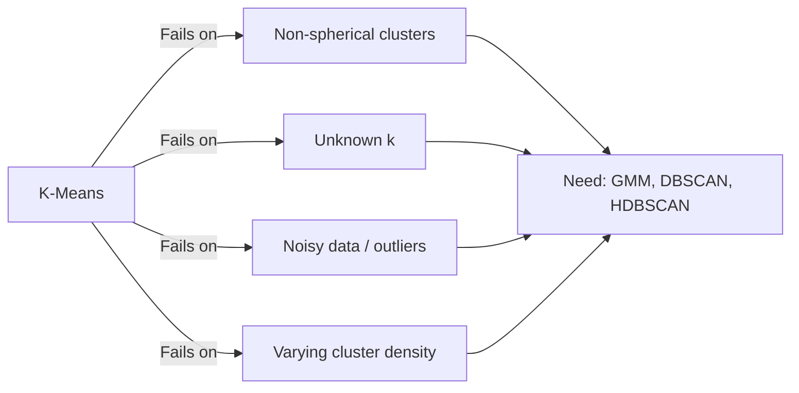
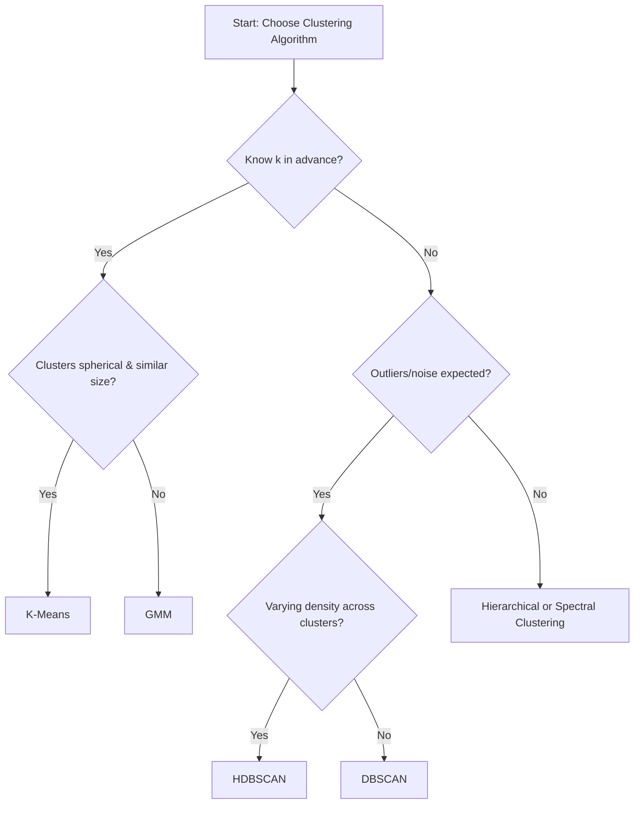
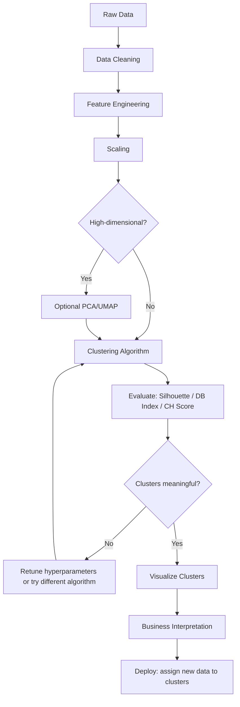

# Advanced Clustering

## 1. Learning Objectives

By the end of this chapter, you should be able to:

- Explain why K-Means alone is insufficient for many real-world clustering problems
- Choose the right clustering algorithm systematically instead of defaulting to K-Means
- Evaluate cluster quality using Silhouette Score, Davies-Bouldin Index, and Calinski-Harabasz Score
- Design a production-grade clustering workflow from raw data to business insight
- Confidently answer clustering-strategy interview questions and justify algorithm choices with engineering reasoning

---

## 2. Why Another Clustering Chapter?

K-Means is the algorithm most engineers reach for first — and often the only one they know well. That's a problem, because K-Means makes strong assumptions about your data that frequently don't hold in practice.

**Where K-Means breaks down:**

| Assumption K-Means Makes | Reality in Real Data |
|---|---|
| Clusters are roughly spherical (equal variance in all directions) | Real clusters are often elongated, irregular, or nested |
| Clusters are similar in size | Real-world segments (e.g., customer tiers) are often wildly imbalanced |
| You know `k` in advance | In exploratory settings, the "right" number of clusters is often unknown |
| Every point belongs to exactly one cluster | Noise/outliers exist and shouldn't be forced into a cluster |
| Clusters are separated by roughly linear boundaries (Voronoi regions) | Data can form crescents, rings, or density-based shapes K-Means cannot represent |

**The dedicated chapters that follow this one** (DBSCAN, HDBSCAN, Gaussian Mixture Models) exist precisely to solve these gaps. This chapter's job is to build the **decision-making framework** — knowing *when* K-Means is enough and *when* you need to reach for something else — before diving into each algorithm's mechanics individually.

---

## 3. K-Means Revision (No Math)

Quick recap of engineering judgment only — full mechanics assumed from earlier chapters.

**Strengths**

- Fast and scales well to large datasets
- Simple to explain to non-technical stakeholders
- Works well when clusters are genuinely globular and similar in size

**Weaknesses**

- Requires specifying `k` upfront
- Sensitive to initialization (mitigated but not eliminated by K-Means++)
- Assumes spherical, equally-sized clusters — fails on irregular shapes
- Sensitive to outliers (centroids get pulled by extreme points)
- Sensitive to feature scale — always scale before clustering

**Initialization**

- Random initialization can lead to poor local optima (bad centroid placement)
- **K-Means++** is the standard fix: spreads initial centroids apart intelligently before running the standard algorithm — sklearn uses this by default (`init="k-means++"`) and it should almost never be turned off

**Choosing `k`**

| Method | Intuition | Practical Note |
|---|---|---|
| **Elbow Method** | Plot within-cluster variance (inertia) vs `k`; look for the point where adding more clusters stops giving meaningful improvement | Subjective — the "elbow" isn't always obvious; use as a starting hypothesis, not a final answer |
| **Silhouette Score** | Measures how well-separated and internally cohesive clusters are, per `k` | More objective than the elbow method; combine both for confidence |

**When K-Means is still the correct choice**

- Clusters are expected to be roughly spherical and similar in size (e.g., segmenting numeric features that don't have weird geometric shapes)
- You need speed and simplicity at scale
- You have a reasonable prior on `k` (e.g., business wants exactly 4 customer tiers)
- Interpretability for stakeholders matters more than squeezing out the most accurate cluster shapes

---

## 4. Choosing the Right Clustering Algorithm

Before running any clustering algorithm, a senior engineer asks a structured set of questions — not "which algorithm is trendy" but "what does my data and problem actually require."

**The decision checklist:**

| Question | Why It Matters |
|---|---|
| Do I know `k` in advance? | K-Means/GMM need it; DBSCAN/HDBSCAN infer cluster count automatically |
| Are clusters likely to be non-spherical or irregularly shaped? | K-Means fails here; DBSCAN/HDBSCAN/Spectral clustering handle it |
| Is there likely to be noise/outliers that shouldn't be forced into any cluster? | DBSCAN/HDBSCAN explicitly support "noise" as a label; K-Means/GMM force every point into a cluster |
| Do clusters vary significantly in density? | Classic DBSCAN struggles here; HDBSCAN handles varying density much better |
| Do I need soft/probabilistic cluster membership? | GMM gives probabilities; K-Means/DBSCAN give hard assignments only |
| How large is my dataset? | K-Means and HDBSCAN scale reasonably; some density/hierarchical methods do not scale well to millions of rows |
| Do I need to assign new/unseen points to clusters later (production scoring)? | K-Means and GMM support this naturally; classic DBSCAN does not (HDBSCAN has approximate support) |

**High-level algorithm map (mechanics covered in dedicated chapters):**

| Algorithm | Best For | Weak Point |
|---|---|---|
| K-Means | Fast, spherical, similarly-sized clusters, known `k` | Irregular shapes, unknown `k`, outliers |
| Gaussian Mixture Models (GMM) | Overlapping/elliptical clusters, soft assignments | Still assumes a parametric shape (Gaussian), sensitive to initialization |
| DBSCAN | Arbitrary-shaped clusters, built-in outlier detection, no need to specify `k` | Struggles with varying density, sensitive to parameter tuning |
| HDBSCAN | Arbitrary shapes + varying density, more robust than DBSCAN | Slightly more complex to tune/interpret, can be slower on huge datasets |
| Hierarchical (Agglomerative) | Small-to-medium datasets, need a dendrogram / nested cluster structure | Doesn't scale well to large `n`, computationally expensive |
| Spectral Clustering | Non-convex cluster shapes, graph-like structure | Expensive on large datasets, requires similarity graph construction |

---

## 5. Cluster Evaluation

Clustering is unsupervised — there are no ground-truth labels to compute accuracy against. Instead, engineers rely on **internal validation metrics** that measure how well-separated and cohesive the discovered clusters are.

### Silhouette Score

- **What it measures:** for each point, how similar it is to its own cluster compared to the next-nearest cluster.
- **Range:** -1 to +1. Higher is better.
- **Intuition:** a score near +1 means the point sits comfortably inside its cluster and far from others; near 0 means it's on a cluster boundary; negative means it's probably in the wrong cluster.
- **Practical usage:** compute the average silhouette score across all points to compare different values of `k` or different algorithms. Also useful to plot per-cluster silhouette values to spot weak/poorly-formed clusters.
- **Limitation:** computationally expensive on very large datasets (pairwise distance-based); tends to favor convex, well-separated clusters — can be misleading for density-based clusters (e.g., DBSCAN's arbitrary shapes).

### Davies-Bouldin Index

- **What it measures:** the average "similarity" between each cluster and its most similar other cluster (based on within-cluster scatter vs between-cluster separation).
- **Range:** 0 and above. **Lower is better** (opposite direction from Silhouette).
- **Intuition:** low values mean clusters are compact and well-separated from their nearest neighboring cluster.
- **Practical usage:** fast to compute, good for quick comparisons across many `k` values or algorithm configurations.
- **Limitation:** like Silhouette, biased toward convex cluster shapes; less meaningful for density-based or highly irregular clusters.

### Calinski-Harabasz Score

- **What it measures:** ratio of between-cluster dispersion to within-cluster dispersion (conceptually similar to an ANOVA F-statistic).
- **Range:** 0 and above. **Higher is better.**
- **Intuition:** rewards configurations where clusters are tight internally and far apart from each other.
- **Practical usage:** very fast to compute — good for quickly scanning across many candidate `k` values.
- **Limitation:** same convex-cluster bias as the other two metrics; sensitive to cluster size imbalance.

**Comparison table:**

| Metric | Direction (better) | Speed | Best For | Weakness |
|---|---|---|---|---|
| Silhouette Score | Higher is better | Slow on large `n` | Detailed per-point/per-cluster diagnosis | Expensive at scale; convex bias |
| Davies-Bouldin Index | Lower is better | Fast | Quick comparison across configurations | Convex bias |
| Calinski-Harabasz Score | Higher is better | Fast | Quick comparison across configurations | Convex bias; sensitive to imbalance |

**Engineering rule:** never rely on a single metric. Use Silhouette for a deeper per-cluster look, and Davies-Bouldin/Calinski-Harabasz for fast iteration across many `k` values or algorithm settings. All three metrics have the same fundamental blind spot — they favor round, convex clusters — so for density-based algorithms (DBSCAN/HDBSCAN), also visually inspect results and consider domain-specific validation.

---

## 6. Production Workflow

**Key production considerations:**

- **Reusability:** if new data needs to be assigned to clusters later (e.g., scoring new customers), choose an algorithm that supports this naturally (K-Means, GMM) or plan for approximate/retraining strategies (DBSCAN/HDBSCAN).
- **Monitoring drift:** cluster structure discovered today may not hold next quarter — production clustering pipelines should periodically re-validate cluster quality against fresh data.
- **Stability:** clustering results can be sensitive to random seeds and hyperparameters — always fix `random_state` and document the exact configuration used for any clustering shipped to production or reported to stakeholders.

---

## 7. Practical Workflow

**Step-by-step engineering approach:**

1. **EDA:** understand feature distributions, correlations, and obvious outliers before choosing an algorithm.
2. **Scaling:** almost all clustering algorithms are distance-based — always scale (StandardScaler or MinMaxScaler) first.
3. **Optional PCA/UMAP:** if you have many features, reduce dimensionality to cut noise and speed up distance computations — also helps clustering algorithms that struggle with the curse of dimensionality.
4. **Clustering:** apply the chosen algorithm(s) — often worth trying 2–3 candidates (e.g., K-Means vs HDBSCAN) rather than committing to one blindly.
5. **Evaluation:** use Silhouette/Davies-Bouldin/Calinski-Harabasz to compare configurations quantitatively.
6. **Visualization:** project to 2D (PCA/UMAP) and plot clusters to sanity-check that the quantitative metrics match visual intuition.
7. **Business Insights:** translate clusters into actionable descriptions (e.g., "Cluster 2 = high-value, low-frequency customers") — this final translation step is what actually delivers value; a clustering result nobody can interpret is not useful.

---

## 8. Common Mistakes

| Mistake | Consequence |
|---|---|
| Defaulting to K-Means without checking cluster shape assumptions | Poor cluster quality on non-spherical or imbalanced data |
| Skipping feature scaling | Distance-based algorithms get dominated by high-magnitude features |
| Choosing `k` using only the elbow method | Elbow point is often ambiguous — pair with Silhouette Score |
| Ignoring outliers before clustering | Centroids get distorted (especially in K-Means); consider DBSCAN/HDBSCAN or outlier removal first |
| Using only one evaluation metric | Different metrics can disagree — a robust decision needs multiple signals plus visual inspection |
| Trusting evaluation metrics blindly on density-based clusters | Silhouette/DB/CH metrics are biased toward convex shapes — misleading for DBSCAN/HDBSCAN results |
| Not fixing `random_state` | Irreproducible clustering results across runs |
| Treating clusters as permanent ground truth | Real-world data drifts — clusters discovered today may not hold months later |
| Over-interpreting cluster labels as causal explanations | Clusters describe correlation/grouping, not causation — avoid overclaiming business meaning |
| Applying clustering to unscaled mixed categorical + numeric data without proper encoding/distance handling | Produces meaningless or dominated-by-one-feature-type clusters |

---

## 9. Rules of Thumb

1. Always scale features before clustering — no exceptions.
2. K-Means is the right default only when clusters are expected to be roughly spherical and similarly sized.
3. Use K-Means++ initialization — never plain random init.
4. Never trust the elbow method alone — validate with Silhouette Score.
5. If you don't know `k` in advance, consider DBSCAN or HDBSCAN instead of guessing.
6. If your data has outliers you don't want forced into clusters, use DBSCAN/HDBSCAN.
7. If clusters likely overlap or have different shapes/sizes, consider GMM over K-Means.
8. Always fix `random_state` for reproducible clustering results.
9. Use PCA or UMAP before clustering on high-dimensional data to reduce noise and improve distance meaningfulness.
10. Never rely on a single evaluation metric — cross-check Silhouette, Davies-Bouldin, and Calinski-Harabasz.
11. Visualize clusters in 2D even if metrics look good — sanity-check visually before trusting numbers.
12. Re-validate cluster quality periodically in production — data distributions drift over time.
13. Document the exact algorithm, hyperparameters, and preprocessing steps used for any clustering shipped or reported.
14. Don't force every point into a cluster if some points are genuinely noise — density-based methods handle this correctly.
15. Cluster interpretability matters as much as cluster quality — a "perfect" cluster nobody can explain to stakeholders has limited business value.
16. Try multiple algorithms before committing — K-Means and HDBSCAN often tell different, complementary stories about the same data.
17. Be skeptical of clustering results on very high-dimensional raw data — distance metrics become less meaningful as dimensionality grows ("curse of dimensionality").

---

## 10. Real-World Applications

| Domain | Application |
|---|---|
| Customer Segmentation | Grouping customers by behavior/spend for targeted marketing strategies |
| Marketing | Identifying distinct campaign-response segments to personalize messaging |
| Recommendation Systems | Clustering users or items to power "users like you" or "similar items" recommendations |
| Healthcare | Grouping patients by symptom/biomarker profiles to identify disease subtypes |
| Fraud Analysis | Using density-based clustering to flag transactions that don't fit any normal cluster (treated as noise/outliers) |

---

## 11. Interview Questions

1. Why is K-Means often insufficient for real-world clustering problems?
2. What assumptions does K-Means make about cluster shape and size?
3. How does K-Means++ improve on random initialization?
4. Explain the difference between the Elbow Method and the Silhouette Score for choosing `k`.
5. Why can the Elbow Method be ambiguous or misleading?
6. What does the Silhouette Score actually measure, intuitively?
7. Compare Davies-Bouldin Index and Calinski-Harabasz Score in terms of what "better" means for each.
8. Why do internal clustering metrics tend to favor convex, spherical clusters?
9. When would you choose a Gaussian Mixture Model over K-Means?
10. When would you choose DBSCAN over K-Means?
11. What's the key practical advantage of HDBSCAN over classic DBSCAN?
12. Why doesn't DBSCAN require specifying the number of clusters upfront?
13. How would you handle outliers before or during clustering?
14. Why is feature scaling critical for almost all clustering algorithms?
15. How would you validate that discovered clusters are meaningful, not just a metric artifact?
16. Describe how you would design a production pipeline that assigns new incoming data to existing clusters.
17. What risks arise from treating clustering results as static/permanent in a production system?
18. How would you decide between reducing dimensionality with PCA vs UMAP before clustering?
19. Why might two different clustering algorithms produce very different results on the same dataset, and how would you decide which to trust?
20. How would you explain a clustering result to a non-technical business stakeholder?

---

## 12. Myth vs Reality

| Myth | Reality |
|---|---|
| K-Means is always a safe default for clustering | It fails badly on non-spherical, imbalanced, or noisy data |
| A higher Silhouette Score always means a "correct" clustering | It only measures internal cohesion/separation — it doesn't validate business meaning or ground truth |
| The Elbow Method gives a definitive answer for `k` | It's often ambiguous and should be combined with other metrics |
| Clustering algorithms find "the true" groups in data | Clustering finds *a* plausible grouping based on distance/density assumptions — not necessarily the objectively "true" structure |
| More clusters always mean more insight | Over-segmentation creates clusters too small or granular to act on meaningfully |
| DBSCAN/HDBSCAN are always better than K-Means | They solve specific problems (shape, noise, unknown `k`) but are harder to tune and can underperform on genuinely spherical, clean data |
| Clustering results are stable and permanent | Real-world data drifts — clusters should be periodically re-evaluated |

---

## 13. Decision Guide

**When K-Means is enough:**

- Clusters are expected to be roughly spherical and similarly sized
- You have a reasonable, business-driven prior on `k`
- Speed and simplicity matter more than precisely capturing irregular shapes
- Data is relatively clean (few extreme outliers)

**When another algorithm is needed:**

| Situation | Recommended Algorithm |
|---|---|
| Unknown number of clusters | DBSCAN, HDBSCAN |
| Significant outliers/noise expected | DBSCAN, HDBSCAN |
| Clusters vary in density | HDBSCAN |
| Clusters overlap or are elliptical | Gaussian Mixture Model |
| Need soft/probabilistic cluster membership | Gaussian Mixture Model |
| Non-convex, arbitrarily shaped clusters | DBSCAN, HDBSCAN, Spectral Clustering |
| Need a nested/hierarchical view of structure | Agglomerative Hierarchical Clustering |
| Very large dataset with density-based needs | HDBSCAN (more scalable than classic hierarchical methods) |

**Common engineering decisions:**

- **Start simple:** always try K-Means first as a fast baseline, even if you expect to need something more advanced — it gives you a quick sanity check on cluster count and rough structure.
- **Validate assumptions before switching:** visualize the data (via PCA/UMAP) to check if K-Means' spherical assumption is obviously violated before reaching for a more complex algorithm.
- **Balance interpretability vs precision:** a slightly less "accurate" but more interpretable clustering (e.g., K-Means with clean centroids) can be more valuable in a business context than a technically superior but hard-to-explain HDBSCAN result.

---

## 14. Chapter Summary

- K-Means is fast and interpretable but assumes spherical, similarly-sized clusters and requires knowing `k` upfront — it fails on irregular shapes, unknown cluster counts, and noisy data.
- Choosing the right clustering algorithm requires a structured checklist: known `k`, cluster shape, noise tolerance, density variation, and need for soft assignments.
- Silhouette Score, Davies-Bouldin Index, and Calinski-Harabasz Score are the standard internal evaluation metrics — none are perfect, and all favor convex clusters, so use multiple metrics plus visualization.
- A production clustering workflow includes cleaning, scaling, optional dimensionality reduction, clustering, multi-metric evaluation, visualization, and translation into business insight.
- Dedicated chapters ahead (DBSCAN, HDBSCAN, GMM) cover the mechanics of the algorithms introduced here at a high level.

---

## 15. Interview Cheat Sheet

| If asked... | Say this |
|---|---|
| "Why isn't K-Means always sufficient?" | It assumes spherical, similarly-sized clusters, requires a known `k`, and is sensitive to outliers — real data often violates all three. |
| "How do you choose `k`?" | Combine the Elbow Method (quick visual heuristic) with Silhouette Score (quantitative validation) — never rely on one alone. |
| "How do you evaluate clustering without ground truth labels?" | Use internal metrics: Silhouette Score, Davies-Bouldin Index, Calinski-Harabasz Score — plus visual inspection via PCA/UMAP. |
| "When would you use DBSCAN/HDBSCAN over K-Means?" | When cluster count is unknown, clusters are irregularly shaped, or noise/outliers need to be excluded rather than forced into clusters. |
| "When would you use GMM over K-Means?" | When clusters overlap, are elliptical rather than spherical, or you need probabilistic (soft) cluster membership. |
| "What's the biggest blind spot of standard clustering metrics?" | They're biased toward convex, well-separated clusters — misleading for density-based or irregularly shaped clustering results. |

---

## 16. Quick Revision

**Core idea:** K-Means is a fast, interpretable baseline — but it assumes spherical, similarly-sized clusters and a known `k`. Real-world data often breaks these assumptions, motivating GMM, DBSCAN, and HDBSCAN.

**Decision checklist before clustering:**
- Do I know `k`? → No: DBSCAN/HDBSCAN
- Are clusters spherical/similar size? → No: GMM or density-based methods
- Is there noise/outliers to exclude? → Yes: DBSCAN/HDBSCAN
- Do I need soft cluster membership? → Yes: GMM

**Evaluation metrics:**
- Silhouette Score — higher is better, detailed but slow
- Davies-Bouldin Index — lower is better, fast
- Calinski-Harabasz Score — higher is better, fast
- Use multiple metrics + visualization together — never trust one number alone

**Golden rules:**
- Always scale before clustering.
- Always fix `random_state`.
- Never force noise into clusters if the domain has genuine outliers.
- Validate clusters visually, not just numerically.
- Re-check cluster quality periodically in production — data drifts.

**One-line memory hook:**
> K-Means answers "how do I split data into round, evenly-sized groups?" — everything else in this chapter exists to answer "what if my data doesn't look like that?"