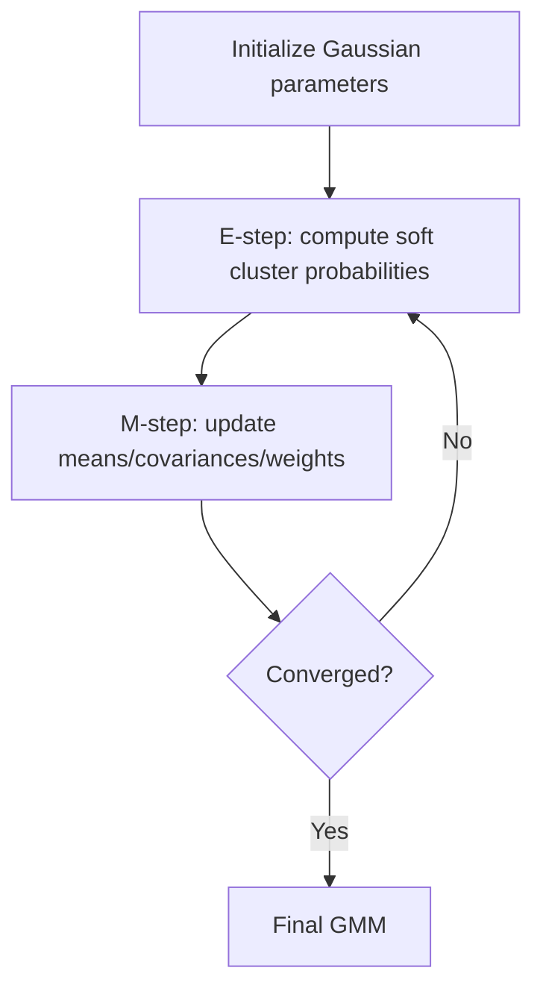
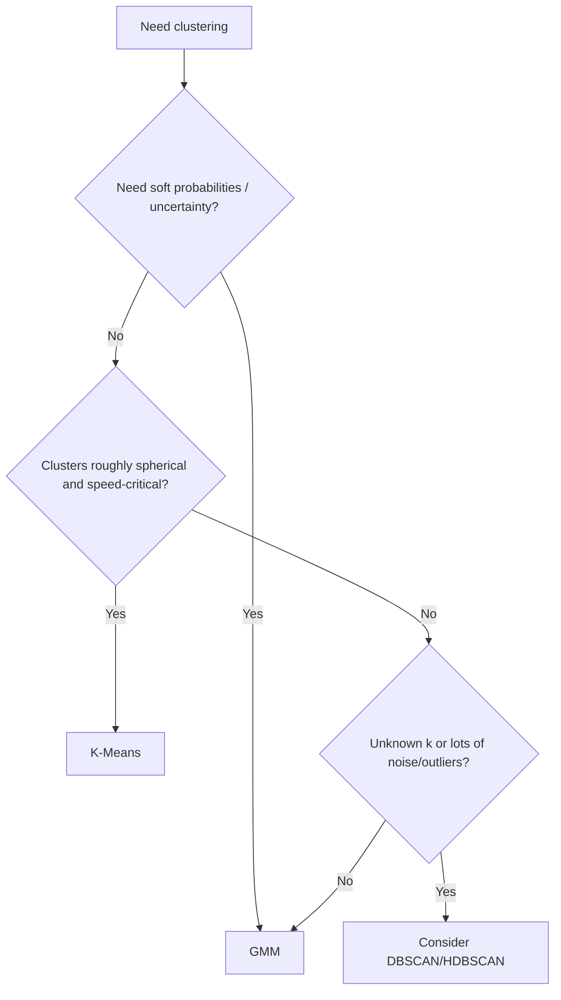

# Gaussian Mixture Models

## 1. Learning Objectives

By the end of this chapter, you should be able to:

- Explain *why* Gaussian Mixture Models (GMMs) exist and when they beat K-Means
- Describe soft clustering and probabilistic assignments in clear engineering terms
- Explain the EM algorithm at a high level (what happens each step, why it converges)
- Choose `covariance_type` intelligently (spherical/diagonal/tied/full)
- Implement GMMs in sklearn, tune key hyperparameters, and avoid common pitfalls
- Communicate GMM trade-offs in interviews and production design discussions

---

## 2. Why Gaussian Mixture Models Exist

K-Means is a strong baseline, but it forces a very specific worldview:

- every cluster is represented by a **single centroid**
- every point is assigned **hard** to exactly one cluster
- boundaries are basically "closest centroid wins"

This breaks down in common real-world scenarios:

| Scenario | Why K-Means Struggles | What GMM Fixes |
|---|---|---|
| Clusters overlap | Hard assignment is brittle; boundary points get arbitrarily forced | Soft probabilities capture uncertainty near overlaps |
| Clusters are elliptical (stretched) | Centroid distance doesn't model direction/shape | Covariance captures direction and spread |
| Different cluster sizes/densities | K-Means tends to split large clusters or merge small ones | Mixture weights + covariances handle imbalance better |
| You need confidence/uncertainty | K-Means gives only labels | GMM gives probability per cluster per point |

**Engineering translation:** GMM is what you reach for when "nearest centroid" is too crude and you need a model that can express **shape + uncertainty**.

---

## 3. Core Intuition

### Gaussian clusters (intuitive, not mathematical)

A Gaussian is a “cloud” of points with:

- a **center** (mean)
- a **shape/spread** (covariance)

If K-Means clusters are circles around centroids, GMM clusters are **ellipses** that can tilt and stretch.

### Soft clustering

Instead of forcing:

- point X belongs to cluster 2

GMM says:

- point X is 70% cluster 2, 25% cluster 1, 5% cluster 3

This is extremely useful in business contexts where ambiguity matters (e.g., “likely high-value customer” vs “definitely high-value customer”).

### Probabilistic assignment (why it matters)

Soft probabilities let you:

- create **risk-aware** decisions (threshold probabilities)
- avoid brittle boundary decisions
- build **triage pipelines** (e.g., send ambiguous cases to manual review)

**Key outputs you should expect from a GMM model:**

| Output | What it means | Typical use |
|---|---|---|
| `predict(X)` | Hard cluster label (argmax probability) | Segment assignment |
| `predict_proba(X)` | Soft probabilities per cluster | Confidence-based decisions |
| mixture weights | How common each cluster is | Segment size estimation |

---

## 4. High-Level Working (EM Algorithm Conceptually)

GMMs are typically fit with the EM algorithm. Don’t memorize equations—memorize what EM *does*.

**EM in one sentence:** alternate between “guessing cluster membership” and “updating cluster shapes” until stable.

### E-step (Expectation)
Given current Gaussian parameters:

- compute, for each point, **how likely it belongs to each cluster**
- result: soft assignments (“responsibilities”)

### M-step (Maximization)
Given the soft assignments:

- update each cluster’s center, shape, and weight to better fit the points assigned (probabilistically) to it

Repeat until improvement stalls or you hit a max iteration limit.



**Engineering mindset:** EM is prone to local optima. Initialization and multiple restarts matter more than people expect.

---

## 5. Covariance Types (Practical Intuition)

`covariance_type` controls the flexibility of each Gaussian cluster shape.

| Type | Shape intuition | Parameters | When it’s a good fit | Common risk |
|---|---|---:|---|---|
| `spherical` | Round blobs (same variance in all directions) | Low | Fast baseline; roughly isotropic clusters | Underfits elliptical structure |
| `diagonal` | Axis-aligned ellipses (no feature correlation) | Medium | Many real tabular datasets; good speed/quality trade-off | Misses correlated features (tilted ellipses) |
| `tied` | All clusters share the same ellipse shape | Medium | Clusters differ mostly by center, not shape | Too rigid if clusters truly differ in spread |
| `full` | Fully flexible ellipses (can tilt/rotate) | High | Correlated features, complex cluster geometry | Slow, can overfit; unstable with limited data |

**Rule of thumb:**
- Start with `diag` for tabular data.
- Use `full` when you have enough data and you suspect feature correlations define cluster shape.
- Use `spherical` if you want something K-Means-like but probabilistic.
- Use `tied` when you believe clusters share similar covariance (rare but useful sometimes).

---

## 6. Hyperparameters

### `n_components`
- **Intuition:** number of Gaussian clusters in the mixture (like `k`).
- **Common values:** typically 2–20 for business segmentation; can be higher for complex embedding spaces.
- **Practical effects:**
  - too low: merges distinct groups, overly broad clusters
  - too high: splits clusters into redundant subclusters, unstable probabilities
- **How to choose:** use domain constraints + validate with clustering metrics and/or likelihood-based criteria like AIC/BIC (if your handbook includes them elsewhere, that’s where they fit best).

### `covariance_type`
- **Intuition:** how flexible cluster shapes are allowed to be.
- **Common values:** `diag` and `full`.
- **Practical effects:**
  - more flexible covariance ⇒ better fit, higher compute, higher overfitting risk
  - less flexible covariance ⇒ faster, more stable, but can underfit

### `random_state`
- **Intuition:** reproducibility for initialization and restarts.
- **Practical effect:** fixes results across runs (critical in production and debugging).

**Hyperparameter summary table:**

| Hyperparameter | Controls | Increase / more flexible | Decrease / less flexible | Common mistake |
|---|---|---|---|---|
| `n_components` | #clusters | finer segmentation | coarser segmentation | choosing by guess without validation |
| `covariance_type` | shape flexibility | better fit, slower, overfit risk | faster, underfit risk | defaulting to `full` on small data |
| `random_state` | reproducibility | stable results | nondeterministic | not setting it, then chasing “random” changes |

---

## 7. Complexity

GMM cost depends strongly on number of samples `n`, features `d`, and components `k`.

| Aspect | High-level scaling | Practical implication |
|---|---|---|
| Time complexity | roughly O(n · k · d²) for `full`, closer to O(n · k · d) for `diag` | `full` covariance can get expensive fast as feature count grows |
| Memory complexity | O(k · d²) for `full`, O(k · d) for `diag` | `full` can become heavy if `d` is large |
| Scalability | Medium | Good for tens/hundreds of thousands of rows with `diag`; be cautious with `full` on high-dimensional data |

**Engineering implications:**
- If `d` is high (e.g., 768-d embeddings), `full` covariance is usually a bad idea.
- For embedding spaces, consider:
  - reduce dimension first (PCA/UMAP-as-feature reducer, depending on earlier design)
  - use `diag` covariance to avoid d² blowups
- GMM is typically slower than K-Means; in exchange you get probabilistic assignments and richer cluster shapes.

---

## 8. sklearn Implementation

### Library

- `sklearn.mixture.GaussianMixture`

### Key parameters to know

| Parameter | Why you care |
|---|---|
| `n_components` | number of clusters |
| `covariance_type` | model flexibility vs cost |
| `n_init` | number of random restarts (important for avoiding bad local optima) |
| `max_iter` | convergence budget |
| `reg_covar` | stabilizes covariance estimation (prevents singular matrices) |
| `random_state` | reproducibility |

### Clean example

```python
import numpy as np
from sklearn.mixture import GaussianMixture
from sklearn.preprocessing import StandardScaler

X_scaled = StandardScaler().fit_transform(X)

gmm = GaussianMixture(
    n_components=5,
    covariance_type="diag",
    n_init=5,          # important: multiple restarts
    max_iter=300,
    reg_covar=1e-6,    # numerical stability
    random_state=42
)

gmm.fit(X_scaled)

labels = gmm.predict(X_scaled)              # hard assignment
probs = gmm.predict_proba(X_scaled)         # soft assignment, shape (n_samples, n_components)
confidence = probs.max(axis=1)              # useful for "how sure is the model?"

print("Cluster sizes:", np.bincount(labels))
print("Avg confidence:", confidence.mean().round(3))
```

### Best practices checklist

- Scale features (GMM is distance/variance sensitive).
- Use `n_init > 1` to avoid bad local minima.
- Start with `covariance_type="diag"` for most tabular and embedding cases.
- Use `reg_covar` to prevent numerical issues, especially with correlated features or near-duplicate points.
- Monitor convergence warnings — don’t ignore them; they often indicate scale issues, too many components, or too flexible covariance.

---

## 9. Comparison with K-Means

| Dimension | K-Means | GMM |
|---|---|---|
| Assignment type | Hard (one cluster per point) | Soft (probabilities per cluster) |
| Cluster shape | Spherical-ish around centroids | Elliptical (with covariance), can model orientation |
| Overlapping clusters | Poor | Good (probabilistic overlap) |
| Interpretability | Simple centroids | Means + covariances + weights (richer but more complex) |
| Sensitivity to initialization | High | High (often higher) |
| Outputs uncertainty/confidence | No | Yes (`predict_proba`) |
| Outlier handling | Forced into some cluster | Still assigns probability (but can show low confidence); not an outlier detector by default |
| Performance at scale | Excellent | Medium |
| When it shines | Clean, well-separated, spherical clusters | Overlapping / elliptical clusters and risk-aware segmentation |
| Production scoring new data | Easy | Easy (probabilities especially useful) |

**Engineering takeaway:** If you want segmentation + confidence + non-spherical shapes, GMM is your first stop before density-based methods.

---

## 10. Practical Workflow (Business-Facing)


**How probabilities become decisions:**

- Assign segment label = argmax probability (standard segmentation)
- But also use probability as a **confidence signal**:
  - `max_prob > 0.9` → “high confidence segment assignment”
  - `0.6 < max_prob <= 0.9` → “medium confidence”
  - `<= 0.6` → “ambiguous customer” (flag for review, or exclude from strict segmentation analyses)

**Why this matters:** in real businesses, uncertainty is valuable. Hard cluster labels hide ambiguity.

---

## 11. Common Mistakes

| Mistake | Why it hurts | Fix |
|---|---|---|
| Using `full` covariance on high-dimensional data | d² blowup; instability; overfitting | Use `diag` or reduce dimension first |
| Setting `n_init=1` | You can land in a bad local optimum | Use 5–10 restarts for robust results |
| Ignoring scaling | Features with large magnitude dominate covariance | Always scale |
| Choosing `n_components` purely by "what looks nice" | Over/under segmentation | Validate with metrics, business constraints, and stability |
| Treating GMM probabilities as calibrated confidence | GMM outputs are model-based, not necessarily calibrated | Use them relatively; calibrate if used as hard thresholds |
| Forgetting `reg_covar` | Singular covariance errors on real data | Add small regularization |
| Over-interpreting covariance matrices | Correlations can be artifacts of preprocessing and feature engineering | Validate with domain knowledge |
| Assuming GMM handles outliers automatically | It doesn’t; outliers can distort parameters | Clean data or use robust approaches / explicit outlier detection |

---

## 12. Rules of Thumb

1. Use GMM when clusters overlap and hard assignments are too brittle.
2. Use GMM when you need cluster membership probabilities for business decisions.
3. Start with `covariance_type="diag"` unless you have strong evidence for correlated feature structure.
4. Avoid `full` covariance when `d` is large (embeddings) unless you reduce dimension first.
5. Always scale features before fitting a GMM.
6. Always use `n_init > 1` (5 is a good default).
7. Set `random_state` for reproducibility.
8. Use `reg_covar` to prevent singular covariance issues in real datasets.
9. Don’t treat `predict_proba` as perfectly calibrated confidence without validation.
10. If many points have low max probability, your model may be underfit/overfit or `n_components` is wrong.
11. If clusters look unstable across runs, increase `n_init` and reconsider `n_components`.
12. Use hard labels for reporting, but keep probabilities for decision thresholds and monitoring.
13. Compare GMM vs K-Means as baselines; if both fail, consider density-based clustering.
14. For production, store the scaler + fitted GMM together as a single artifact.
15. Monitor cluster drift: changes in mixture weights or average confidence can indicate data distribution shift.
16. If GMM fails to converge, suspect scaling issues, too many components, or overly flexible covariance.

---

## 13. Real-World Applications

| Domain | Application | Why GMM fits |
|---|---|---|
| Customer Segmentation | Probability-based segmentation and targeting | Soft membership supports cautious marketing decisions |
| Finance | Regime detection (market states), portfolio behavior clustering | Overlapping regimes are common |
| Healthcare | Patient subgroup discovery | Probabilistic membership handles ambiguous cases |
| Speaker Recognition | Modeling speaker characteristics as mixtures | Captures variability and overlap between speakers |
| Image Segmentation | Pixel clustering by color/texture features | Elliptical clusters and soft assignment can improve boundaries |

---

## 14. Interview Questions

1. Why would you choose a Gaussian Mixture Model over K-Means?
2. What does “soft clustering” mean, and why is it useful in production?
3. Explain the EM algorithm at a high level.
4. What does the E-step do? What does the M-step do?
5. Why does EM require good initialization and multiple restarts?
6. What does `covariance_type` control in sklearn’s `GaussianMixture`?
7. When would you use `diag` vs `full` covariance?
8. What problems can occur with `full` covariance in high dimensions?
9. What is `reg_covar` and why would you increase it?
10. How do you choose `n_components` in practice?
11. What signals suggest you have chosen too many components?
12. How would you use `predict_proba` output in a business workflow?
13. Can GMM detect outliers? Why or why not?
14. Why might a GMM fail to converge?
15. How does feature scaling affect GMM results?
16. How do you make GMM results reproducible?
17. In what scenario would K-Means outperform GMM?
18. How would you monitor a GMM-based segmentation system in production?
19. How do mixture weights help interpret clustering results?
20. How would you validate cluster usefulness without labels?

---

## 15. Myth vs Reality

| Myth | Reality |
|---|---|
| GMM is “K-Means but better” | It’s different: more flexible and informative, but slower and more fragile |
| GMM probabilities are always trustworthy confidence | They’re model-based and can be miscalibrated; treat as relative signals |
| `full` covariance is always the best | It can overfit and becomes unstable/expensive in high dimensions |
| GMM automatically handles outliers | Outliers can still distort fits; GMM is not an outlier detector |
| EM finds the global optimum | EM can get stuck in local optima; multiple restarts are important |

---

## 16. Decision Guide

### Prefer GMM when:

- Clusters overlap and you need a probability, not a binary assignment
- Cluster shapes are elliptical/anisotropic (directional spread matters)
- You need uncertainty signals for downstream decisioning
- You can tolerate more compute than K-Means and need better modeling fidelity

### Prefer K-Means when:

- You need maximum speed and simplicity at scale
- Clusters are expected to be reasonably spherical and well-separated
- You don’t need uncertainty/probabilities
- You need very stable, easy-to-explain results for stakeholders



---

## 17. Chapter Summary

- GMMs exist to handle cases where K-Means is too rigid: overlapping clusters, elliptical shapes, and situations where uncertainty matters.
- The defining feature is **soft clustering**: `predict_proba` yields probabilistic membership per cluster.
- Fitting uses EM: alternate between estimating soft assignments (E-step) and updating cluster parameters (M-step).
- `covariance_type` is the main lever for flexibility vs compute: `diag` is a practical default; `full` is powerful but costly and can be unstable in high dimensions.
- Production value comes from probabilities: thresholds, triage, monitoring drift, and cautious decisioning.

---

## 18. Interview Cheat Sheet

| If asked... | Say this |
|---|---|
| “Why use GMM?” | It models clusters as Gaussian ellipses and provides soft membership probabilities, handling overlap and non-spherical shapes better than K-Means. |
| “How does EM work?” | Iteratively: compute soft membership probabilities (E-step), then update cluster parameters based on those probabilities (M-step) until convergence. |
| “What’s `covariance_type`?” | Controls cluster shape flexibility: spherical < diagonal < tied < full (most flexible and expensive). |
| “How do you avoid bad fits?” | Scale features, use multiple restarts (`n_init`), regularize covariance (`reg_covar`), and choose `diag` when dimensionality is high. |
| “Key production advantage over K-Means?” | Probabilities enable confidence-aware decisions and monitoring. |

---

## 19. Quick Revision

**What it is:** a clustering model that represents data as a mixture of Gaussian “clouds,” producing **probabilities** of belonging to each cluster.

**Why it exists:** K-Means hard-assigns to centroids and can’t handle overlap or elliptical shapes well; GMM adds shape + uncertainty.

**EM algorithm (conceptual):**
- E-step: estimate cluster membership probabilities
- M-step: update means/covariances/weights using those probabilities
- repeat until stable

**Covariance types:**
- `spherical`: round blobs (fast, limited)
- `diagonal`: axis-aligned ellipses (best default for many problems)
- `tied`: shared shape across clusters
- `full`: fully flexible ellipses (powerful, expensive/fragile)

**Production tips:**
- Scale features
- Use `n_init=5+`
- Set `random_state`
- Use `reg_covar` for stability
- Use `predict_proba` for confidence thresholds and monitoring drift

**One-line memory hook:**
> K-Means gives labels; GMM gives labels *and* uncertainty—plus better cluster shapes when reality isn’t round.