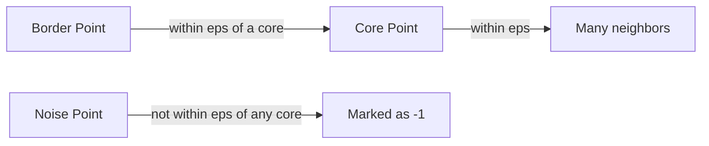
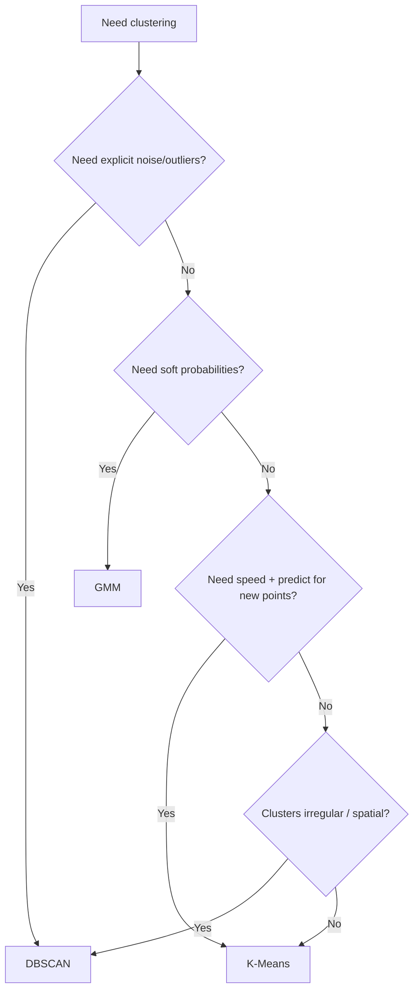

# DBSCAN

## 1. Learning Objectives

By the end of this chapter, you should be able to:

- Explain why DBSCAN exists and what it solves that centroid/probabilistic methods don’t
- Describe DBSCAN using the concepts of **density**, **core points**, **border points**, and **noise**
- Tune `eps`, `min_samples`, and `metric` with solid engineering intuition
- Predict when DBSCAN will fail (especially varying density + high dimensionality)
- Implement DBSCAN in sklearn and integrate it into a practical clustering/anomaly workflow
- Answer DBSCAN interview questions confidently, including trade-offs and production constraints

---

## 2. Why DBSCAN Exists

Centroid-based methods (like K-Means) and mixture-based methods (like GMM) work best when clusters are “blob-like” and the dataset is relatively clean. Many real datasets are not.

DBSCAN was created to handle three recurring engineering realities:

### 1) Arbitrary cluster shapes
- Real clusters can look like crescents, rings, winding paths, or geographically shaped regions.
- Any method that partitions space by “closest center” will struggle with these.

### 2) Noisy datasets / outliers
- In production data, outliers are normal: fraud, sensor glitches, bots, corrupted records.
- Forcing every point into a cluster can destroy cluster quality and downstream decisions.

### 3) Unknown number of clusters
- Many unsupervised problems don’t have a known `k` (and “guessing k” is often cargo-cult).
- DBSCAN discovers clusters based on density, not a pre-set count.

**DBSCAN’s engineering promise:**
> “Find dense regions as clusters, and label sparse regions as noise.”

---

## 3. Core Intuition

DBSCAN thinks in terms of **crowds**.

- A **cluster** is a crowded region.
- **Noise** is isolated points (or small sparse pockets).

DBSCAN uses two ideas:

- **`eps`**: what counts as “nearby”
- **`min_samples`**: how many neighbors you need to be considered “dense”

### Point types

| Point Type | Intuition | What it means in practice |
|---|---|---|
| **Core point** | You’re in a crowd | Has at least `min_samples` points within distance `eps` (including itself) |
| **Border point** | You’re near a crowd | Not dense enough alone, but within `eps` of a core point |
| **Noise point (outlier)** | You’re isolated | Not within `eps` of any core point |



**Key intuition: connectivity creates clusters.**
A cluster isn’t just a dense spot — it’s a set of points connected through chains of `eps`-neighbors anchored by core points.

---

## 4. High-Level Working (Step-by-Step)

DBSCAN is conceptually simple:

1. **Pick an unvisited point `p`.**
2. Find all points within distance `eps` of `p` (its neighborhood).
3. If `p` has **fewer than `min_samples`** neighbors:
   - mark it as **noise** (for now)
4. If `p` has **at least `min_samples`** neighbors:
   - `p` is a **core point**
   - create a new cluster and add `p` and its neighbors
5. **Expand the cluster**:
   - for each neighbor `q`:
     - if `q` is also a core point, add *its* neighbors to the cluster expansion
     - if `q` is a border point, include it but don’t expand from it
6. Continue until all reachable points are added.
7. Repeat from step 1 until all points are visited.

```mermaid
flowchart TD
    A[Choose unvisited point p] --> B[Find neighbors within eps]
    B --> C{neighbors >= min_samples?}
    C -->|No| D[Mark as noise (temporary)]
    C -->|Yes| E[Start new cluster]
    E --> F[Expand via core-point neighbors]
    F --> G{More reachable points?}
    G -->|Yes| F
    G -->|No| H[Cluster complete]
    D --> I{Unvisited points remain?}
    H --> I
    I -->|Yes| A
    I -->|No| J[Done: clusters + noise]
```

**Important behavior:** a point marked as noise early can later become a **border point** if it’s found within `eps` of a core point during expansion.

---

## 5. Hyperparameters

DBSCAN lives or dies on hyperparameters. The good news: there are only a few. The bad news: they interact and are dataset-dependent.

### `eps`

- **What it controls:** the radius that defines “neighbors”
- **Increase `eps`:**
  - clusters merge more easily
  - fewer points labeled noise
  - risk: everything becomes one giant cluster
- **Decrease `eps`:**
  - clusters fragment
  - more points labeled noise
  - risk: you get no clusters at all

**Common values**
- No universal default. It depends on:
  - feature scaling
  - dimensionality
  - chosen `metric`
  - data density

**Tuning advice**
- Always scale first (otherwise `eps` has no consistent meaning).
- Use a **k-distance plot** heuristic:
  - compute distance to each point’s `min_samples`-th nearest neighbor
  - sort those distances
  - pick `eps` near the “knee” (where distances start rising fast)
- For embeddings (especially high-dimensional), `eps` tuning is notoriously fragile—consider reducing dimensionality first.

**Common mistakes**
- Picking `eps` without scaling
- Using the same `eps` across datasets/feature sets
- Assuming `eps` is interpretable in high dimensions (it often isn’t)

---

### `min_samples`

- **What it controls:** how dense an area must be to form a cluster core
- **Increase `min_samples`:**
  - requires denser clusters
  - more noise points
  - more conservative clustering (less over-clustering)
- **Decrease `min_samples`:**
  - easier to form clusters
  - less noise
  - risk: clusters form from random fluctuations

**Common values**
- Typical starting points:
  - 5 to 10 for many problems
  - higher for larger datasets or higher dimensionality
- A common heuristic: `min_samples ≈ 2 * (#features)` for scaled numeric data (not a law; just a starting guess)

**Tuning advice**
- Treat `min_samples` as your **noise tolerance** knob:
  - higher value = you demand stronger evidence of a cluster
- If your goal is anomaly detection, a larger `min_samples` often helps label ambiguous points as noise.

**Common mistakes**
- Setting `min_samples=2` and getting lots of tiny “clusters”
- Changing `eps` and forgetting that it changes the effective density, so `min_samples` might need adjustment too

---

### `metric`

- **What it controls:** how distance is computed
- **Why it matters:** DBSCAN is a neighborhood algorithm—distance choice is the definition of neighborhood.

**Common values**
- `"euclidean"`: default for general numeric features
- `"manhattan"`: sometimes better for sparse-ish tabular patterns
- `"cosine"`: common for normalized embeddings (text/LLM embeddings)
- `"precomputed"`: when you supply your own distance matrix (be careful with O(n²) memory)

**Tuning advice**
- For embedding vectors: try `"cosine"` first.
- For mixed feature types: DBSCAN can be a poor fit unless you engineer an appropriate distance (or embed to a meaningful vector space first).

**Common mistakes**
- Using Euclidean distance on embeddings where angle matters more than magnitude
- Using `precomputed` distance matrices on large datasets (memory blow-ups)

---

### Hyperparameter quick table

| Param | What it is | If too small | If too large | Practical symptom |
|---|---|---|---|---|
| `eps` | neighborhood radius | too much noise, fragmented clusters | giant merged cluster | “Everything is noise” vs “Everything is one cluster” |
| `min_samples` | density threshold | spurious clusters | too much noise | “Lots of tiny clusters” vs “No clusters” |
| `metric` | distance definition | wrong neighborhoods | wrong neighborhoods | clusters don’t match domain intuition |

---

## 6. Complexity

DBSCAN’s performance depends heavily on whether neighbor queries are accelerated (e.g., via KD-tree / ball tree) and on the metric.

| Aspect | High-level complexity | Engineering implications |
|---|---|---|
| Time (with spatial index, suitable metric) | ~O(n log n) | Practical on medium-to-large datasets |
| Time (worst case / no useful index) | O(n²) | Can become unusable for large `n` |
| Memory | ~O(n) to store labels + index (plus neighbor queries) | Usually manageable, but depends on implementation and dimension |
| Scalability | Medium | Works well for 2D/3D/geospatial; gets harder in high dimensions |

**Engineering implications you should remember:**
- DBSCAN is great for **low-dimensional spatial data** (GPS, 2D/3D geometry).
- DBSCAN can struggle in **high dimensions** because:
  - distances become less informative
  - the concept of a fixed radius neighborhood becomes unstable
- If you’re clustering embeddings, consider dimensionality reduction first (PCA/UMAP as appropriate from earlier chapters), then DBSCAN.

---

## 7. sklearn Implementation

### Library
- `sklearn.cluster.DBSCAN`

### Parameters worth knowing

| Parameter | Why you care |
|---|---|
| `eps` | the most sensitive knob; drives cluster formation |
| `min_samples` | density threshold; controls noise vs clusters |
| `metric` | defines what “nearby” means |
| `n_jobs` | parallel neighbor search in some cases (implementation-dependent) |

### Clean example

```python
import numpy as np
from sklearn.cluster import DBSCAN
from sklearn.preprocessing import StandardScaler

X_scaled = StandardScaler().fit_transform(X)

db = DBSCAN(
    eps=0.5,
    min_samples=10,
    metric="euclidean",
)

labels = db.fit_predict(X_scaled)

n_clusters = len(set(labels)) - (1 if -1 in labels else 0)
n_noise = np.sum(labels == -1)

print(f"Clusters: {n_clusters}, Noise points: {n_noise}")
print("Label counts:", dict(zip(*np.unique(labels, return_counts=True))))
```

### Best practices checklist

- Scale features before DBSCAN.
- Start by tuning `eps` with a k-distance plot heuristic (or a small grid search).
- Try a couple of `min_samples` values (e.g., 5, 10, 20) to control noise sensitivity.
- For embeddings, consider `metric="cosine"` and/or reduce dimensionality first.
- Always report:
  - number of clusters
  - percentage labeled noise
  - stability across small parameter changes (DBSCAN can be brittle)

---

## 8. Comparison (DBSCAN vs K-Means vs GMM)

| Dimension | K-Means | GMM | DBSCAN |
|---|---|---|---|
| Needs `k` upfront | Yes | Yes | No |
| Cluster shape | Spherical-ish | Elliptical (covariance) | Arbitrary shapes |
| Handles noise/outliers explicitly | No | Not explicitly | Yes (labels noise as `-1`) |
| Soft membership probabilities | No | Yes | No |
| Works with overlapping clusters | Poor | Good | Mixed (depends on density separation) |
| Parameter sensitivity | Medium | Medium–High | High (`eps` is brittle) |
| Scalability | Excellent | Medium | Medium (can degrade to O(n²)) |
| High-dimensional embeddings | Often OK (baseline) | OK with care (`diag`) | Harder (distance radius becomes unstable) |
| Assign new points without refit | Yes | Yes | Not naturally (needs re-fit or custom logic) |
| Best use case | Fast baseline segmentation | Probabilistic / overlapping clusters | Spatial / irregular clusters + outlier detection |

**Engineering takeaway:**
- Choose DBSCAN when “cluster” means “dense region” and you explicitly want a noise label.
- Choose GMM when you want uncertainty/probabilities and clusters overlap.
- Choose K-Means when you want speed and have a reasonable `k` and blob-like clusters.

---

## 9. Practical Workflow

```mermaid
flowchart LR
    A[Customer Data] --> B[Scaling]
    B --> C{High-dimensional?}
    C -->|Yes| D[Optional PCA]
    C -->|No| E[DBSCAN]
    D --> E
    E --> F[Noise Detection (-1)]
    F --> G[Business Insights]
```

**How this plays out in practice:**

- DBSCAN clusters dense “typical” customer behavior patterns.
- Points labeled `-1` are “atypical” customers:
  - potential fraud
  - data quality issues
  - niche segments too small to be considered stable clusters

**Important nuance:** “noise” is not automatically “bad.” It just means “not part of any dense region under your current density definition.”

---

## 10. Common Mistakes

| Mistake | Consequence | Fix |
|---|---|---|
| Not scaling features | `eps` becomes meaningless | Always scale first |
| Using one `eps` value and trusting the result | DBSCAN is sensitive; small changes can flip results | Check stability across a small range |
| Expecting DBSCAN to work well in high dimensions out-of-the-box | Often returns “everything is noise” or “everything is one cluster” | Reduce dimension and/or switch algorithms |
| Treating noise points as guaranteed anomalies | Many are just rare but valid | Validate with domain checks |
| Using Euclidean distance for embeddings blindly | Poor neighborhood quality | Try cosine metric |
| Deploying DBSCAN for streaming assignment | No natural `predict` for new points | Refit periodically or implement a custom assignment heuristic |
| Trying to force DBSCAN to find a specific number of clusters | Not what it’s designed for | Choose an algorithm aligned with your goal |

---

## 11. Rules of Thumb

1. DBSCAN is best when clusters are **dense regions** and you explicitly want **noise/outlier labeling**.
2. Always scale numeric features before DBSCAN.
3. Treat `eps` as the primary tuning knob; treat `min_samples` as your conservativeness/noise tolerance knob.
4. If you get **one giant cluster**, lower `eps`.
5. If you get **everything labeled noise**, increase `eps` or lower `min_samples`.
6. Don’t tune `eps` without checking how feature scaling and the chosen metric affect distance magnitudes.
7. For embeddings, try `metric="cosine"` first.
8. DBSCAN is usually excellent for geospatial clustering (GPS, coordinates).
9. DBSCAN is often fragile in high-dimensional spaces—reduce dimensions first or choose a different algorithm.
10. Always report the **noise fraction**; it’s a key outcome, not a side effect.
11. Validate “noise = anomaly” assumptions with domain rules and downstream checks.
12. Check parameter stability: if tiny `eps` changes completely reshuffle clusters, the clustering is not robust.
13. DBSCAN doesn’t naturally support assigning new points—plan for refits or approximations.
14. Don’t force DBSCAN to hit a target number of clusters; it discovers clusters based on density.
15. If your dataset has **varying densities**, DBSCAN will struggle—consider HDBSCAN.
16. If you need probabilities/uncertainty, DBSCAN is the wrong tool—use GMM.
17. When in doubt, baseline with K-Means/GMM for sanity checks, then use DBSCAN if density/noise is the core requirement.

---

## 12. Real-World Applications

| Application | Why DBSCAN fits |
|---|---|
| Fraud Detection | Dense “normal” behavior vs sparse suspicious points labeled as noise |
| GPS Clustering | Arbitrary geographic shapes; clusters based on spatial density (hotspots) |
| Customer Segmentation (niche) | Finds dense behavior groups; flags rare profiles as noise |
| Image Processing | Grouping pixels/points by dense regions (e.g., spatial + color features), separating noise |
| Anomaly Detection | Noise label is a direct signal for “does not belong to any dense pattern” |

---

## 13. Interview Questions

1. Why was DBSCAN developed? What problems does it solve compared to centroid-based clustering?
2. Explain core points, border points, and noise points intuitively.
3. What do `eps` and `min_samples` control?
4. What happens if `eps` is too small? Too large?
5. What happens if `min_samples` is too small? Too large?
6. Why does DBSCAN not require choosing the number of clusters in advance?
7. Why can DBSCAN struggle in high-dimensional spaces?
8. How would you tune `eps` in practice?
9. How do you interpret points labeled `-1`?
10. Can DBSCAN handle clusters of varying density? Why or why not?
11. Why is feature scaling important for DBSCAN?
12. How does the choice of distance metric affect DBSCAN results?
13. When would cosine distance be more appropriate than Euclidean for DBSCAN?
14. What is the time complexity of DBSCAN and what makes it degrade to O(n²)?
15. How would you make DBSCAN work on a dataset with 500k points?
16. Does DBSCAN support predicting clusters for new points without retraining?
17. Compare DBSCAN vs GMM: when would you prefer each?
18. Compare DBSCAN vs K-Means: when would you prefer each?
19. How would you validate that DBSCAN clusters are meaningful?
20. Describe a production workflow using DBSCAN for anomaly detection.

---

## 14. Myth vs Reality

| Myth | Reality |
|---|---|
| DBSCAN is “parameter-free” clustering | It avoids choosing `k`, but `eps` and `min_samples` are highly influential |
| Noise points (`-1`) are always anomalies | Noise means “not in any dense region under these settings,” not guaranteed fraud/bug |
| DBSCAN always finds arbitrary shapes perfectly | It can, but only when `eps` matches the local density scale |
| DBSCAN works fine in high-dimensional embeddings | Often fragile due to distance concentration; needs careful metric choice and/or dimensionality reduction |
| You can pick `eps` once and reuse it forever | `eps` depends on scaling, features, metric, and dataset density |

---

## 15. Decision Guide

### Prefer DBSCAN when:
- You expect **arbitrary cluster shapes** (spatial patterns, paths, non-convex regions)
- You expect **noise/outliers** and want them labeled explicitly
- You do **not** know the number of clusters and don’t want to guess
- You care about **density-defined groups** (hotspots, typical behavior regions)

### Prefer K-Means when:
- You need **speed at scale** and clusters are roughly blob-like
- You need stable cluster assignment for new data via a simple `predict`
- You have a reasonable business-driven `k`

### Prefer GMM when:
- You need **soft probabilities** / uncertainty
- Clusters **overlap** and hard boundaries are too brittle
- Clusters are roughly elliptical and you can model them probabilistically



---

## 16. Chapter Summary

- DBSCAN finds clusters as **dense regions** and labels sparse points as **noise**.
- It’s designed for arbitrary shapes, noisy datasets, and unknown cluster count.
- The three point types matter: **core** (dense), **border** (attached), **noise** (isolated).
- The algorithm expands clusters by connectivity through core points.
- `eps` and `min_samples` are the critical knobs; `metric` defines what “near” means.
- DBSCAN scales well with the right neighbor index but can degrade to O(n²) and can be fragile in high-dimensional spaces.
- It’s a strong choice for geospatial clustering and anomaly-style workflows, but not ideal when you need soft probabilities or easy new-point assignment.

---

## 17. Interview Cheat Sheet

| If asked... | Say this |
|---|---|
| “What is DBSCAN?” | A density-based clustering algorithm that groups dense regions into clusters and labels sparse points as noise. |
| “Why DBSCAN over K-Means?” | It handles arbitrary shapes, doesn’t require `k`, and can mark outliers as noise. |
| “What do `eps` and `min_samples` do?” | `eps` defines neighborhood radius; `min_samples` defines how many neighbors are needed for a core (dense) point. |
| “Biggest DBSCAN weakness?” | Struggles with varying density and high-dimensional data; very sensitive to `eps`. |
| “Does DBSCAN support predicting new points?” | Not naturally; it usually requires refitting or custom approximate assignment logic. |

---

## 18. Quick Revision

**What it is:** density-based clustering + explicit noise labeling.

**Key concepts:**
- **Core point:** dense neighborhood (≥ `min_samples` within `eps`)
- **Border point:** near a core point but not dense itself
- **Noise point:** not near any core point (label `-1`)

**Key knobs:**
- `eps`: neighborhood radius  
  - too small ⇒ everything is noise  
  - too big ⇒ one giant cluster
- `min_samples`: density threshold  
  - too small ⇒ spurious clusters  
  - too big ⇒ too much noise
- `metric`: distance definition (cosine often for embeddings)

**When to use:**
- arbitrary shapes, noisy data, unknown cluster count, spatial clustering, anomaly-style workflows

**When to avoid:**
- varying density (consider HDBSCAN)
- very high-dimensional spaces without dimensionality reduction
- production systems needing simple `predict` for new points

**One-line memory hook:**
> DBSCAN doesn’t ask “which center is closest?”—it asks “where are the crowds, and who’s alone?”