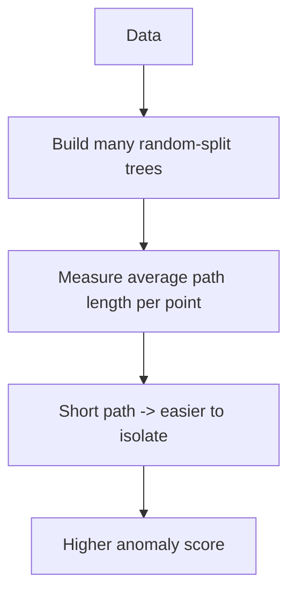
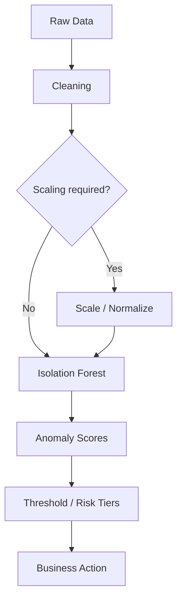
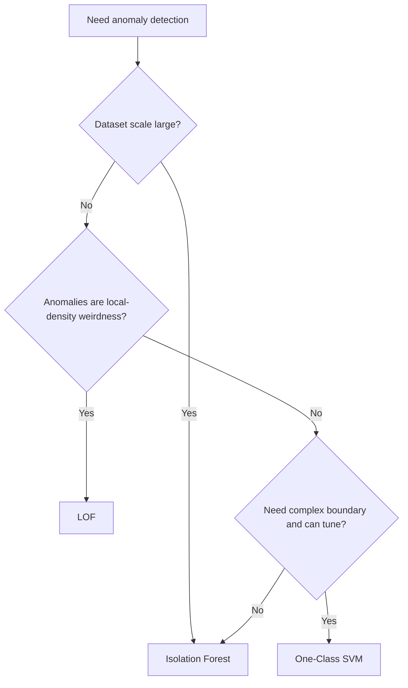

# Anomaly Detection

## 1. Learning Objectives

By the end of this chapter, you should be able to:

- Distinguish **anomaly**, **outlier**, and **novelty** (and explain why the difference matters in production)
- Identify whether a problem is **point**, **contextual**, or **collective** anomaly detection
- Choose between **Isolation Forest**, **Local Outlier Factor (LOF)**, and **One-Class SVM** based on data shape, scale, and deployment constraints
- Implement Isolation Forest in sklearn with production-safe preprocessing and reproducibility
- Convert anomaly scores into actions using thresholds, risk tiers, and human-in-the-loop workflows
- Avoid common anomaly detection traps (data leakage, wrong contamination, “anomaly = fraud” thinking)

---

## 2. What is Anomaly Detection?

Anomaly detection is about identifying data points (or groups of points) that do not conform to expected patterns.

The terminology is often mixed in interviews and teams. Use these definitions to stay precise:

### Anomaly vs Outlier vs Novelty

| Term | Meaning (practical) | Typical setting | Key risk |
|---|---|---|---|
| **Outlier** | A point that is far from others *in the observed dataset* | Offline analysis / EDA | Might be a legitimate rare case |
| **Anomaly** | A point (or pattern) that is abnormal *relative to what you care about operationally* | Production monitoring, fraud, quality control | Easy to confuse with rare-but-valid behavior |
| **Novelty** | A new type of normal that wasn’t in training data (distribution shift) | Deployed systems over time | Model flags “new normal” as anomaly (alert fatigue) |

**Engineering translation:**
- Outlier is geometry/statistics-focused.
- Anomaly is risk/business-focused.
- Novelty is time/shift-focused.

---

## 3. Why Anomaly Detection Matters

Most real systems fail in the tail: the rare cases. Anomaly detection is a practical tool for finding those tails early.

| Domain | Example anomalies | What happens if you miss them |
|---|---|---|
| Fraud Detection | account takeover, synthetic identity, bot transactions | financial loss, chargebacks, regulatory risk |
| Manufacturing | defect patterns, drifting sensor calibration | scrap, rework, recalls |
| Cybersecurity | lateral movement, credential stuffing, DDoS patterns | breach, downtime, data exfiltration |
| Healthcare | unusual lab patterns, adverse event signals | missed diagnosis, patient harm |
| Sensor Monitoring | spikes, dropouts, stuck sensors, drift | incorrect control actions, equipment damage |
| Financial Transactions | abnormal trade patterns, market manipulation | compliance failures, capital risk |

**Production reality:** anomaly detection is rarely “fully automated.” It is commonly used to **prioritize investigation**, not to instantly block/approve.

---

## 4. Types of Anomaly Detection

### Point anomalies
A single point is unusual by itself.

- Example: a transaction amount 100× larger than usual
- Typical algorithms: Isolation Forest, One-Class SVM

### Contextual anomalies
A point is only anomalous in a specific context (time, location, device, user state).

- Example: 2 AM login is normal for user A but abnormal for user B
- Requires: good feature engineering for context (time-of-day, per-user baselines)

### Collective anomalies
A group/sequence is anomalous, even if individual points look normal.

- Example: a burst of small transactions (individually normal) forming a suspicious pattern
- Often needs: time-series methods, sequence models, or rule-based aggregation on top of point anomaly scores

**Quick mapping:**

| Type | Needs context? | Needs grouping? | Common approach |
|---|---:|---:|---|
| Point | No | No | per-event scoring |
| Contextual | Yes | No | feature engineering + per-event scoring |
| Collective | Often | Yes | aggregate/sequence detection |

---

## 5. Algorithms Overview

### Isolation Forest (primary focus)
- Best general-purpose choice for tabular anomaly detection
- Scales well
- Works without labels
- Outputs an anomaly score and can produce binary flags via thresholding

### One-Class SVM (high level)
- Learns a boundary around “normal” data
- Powerful but often slow and sensitive to feature scaling and hyperparameters
- Struggles at large scale

### Local Outlier Factor (LOF) (high level)
- Flags points that are outliers relative to their local neighborhood density
- Strong when anomalies are “local” (in dense regions) rather than global extremes
- Classic LOF is awkward for production scoring of new points (deployment caveat)

**At-a-glance comparison:**

| Algorithm | Strength | Weakness | Production fit |
|---|---|---|---|
| Isolation Forest | Fast, scalable, robust default | Needs thresholding; “contamination” guessing | Good |
| One-Class SVM | Can model complex boundaries | Slow, sensitive, hard to tune | Poor–Medium |
| LOF | Great for local density anomalies | Limited new-point scoring story | Medium (with care) |

---

## 6. Isolation Forest

### Intuition

Isolation Forest is built on a simple idea:

> Anomalies are easier to isolate than normal points.

Instead of modeling “normal,” it repeatedly **randomly partitions** the feature space:

- Normal points sit in dense regions → it takes many random splits to isolate them
- Anomalies are rare/isolated → they get separated quickly with fewer splits

### Random partitioning (how it “isolates” points)

Each tree:
- randomly selects a feature
- randomly selects a split value
- repeats until points are separated

Across many trees:
- anomalies have **shorter average path lengths** (isolated early)
- normal points have **longer path lengths**



### Anomaly score (conceptual)

Isolation Forest produces a score per sample that reflects how “easy” it is to isolate.

**Engineering note:** the score is not a probability. Treat it as a **ranking signal** unless you have a calibrated thresholding strategy.

### Why it’s efficient

- Trees are built with random splits (no expensive optimization)
- Works well for tabular features at scale
- Often strong out-of-the-box compared to methods that require distance matrices or kernel methods

---

## 7. Hyperparameters (Isolation Forest)

### `contamination`

- **What it controls:** expected fraction of anomalies in the dataset (used to set the default decision threshold)
- **Effect of increasing:** more points flagged as anomalies
- **Effect of decreasing:** fewer points flagged as anomalies

**Common values**
- 0.001 to 0.1 depending on domain
- Fraud/security often: 0.1%–2%
- Sensor failures/quality control can vary widely

**Tuning advice**
- If you have no labels: treat it as a **budget knob** (“how many alerts can we handle?”)
- If you have some labels: tune to business objective (precision/recall trade-off), not to match a guessed rate

**Common mistakes**
- Setting contamination to the true anomaly rate without verifying the system’s tolerance for false positives
- Treating contamination as a universal constant across time (it often shifts)

---

### `n_estimators`

- **What it controls:** number of trees
- **Increase it:** more stable scores, better averaging, more compute/memory
- **Decrease it:** faster but noisier results

**Common values**
- 100–500 is common
- 200 is a reasonable default for many tabular problems

**Tuning advice**
- Increase if results vary too much between runs or scores look unstable
- Past a point, gains are diminishing

**Common mistakes**
- Using very small values (e.g., 10) and concluding “algorithm doesn’t work”

---

### `max_samples`

- **What it controls:** number of samples used to build each tree
- **Increase it:** better representation of data; slower
- **Decrease it:** faster; can miss structure if too small

**Common values**
- `"auto"` in sklearn typically uses `min(256, n_samples)`
- 256 is a common practical setting and often enough for robust anomaly ranking

**Tuning advice**
- For very large datasets, keeping this moderate is often fine and improves speed
- If data is highly multi-modal, consider increasing (carefully)

**Common mistakes**
- Setting it to full dataset size on huge data and causing unnecessary training cost

---

### `random_state`

- **What it controls:** reproducibility
- **Best practice:** always set it in experiments and production

---

### Quick hyperparameter table

| Param | Primary role | If too low | If too high |
|---|---|---|---|
| `contamination` | threshold aggressiveness | misses anomalies (low recall) | alert flood (low precision) |
| `n_estimators` | stability | noisy scores | slow, diminishing returns |
| `max_samples` | per-tree data coverage | misses patterns | slow, expensive |
| `random_state` | reproducibility | non-repeatable results | N/A |

---

## 8. Complexity & Scalability

Let `n` be samples, `d` features, `t` trees, `m` = `max_samples`.

| Aspect | High-level scaling | Engineering implications |
|---|---|---|
| Time complexity (fit) | ~O(t · m · log m) | Scales well; avoids O(n²) patterns |
| Time complexity (score/predict) | ~O(t · log m) per point | Cheap scoring; viable for batch scoring |
| Memory | ~O(t · m) | Depends mainly on number/size of trees |
| Scalability | Good | Typically much more scalable than kernel/distance-based methods |

**Practical implications:**
- Great for large tabular datasets where you can batch-score daily/hourly.
- For real-time scoring, it can work if your feature extraction is the bigger cost (often true).
- If `d` is huge (e.g., raw sparse text), consider embedding/feature reduction before applying.

---

## 9. sklearn Implementation (Isolation Forest)

### Library
- `sklearn.ensemble.IsolationForest`

### Key parameters worth knowing
| Parameter | Why you care |
|---|---|
| `n_estimators` | stability vs speed |
| `max_samples` | per-tree coverage vs speed |
| `contamination` | sets decision threshold |
| `max_features` | subsampling features can help robustness |
| `random_state` | reproducibility |
| `n_jobs` | parallelism |

### Clean example

```python
import numpy as np
import pandas as pd
from sklearn.ensemble import IsolationForest
from sklearn.preprocessing import StandardScaler

# X: numeric feature matrix (DataFrame or ndarray)
X_scaled = StandardScaler().fit_transform(X)

iso = IsolationForest(
    n_estimators=300,
    max_samples="auto",
    contamination=0.01,   # start with an operational guess; tune later
    random_state=42,
    n_jobs=-1
)

iso.fit(X_scaled)

# sklearn conventions:
# - decision_function: higher = more normal
# - score_samples: higher = more normal (implementation detail; treat as ranking)
normality = iso.decision_function(X_scaled)
anomaly_score = -normality  # higher = more anomalous (more intuitive)

is_anomaly = iso.predict(X_scaled) == -1  # -1 anomaly, 1 normal

summary = {
    "flagged": int(is_anomaly.sum()),
    "flagged_pct": float(is_anomaly.mean()),
    "score_p95": float(np.quantile(anomaly_score, 0.95)),
}
print(summary)
```

### Best practices checklist

- **Version and persist preprocessing** with the model (scaler + feature schema + model artifact).
- Use `contamination` as an initial thresholding tool, but prefer explicit business thresholding once you have monitoring/feedback.
- Log and monitor:
  - anomaly score distribution over time
  - alert volume
  - top contributing segments (by user/device/region)
- If you have partial labels, evaluate on them—but avoid training leakage (don’t tune on future incidents).

---

## 10. Practical Workflow



### Turning scores into business actions

Avoid a single hard threshold whenever possible. Use **risk tiers**:

| Tier | Score percentile / threshold | Action |
|---|---|---|
| Low | below threshold | no action |
| Medium | near threshold | log + passive monitoring |
| High | above threshold | alert / queue for review |
| Critical | extreme tail | block, throttle, or immediate response |

**This is how anomaly detection becomes usable in production:** you align detection with operational capacity and business cost.

---

## 11. Common Mistakes

| Mistake | Why it’s bad | Better approach |
|---|---|---|
| Treating anomaly detection as “fully unsupervised = no evaluation needed” | You ship an alert generator with no accountability | Use proxy labels, audits, and monitoring; evaluate alert yield |
| Setting `contamination` to a random default and never revisiting | Alert volume and precision drift over time | Treat contamination/threshold as a managed product decision |
| Forgetting preprocessing consistency | Different scaling at inference changes the meaning of splits | Persist and reuse the same scaler/feature pipeline |
| “Anomaly = fraud” assumption | Causes false accusations, wasted analyst time | Frame anomalies as “needs investigation” |
| Not handling seasonality/context | Normal changes get flagged as anomalies | Add contextual features or separate models per segment/time |
| Training on contaminated “normal” data unknowingly | Model learns anomalies as normal | Curate training window; consider robust filtering |
| Ignoring feedback loops | Analysts change behavior; attackers adapt | Monitor drift; retrain; keep rules + ML hybrid |
| Alert fatigue | Too many false positives kill trust | Use tiering, budgets, and precision-focused thresholds |

---

## 12. Rules of Thumb (Engineering)

1. Treat anomaly detection outputs as **prioritization**, not truth.
2. Start with Isolation Forest for tabular anomaly detection unless you have a strong reason not to.
3. Always version and persist the preprocessing pipeline with the model artifact.
4. Use risk tiers instead of a single binary threshold whenever possible.
5. If you don’t know anomaly rate, set `contamination` based on **alert budget**, not guesswork.
6. Monitor score distribution drift—changes often indicate upstream pipeline issues or concept drift.
7. Don’t equate “noise/outlier” with “fraud”—verify with investigation or labels.
8. Add context features (time-of-day, per-user baselines) for contextual anomaly problems.
9. For high-dimensional sparse data, embed/reduce first; don’t force Isolation Forest on raw sparse vectors blindly.
10. Keep `random_state` fixed for reproducibility in debugging and incident investigations.
11. Increase `n_estimators` when results are unstable across runs.
12. Use moderate `max_samples` (often `"auto"`) for huge datasets to keep training fast.
13. If your anomalies are local-density anomalies, consider LOF rather than Isolation Forest.
14. If your data is small and you need complex boundaries, consider One-Class SVM (but expect tuning pain).
15. Anomaly detection is usually a **system**, not a model: logging, queues, analyst tools, and feedback matter as much as the algorithm.
16. Always test your pipeline against known incident replays if available (backtesting).
17. Expect “novelty” (new normal) and plan retraining/threshold updates.

---

## 13. Real-World Applications

| Domain | Typical anomalies | Typical workflow |
|---|---|---|
| Banking | unusual transaction patterns, account takeover | score → tier → manual review/block |
| Insurance | suspicious claims behavior | score → investigation queue |
| Network Security | scanning, brute force, unusual traffic | score → alert correlation → response |
| Predictive Maintenance | abnormal vibration/temperature patterns | score → maintenance ticket |
| Medical Diagnosis | rare lab/feature combinations | score → clinician review (decision support) |

---

## 14. Interview Questions (No Answers)

1. What is the difference between an outlier, an anomaly, and novelty?
2. What are point, contextual, and collective anomalies? Give an example of each.
3. Why is anomaly detection often framed as a ranking problem rather than a classification problem?
4. Explain Isolation Forest intuition in plain English.
5. Why does random partitioning isolate anomalies faster?
6. What does `contamination` do in sklearn’s Isolation Forest?
7. How would you choose a threshold if you have no labels?
8. How would you evaluate an anomaly detector if you have a small set of labeled incidents?
9. What production metrics would you monitor for an anomaly detection system?
10. What are typical causes of alert fatigue and how do you mitigate them?
11. When would LOF outperform Isolation Forest?
12. Why can One-Class SVM be difficult to use at scale?
13. How does feature scaling affect anomaly detection?
14. How would you handle seasonality and contextual normal behavior?
15. What is concept drift in anomaly detection and how do you detect it?
16. How would you design a human-in-the-loop workflow around anomaly alerts?
17. How do feedback loops and adversaries affect anomaly detection systems?
18. What are common data leakage pitfalls in anomaly detection?
19. If your anomaly scores shift suddenly across all traffic, what might have happened?
20. How would you roll out an anomaly detector safely in production?

---

## 15. Myth vs Reality

| Myth | Reality |
|---|---|
| “Unsupervised means I don’t need evaluation” | You still need monitoring, audits, backtests, and alert-yield metrics |
| “Anomaly = fraud” | Many anomalies are benign, rare, or data quality issues |
| “Choose one threshold and you’re done” | Thresholds drift with seasonality, product changes, adversaries |
| “Isolation Forest outputs probabilities” | Scores are relative/algorithmic, not calibrated probabilities |
| “More alerts means better detection” | Alert volume without precision destroys trust and operational capacity |
| “One model for everyone” | Context matters; segment/time-specific models can reduce false positives |

---

## 16. Decision Guide

### When should Isolation Forest be used?
Use Isolation Forest when you need:
- a strong **general-purpose** anomaly detector for tabular data
- good **scalability**
- a model that works reasonably well without heavy tuning
- a ranking signal + manageable thresholding strategy

### When should LOF be preferred?
Prefer LOF when:
- anomalies are **local** (weird relative to nearby neighborhood) rather than global extremes
- your data has clusters of different densities and you care about “outliers within a cluster”
- you’re doing offline analysis or can manage deployment constraints carefully

### When should One-Class SVM be preferred?
Prefer One-Class SVM when:
- dataset is relatively **small to medium**
- the boundary of “normal” is complex and kernel methods help
- you can afford heavier tuning and compute



---

## 17. Chapter Summary

- Anomaly detection finds unusual points/patterns; distinguish **outlier**, **anomaly**, and **novelty** to avoid production confusion.
- Three anomaly types: **point**, **contextual**, **collective**—your feature engineering and evaluation depend on which one you have.
- Isolation Forest is the practical default: it isolates anomalies via random partitioning and scales well.
- Key Isolation Forest knobs: `contamination` (threshold aggressiveness), `n_estimators` (stability), `max_samples` (speed/coverage), `random_state` (reproducibility).
- Production anomaly detection is a system: thresholds, risk tiers, monitoring, analyst workflows, drift handling, and feedback loops matter as much as the model.

---

## 18. Interview Cheat Sheet

| Topic | What to say |
|---|---|
| Define anomaly vs novelty | Anomaly is operational abnormality; novelty is new normal due to drift; outlier is dataset-relative |
| Isolation Forest intuition | Anomalies are easier to isolate with random splits → shorter paths → higher anomaly score |
| `contamination` | Sets expected anomaly fraction and default threshold; often used as an alert-budget knob |
| Production mindset | Use tiers, monitor drift, don’t equate anomaly with fraud, keep human-in-the-loop |
| When LOF | Local density outliers (weird relative to neighbors) |
| When One-Class SVM | Smaller datasets + complex boundary; expect tuning and scalability costs |

---

## 19. Quick Revision

**Definitions**
- **Outlier:** far from others in the dataset
- **Anomaly:** operationally abnormal and worth action
- **Novelty:** new normal (distribution shift) that looks anomalous to an older model

**Types**
- Point / Contextual / Collective (collective often needs aggregation)

**Isolation Forest**
- Random splits isolate anomalies quickly
- Produces a score (not a probability)
- Scales well; strong default for tabular data

**Key knobs**
- `contamination`: how aggressive the alerts are
- `n_estimators`: stability
- `max_samples`: speed vs coverage
- `random_state`: reproducibility

**Production essentials**
- Tiered thresholds + alert budgets
- Monitor score drift + alert yield
- Keep human-in-the-loop
- “Anomaly” is a lead, not a verdict