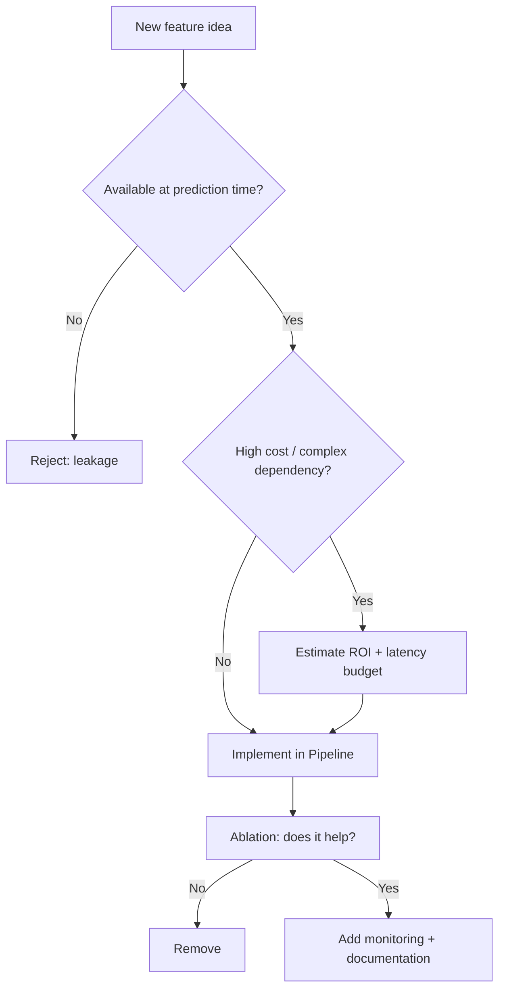

# Feature Engineering

## 1. Learning Objectives

By the end of this chapter, you should be able to:

- Explain why feature engineering often beats “just use a bigger model”
- Choose sensible defaults for missing values, categorical encoding, and scaling
- Create high-signal features from dates, interactions, ratios, bins, and aggregations
- Select features using correlation, mutual information, tree-based importance, and RFE (high level)
- Detect and prevent feature leakage (the most expensive silent failure in ML)
- Implement production-friendly feature engineering with `sklearn` Pipelines + `ColumnTransformer`
- Communicate feature engineering trade-offs clearly in interviews and real projects

---

## 2. Why Feature Engineering Matters

Better features often outperform more complex models because:

- **Models learn patterns from representations**, not raw reality.
- Good features can turn a hard nonlinear problem into an easy linear one.
- Many production failures are not “wrong model,” but “wrong signal.”

### Engineering intuition: features shape the search space

| Approach | What you’re optimizing | Typical outcome |
|---|---|---|
| Upgrade model complexity | “Try to learn a better function” | Often limited by noisy/insufficient signals |
| Improve features | “Give the model better inputs” | Usually larger, more reliable gains with better interpretability |

### When feature engineering matters most
- Tabular data (finance, marketing, ops): **huge impact**
- Time-dependent problems: **context and leakage risks dominate**
- Small-to-medium datasets: features matter more than deep learning capacity
- Highly imbalanced or rare-event tasks: features reduce false positives

### When it matters less (but still matters)
- End-to-end deep learning on raw images/audio (feature learning is integrated)
- Large language model embeddings (your “features” are often the embedding + lightweight transformations)

---

## 3. Missing Value Handling

Missingness is not a nuisance. It can be **signal** (e.g., “income missing” might correlate with risk).

### Common imputation strategies

| Strategy | What it is | Use when | Avoid when | Notes |
|---|---|---|---|---|
| Mean | Fill numeric with average | roughly symmetric numeric distributions | heavy skew/outliers | sensitive to outliers |
| Median | Fill numeric with median | skewed numeric distributions | when distribution is genuinely normal and clean | safer default than mean |
| Mode | Fill categorical with most common | categorical features with low cardinality | high cardinality with long-tail categories | can bias toward majority class |
| Constant value | Fill with sentinel (e.g., 0, -1, “Missing”) | missingness is meaningful and you want model to learn it | sentinel collides with valid values | great with tree models + missing indicator |
| KNN Imputer (intuition) | Fill using “similar rows” | missingness depends on other features and data is dense | high dimensionality, large datasets, mixed types | can be slow and leak info if not careful |

### Add missing indicators (often a power move)
If missingness itself may matter, add a boolean feature:

- `is_income_missing`
- `is_last_login_missing`

**Rule:** for many tabular problems, *Median + MissingIndicator* is a strong default.

### Imputation decision guide (fast)

| Situation | Recommended |
|---|---|
| Numeric, skewed/outliers | Median (optionally + indicator) |
| Numeric, clean-ish normal | Mean |
| Categorical | Most frequent or constant `"__MISSING__"` |
| Missingness likely meaningful | Constant sentinel + indicator |
| Complex dependency between features | Consider KNN imputer (benchmark; watch compute/leakage) |

---

## 4. Categorical Encoding

Encoding choice is primarily about:

- **model type**
- **cardinality**
- **leakage risk**
- **interpretability**

### Label Encoding
- Maps categories to integers: `red → 0`, `blue → 1`
- **Use when:** categories are truly ordinal *or* model is tree-based and you’ve validated it won’t treat ordering incorrectly (still risky)
- **Avoid when:** linear/logistic regression, distance-based models, neural nets without embeddings (imposes fake ordering)

### One-Hot Encoding
- Creates binary columns per category
- **Use when:** low/medium cardinality categories, linear models, logistic regression, and most baseline pipelines
- **Avoid when:** extremely high cardinality (memory blow-up, sparse explosion)
- **Engineering note:** use `handle_unknown="ignore"` for production safety.

### Ordinal Encoding
- Maps ordered categories to increasing integers (e.g., `S < M < L`)
- **Use when:** category has meaningful order (education level, size)
- **Avoid when:** order is not real (cities, device types)

### Target Encoding (concept)
- Replace category with an estimate of target mean for that category (with smoothing)
- **Use when:** high-cardinality categoricals where one-hot is too big and you have enough data
- **Avoid when:** done incorrectly (it’s a classic leakage vector)
- **Production note:** requires strict CV strategy; implement with care and monitoring.

### Encoding selection table

| Data + Model | Low cardinality | High cardinality |
|---|---|---|
| Linear / Logistic | One-hot | Target encoding (careful) or hashing trick |
| Tree-based (RF/GBM/XGBoost) | One-hot or ordinal (if safe) | Target encoding (careful) or count/frequency encoding |
| Distance-based (kNN, k-means) | One-hot (scaled) | Generally avoid raw categoricals; embed or engineer differently |

---

## 5. Feature Scaling

Scaling is not “always necessary.” It depends on your model family and feature distribution.

### StandardScaler
- Zero mean, unit variance
- **Use when:** linear models, SVMs, neural nets, kNN, PCA
- **Avoid when:** extreme outliers dominate scaling (use RobustScaler)

### MinMaxScaler
- Maps to [0, 1] (or custom range)
- **Use when:** bounded features, neural nets that benefit from small ranges, distance-based methods when you want uniform bounds
- **Avoid when:** outliers exist (they compress most values into a small range)

### RobustScaler
- Uses median and IQR
- **Use when:** heavy-tailed numeric distributions, outliers are common (transactions, revenue)
- **Avoid when:** you need a distribution that is closer to standardized normal for a specific method (rare)

### Scaling decision table

| Situation | Recommended scaler |
|---|---|
| Linear/logistic regression, SVM, kNN | StandardScaler |
| Lots of outliers | RobustScaler |
| Need bounded range for NN / custom scoring | MinMaxScaler |
| Tree models only | Often no scaling needed (but still helpful for mixed pipelines) |

---

## 6. Feature Creation

Feature creation is where most “real” improvement happens on tabular data.

### Date/time features
Turn timestamps into meaningful cycles and recency signals.

Common features:
- `day_of_week`, `is_weekend`
- `hour_of_day`
- `month`, `quarter`
- `days_since_last_event`
- `time_since_signup`

**Engineering tip:** for cyclical features (hour/day-of-week), consider sine/cosine encoding when the model is linear or distance-based.

### Interaction features
When “the combination matters more than each part.”

Examples:
- `price * quantity`
- `is_mobile * is_new_user`
- `country x device_type` (via combined category)

**Rule:** interactions help linear models most; tree models often learn them implicitly, but explicit interactions can still help under data scarcity.

### Ratios
Ratios remove scale and capture behavior.

Examples:
- `clicks / impressions` (CTR)
- `successful_logins / total_logins`
- `spend / sessions`

**Watch for:** divide-by-zero and leakage (ratios computed using future windows).

### Binning
Convert continuous variables into buckets.

Use cases:
- handling nonlinear effects for linear models
- reducing sensitivity to outliers
- easier interpretability (e.g., “age band”)

**Danger:** bins can lose information; use when interpretability or robustness matters.

### Aggregations (group-based features)
Often the highest ROI features in user/item/event data.

Examples:
- per user: `avg_order_value`, `orders_last_30d`, `unique_categories_last_90d`
- per merchant: `chargeback_rate`, `avg_shipping_delay`

**Production warning:** aggregations are the #1 place leakage sneaks in. Time windows must be strictly “past-only.”

---

## 7. Feature Selection

Feature selection is about:

- removing noise
- reducing cost/latency
- improving generalization
- improving interpretability

### Correlation (fast baseline)
- Remove highly correlated numeric features to reduce redundancy (especially helpful for linear models).
- Practical approach:
  - compute correlation matrix
  - drop one of any pair above a threshold (e.g., 0.95)

**Caveat:** correlation only finds linear redundancy.

### Mutual Information
- Measures dependency between feature and target (can detect nonlinear relationships).
- Good for quickly ranking features.

**Caveat:** needs enough data; can be noisy.

### Tree feature importance
- Train a tree-based model and use feature importances as a ranking signal.
- Often a practical reality check: “does this feature matter at all?”

**Caveat:** importances can be biased toward high-cardinality or high-variance features depending on the model.

### Recursive Feature Elimination (RFE) (high level)
- Fit a model, remove least important features, repeat.
- Useful when you must reduce features aggressively.

**Caveat:** expensive; use on smaller feature sets or after initial filtering.

### Practical selection strategy (common in industry)

| Step | Technique | Goal |
|---|---|---|
| 1 | Remove obvious junk | IDs, constants, leakage candidates |
| 2 | Correlation filter | Drop redundant numeric features |
| 3 | Mutual information / tree importance | Rank features and prune bottom tail |
| 4 | Validate with CV | Ensure pruning helps or is neutral |
| 5 | Lock schema | Stable features for production |

---

## 8. Feature Leakage

Feature leakage is when a feature contains information that would not be available at prediction time.

### What it looks like
- Training metrics look amazing
- Validation metrics look amazing (if leakage is also present there)
- Production performance collapses
- Or worse: performance looks fine but decisions are invalid (ethical/regulatory problems)

### Common leakage examples

| Leakage type | Example | Why it leaks |
|---|---|---|
| Future information | `delivered_on_time` used to predict shipping delay | it happens after the prediction moment |
| Post-outcome fields | “refund issued” used to predict fraud | refund is downstream of fraud decision |
| Aggregations using future window | `purchases_next_7d` or “rolling” computed incorrectly | includes future data relative to event time |
| Target encoding leakage | encoding category using full dataset target mean | leaks target into feature |
| Train-test contamination | scaling/encoding fit on full dataset before split | leaks distributional info from test |

### Prevention checklist
- Define a strict **prediction timestamp** per row: “what is known at this time?”
- Build features using **only past data** relative to that timestamp
- Use time-based splits when the problem is time-dependent
- Fit preprocessing only on train folds (`Pipeline` prevents this)
- For target encoding, use out-of-fold encoding only

---

## 9. sklearn Implementation (Practical)

### The production-safe pattern: Pipeline + ColumnTransformer

This structure prevents leakage and keeps preprocessing consistent.

```python
import numpy as np
import pandas as pd

from sklearn.compose import ColumnTransformer
from sklearn.impute import SimpleImputer
from sklearn.pipeline import Pipeline
from sklearn.preprocessing import OneHotEncoder, StandardScaler
from sklearn.linear_model import LogisticRegression

numeric_features = ["age", "income", "tenure_days"]
categorical_features = ["country", "device_type"]

numeric_pipeline = Pipeline(steps=[
    ("imputer", SimpleImputer(strategy="median", add_indicator=True)),
    ("scaler", StandardScaler()),
])

categorical_pipeline = Pipeline(steps=[
    ("imputer", SimpleImputer(strategy="most_frequent")),
    ("onehot", OneHotEncoder(handle_unknown="ignore", sparse_output=True)),
])

preprocess = ColumnTransformer(
    transformers=[
        ("num", numeric_pipeline, numeric_features),
        ("cat", categorical_pipeline, categorical_features),
    ],
    remainder="drop"
)

model = LogisticRegression(max_iter=200)

clf = Pipeline(steps=[
    ("preprocess", preprocess),
    ("model", model),
])

clf.fit(X_train, y_train)
y_pred = clf.predict(X_test)
```

### When you don’t need scaling
For tree-based models, you can simplify numeric pipeline:

```python
from sklearn.ensemble import RandomForestClassifier

numeric_pipeline = Pipeline(steps=[
    ("imputer", SimpleImputer(strategy="median", add_indicator=True)),
])

clf = Pipeline(steps=[
    ("preprocess", preprocess),
    ("model", RandomForestClassifier(random_state=42)),
])
```

### Mutual information for quick feature ranking (numeric-only example)

```python
from sklearn.feature_selection import mutual_info_classif

X_num = X_train[numeric_features].copy()
X_num = SimpleImputer(strategy="median").fit_transform(X_num)

mi = mutual_info_classif(X_num, y_train, random_state=42)
ranked = sorted(zip(numeric_features, mi), key=lambda x: x[1], reverse=True)
ranked[:10]
```

---

## 10. End-to-End Feature Engineering Workflow

```mermaid
flowchart TD
    A[Define prediction target + timestamp] --> B[Data split strategy]
    B --> C[EDA + schema validation]
    C --> D[Baseline features]
    D --> E[Missing value strategy]
    E --> F[Categorical encoding]
    F --> G[Scaling (if needed)]
    G --> H[Feature creation: dates/ratios/interactions/aggregations]
    H --> I[Feature selection + cost pruning]
    I --> J[Train with Pipeline]
    J --> K[Offline evaluation + leakage checks]
    K --> L[Deploy feature pipeline + model]
    L --> M[Monitor drift + feature health]
```

### Production mindset additions (often ignored)
- **Feature store / feature registry**: define feature ownership and reuse
- **Backfills**: can you compute features historically without future leakage?
- **Data contracts**: schema and ranges
- **Feature health checks**:
  - missing rate
  - unique category explosion
  - distribution drift (PSI/KL as appropriate in earlier chapters)

---

## 11. Common Mistakes

| Mistake | Why it hurts | Fix |
|---|---|---|
| Fitting scalers/encoders before split | leakage | use Pipeline |
| Label encoding non-ordinal categories for linear models | fake ordering | one-hot or target encoding (careful) |
| One-hot encoding very high cardinality | huge sparse matrix | target/frequency encoding, hashing, or reduce categories |
| Ignoring missingness as signal | lose predictive power | add missing indicator or sentinel values |
| Mixing training-time and inference-time data availability | silent leakage | enforce “as-of” timestamp feature generation |
| Creating ratio features without stability checks | division by zero, exploding values | clip, add epsilon, validate |
| Unbounded category growth in production | pipeline breaks / memory spikes | handle_unknown, category capping, “other” bucket |
| Agg features computed with future data | catastrophic leakage | time-windowed past-only aggregations |
| Over-engineering features early | wasted time | build baseline, then iterate with ablation |
| No feature cost budgeting | slow models, high latency | prune and prioritize features by ROI |

---

## 12. Rules of Thumb (20+)

1. Start with a baseline model and a minimal feature set, then iterate with ablations.
2. Better features usually beat a fancier model on tabular data.
3. Treat missingness as potential signal; consider missing indicators.
4. Median is a safer default than mean for numeric imputation.
5. Always use `handle_unknown="ignore"` for one-hot encoding in production.
6. Avoid label encoding for non-ordinal categories in linear/distance-based models.
7. For high-cardinality categoricals, one-hot is often a trap—consider target/frequency encoding or hashing.
8. Scaling is mandatory for SVM/kNN/linear models; often optional for trees.
9. RobustScaler is a strong default when outliers are common.
10. Date features (recency + seasonality) are often the highest ROI in time-based problems.
11. Aggregations are powerful but are the #1 source of leakage—use strict time windows.
12. Every feature must answer: “Will I have this at inference time?”
13. Document the feature’s definition, freshness, and source tables (feature contracts).
14. Use interaction features when linear models underfit and you suspect combinations matter.
15. Ratio features are great for normalization, but must handle zero denominators and extreme values.
16. If a feature’s distribution changes drastically in production, treat it as an incident.
17. Feature selection should include cost: compute time, latency, and data dependencies.
18. Correlation filtering is a cheap, effective step for linear models and stability.
19. Tree feature importance is a heuristic, not ground truth—validate with CV.
20. If a model’s performance seems “too good to be true,” suspect leakage first.
21. Prefer Pipeline/ColumnTransformer to prevent preprocessing drift and leakage.
22. Keep category vocabularies under control (“other” bucket, top-N categories).
23. Avoid using IDs directly unless transformed (counts, embeddings, or learned representations).
24. Treat feature engineering as part of the product: monitor, version, and own it.

---

## 13. Real-World Examples

### Example A: Customer churn prediction
High-ROI features:
- recency: `days_since_last_login`, `days_since_last_purchase`
- engagement: `sessions_last_7d`, `avg_session_length`
- trend: `sessions_last_7d / sessions_prev_7d`
- support: `tickets_last_30d`, `ticket_resolution_time_avg`

Leakage trap:
- using “cancellation requested” as a churn predictor (it’s basically the outcome)

### Example B: Fraud detection (transactions)
High-ROI features:
- velocity: `tx_count_last_10m`, `tx_amount_sum_last_1h`
- device consistency: `unique_devices_last_7d`
- geo inconsistency: `distance_from_last_tx`, `country_change_flag`
- risk ratios: `chargeback_rate_per_merchant`

Leakage trap:
- using “chargeback issued” or “manual review decision” as input

### Example C: Demand forecasting (contextual)
High-ROI features:
- calendar: weekday, holiday flags, seasonality
- rolling stats: last 7/14/28 day rolling mean (past-only)
- price/promo interactions

Leakage trap:
- using future promo schedule unless it is truly known at forecast time

### Example D: Credit risk
High-ROI features:
- debt-to-income ratio
- utilization rate trends
- delinquency counts in past windows

Leakage trap:
- post-approval outcomes inadvertently included in features

---

## 14. Interview Questions (No Answers)

1. Why does feature engineering often improve performance more than switching models?
2. How do you prevent leakage when creating time-window aggregation features?
3. When would you use mean vs median imputation?
4. When is it beneficial to add missing value indicators?
5. Compare one-hot encoding vs ordinal encoding vs label encoding.
6. Why is label encoding dangerous for nominal categories with linear models?
7. How would you handle a categorical feature with 100k unique values?
8. What does `handle_unknown="ignore"` do, and why is it important?
9. When do you need feature scaling? Give examples of model families.
10. Compare StandardScaler, MinMaxScaler, and RobustScaler.
11. What are interaction features and when do they help?
12. What are ratio features and what edge cases must you handle?
13. How would you engineer features from timestamps?
14. What is target encoding, and why is it a leakage risk?
15. How can you do feature selection without overfitting?
16. What is mutual information and why might it be useful for feature ranking?
17. Why can tree feature importances be misleading?
18. How do you decide whether a feature is worth the production cost?
19. What feature health metrics would you monitor in production?
20. If offline metrics are extremely high, what are the first things you check?

---

## 15. Myth vs Reality

| Myth | Reality |
|---|---|
| “Deep learning removes the need for feature engineering” | For tabular and time-dependent systems, feature engineering is still decisive |
| “Missing values should always be dropped” | Dropping can lose signal and reduce data; imputation + indicators often wins |
| “One-hot encoding is always safe” | It can explode memory and overfit on high cardinality |
| “Scaling always helps” | Trees often don’t need scaling; scaling can even harm interpretability in some contexts |
| “More features always improves performance” | More features can add noise, cost, leakage risk, and instability |
| “AUC improved so the feature is good” | Might be leakage; always validate data availability and time consistency |

---

## 16. Decision Guide

### Missing values
- Numeric skewed/outliers → **median + indicator**
- Categorical → **most frequent** or **constant `"__MISSING__"`**
- Complex dependency & smaller dataset → consider **KNN imputer** (benchmark)

### Categorical encoding
- Low cardinality → **one-hot**
- True order → **ordinal**
- Very high cardinality → **target/frequency/hashing** (with leakage protections)
- If you need production robustness → always plan for **unknown categories**

### Scaling
- Linear/SVM/kNN/PCA → **StandardScaler** (or RobustScaler if outliers)
- Neural nets → Standard or MinMax depending on architecture and features
- Tree-only pipelines → scaling optional

### Feature creation
- Time-based problems → invest early in **recency/seasonality/rolling aggregations**
- User/item systems → **group-based aggregations** are often the biggest win (but guard against leakage)



---

## 17. Chapter Summary

- Feature engineering often drives larger gains than model complexity on tabular and time-dependent problems.
- Missing values: choose imputation strategy based on distribution + whether missingness is signal; consider missing indicators.
- Categorical encoding: one-hot for low cardinality, ordinal for ordered categories, target encoding carefully for high cardinality.
- Scaling: required for many model families; choose Standard/MinMax/Robust based on distribution and outliers.
- Feature creation: date features, interactions, ratios, bins, and especially time-windowed aggregations (with strict past-only logic).
- Feature selection: start simple (correlation), then use MI/tree importance; validate via CV and consider production cost.
- Leakage prevention is non-negotiable: enforce prediction-time availability, use Pipelines, and be strict with time windows.

---

## 18. Interview Cheat Sheet

| Topic | Key line |
|---|---|
| Why features matter | “Models learn from representation; better features reduce the learning burden.” |
| Missing values default | “Median + missing indicator is a strong numeric default; categorical often most-frequent or ‘Missing’ token.” |
| Encoding default | “One-hot for low cardinality; be careful with label encoding; target encoding needs leakage-safe CV.” |
| Scaling | “Needed for linear/SVM/kNN; often optional for trees; RobustScaler for outliers.” |
| Leakage | “Anything not available at prediction time is leakage; aggregations and target encodings are the usual culprits.” |
| Production | “Use Pipeline + ColumnTransformer; version features; monitor drift and missing rates.” |

---

## 19. Quick Revision

- Better features often beat more complex models on tabular problems.
- Missing values:
  - numeric: median (often) + indicator
  - categorical: most frequent or `"__MISSING__"`
- Encoding:
  - one-hot for low cardinality
  - ordinal only for true order
  - target encoding for high cardinality (leakage-safe)
- Scaling:
  - StandardScaler for linear/SVM/kNN
  - RobustScaler for outliers
  - MinMax when bounded range is helpful
- Feature creation:
  - timestamps → recency + seasonality
  - ratios + interactions → capture behavior and nonlinearity
  - aggregations → high ROI but highest leakage risk
- Leakage: if you wouldn’t know it at prediction time, you can’t use it.
- Production: Pipeline + ColumnTransformer, feature contracts, drift + health monitoring.