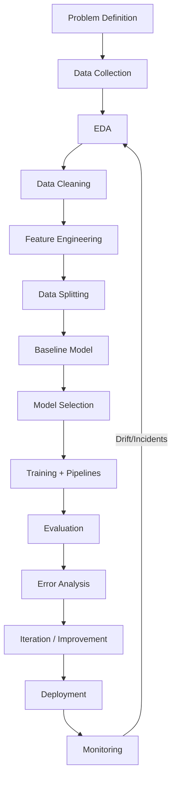
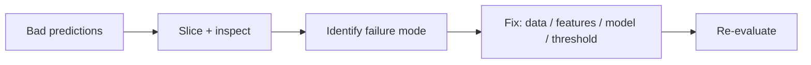

# Machine Learning Workflow

## 1. Learning Objectives

By the end of this chapter, you should be able to:

- Run an end-to-end ML project with a clear, repeatable workflow
- Define the problem in a way that prevents wasted modeling work
- Choose appropriate data splits and cross-validation strategies
- Build training pipelines that prevent leakage and support reproducibility
- Evaluate models beyond a single metric via error analysis and iterative improvement
- Save, version, and deploy models safely (high-level), then monitor them in production (conceptual)
- Communicate the workflow clearly in interviews and system design discussions

---

## 2. What an End-to-End ML Workflow Looks Like

A production-minded workflow is not “train model → deploy.” It’s a loop:

- define the problem precisely
- build a reliable data pipeline
- establish baselines
- iterate systematically
- deploy with safety rails
- monitor and improve continuously



**Engineering principle:** your workflow should be **repeatable**, **auditable**, and **resilient to change** (new data, new categories, new users, new seasonality).

---

## 3. Problem Definition

This is the most leveraged step. Most “ML failures” are actually problem definition failures.

### The minimum spec for an ML problem

| Item | What to write down | Why it matters |
|---|---|---|
| Objective | what decision will the model improve? | aligns ML with product/business |
| Target | what exactly is being predicted? | prevents label ambiguity |
| Unit of prediction | per user? per transaction? per session? | defines dataset rows |
| Prediction time | what is known at inference time? | prevents leakage |
| Horizon | predict next hour/day/week? | changes features and evaluation |
| Constraints | latency, cost, interpretability | determines model family |
| Success metrics | offline + online | prevents optimizing wrong metric |
| Baseline | current rule/system | sets value bar |

### Questions engineers ask early
- What is the **cost of false positives vs false negatives**?
- Do we need **probabilities** or just labels/rankings?
- Will the decision be automated or **human-in-the-loop**?
- How often does the model need retraining?
- Is the label stable or delayed (e.g., fraud confirmed weeks later)?

**Interview-ready phrasing:**
> “Before modeling, I define the prediction timestamp and ensure every feature is available at that moment. That’s how I prevent leakage and build something deployable.”

---

## 4. Data Collection

You can’t ML your way out of missing signal. Data collection is about building the right dataset and the right contracts.

### Data sources
- product events (clicks, sessions)
- transactional databases
- logs
- sensors / IoT
- third-party enrichment

### Production data needs engineering
| Concern | What to do |
|---|---|
| Schema stability | enforce schemas, validate types/ranges |
| Data freshness | define SLAs, detect pipeline delays |
| Backfills | support historical recomputation |
| Join correctness | ensure stable keys + time-aware joins |
| Label reliability | understand when labels become final |

**Practical rule:** build datasets with a **single row definition** (unit of prediction) and a **single prediction timestamp**.

---

## 5. Exploratory Data Analysis (EDA)

EDA is not “pretty charts.” It’s risk discovery.

### EDA checklist (production-minded)
- Missingness rates (overall and per segment)
- Feature distributions (skew, outliers)
- Category cardinality (and growth over time)
- Label distribution (and stability over time)
- Feature/label correlations (spot leakage candidates)
- Train vs future distribution shift (time plots if applicable)

**Output of good EDA:**
- a list of data issues to fix
- a shortlist of promising feature directions
- early leakage warnings
- a baseline expectation of achievable performance

---

## 6. Data Cleaning

Cleaning is about making training data match production reality.

### Common cleaning operations
- type casting and schema enforcement
- deduplication
- invalid-value handling (negative ages, impossible timestamps)
- outlier treatment (clip/winsorize, remove, or model robustly)
- consistent handling of missing values (don’t ad-hoc fill differently in train vs inference)

### Strong engineering practice: data validation gates
- fail fast when distributions/schemas are broken
- log metrics (missing rates, cardinality, min/max ranges)

---

## 7. Feature Engineering

Feature engineering is a workflow phase, not a one-time step.

Typical sequence:
- start with safe, low-leakage baseline features
- add high ROI families (time features, aggregations, ratios)
- track each feature’s incremental value (ablation)

**Production additions:**
- feature definitions (contracts)
- feature freshness requirements
- feature store vs pipeline ownership
- monitoring for feature drift and missingness

(Feature engineering details are covered in the dedicated chapter; here it’s about where it fits in workflow.)

---

## 8. Data Splitting (Train / Validation / Test)

Splitting isn’t just “random 80/20.” It encodes your assumptions about how the model will be used.

### Roles of each split

| Split | Purpose | Rules |
|---|---|---|
| Train | fit model parameters | can be large; used for learning |
| Validation | tune hyperparameters / choose model | must reflect deployment conditions |
| Test | final unbiased estimate | used once at the end; no tuning on it |

### Choosing the right split strategy

| Scenario | Recommended split | Why |
|---|---|---|
| IID tabular classification/regression | random split (stratified if needed) | simplest, matches IID assumption |
| Time-dependent prediction | time-based split | prevents look-ahead leakage |
| User-based personalization | group split by user | prevents same-user leakage |
| Multiple records per entity | GroupKFold / GroupShuffleSplit | avoids near-duplicate leakage |

**Engineering rule:** if the same entity can appear multiple times, random splitting often leaks entity identity.

---

## 9. Cross Validation (Revision)

Cross-validation (CV) is how you get a robust performance estimate and avoid overfitting hyperparameters to a lucky split.

### Practical CV types
| CV type | Use when | Notes |
|---|---|---|
| K-Fold | general IID datasets | stable estimate, moderate compute |
| Stratified K-Fold | classification with imbalance | preserves label proportions per fold |
| Group K-Fold | repeated entities (user/item) | prevents entity leakage |
| TimeSeriesSplit | time-ordered data | preserves temporal causality |

### CV in real projects
- CV is often used during research/iteration.
- For production, you often finalize with:
  - time-based holdout (recent period)
  - plus some CV during development if data is IID enough.

**Rule:** your validation strategy must mirror your deployment scenario.

---

## 10. Model Selection

Model selection should be a structured decision, not a popularity contest.

### Model selection checklist
- latency constraints
- interpretability requirements
- training data size
- feature types and sparsity
- calibration/probability needs
- maintenance complexity

### Practical selection strategy
1. start with a simple baseline (logistic regression / linear regression)
2. add a strong tabular baseline (tree ensembles)
3. only then consider heavier models (deep learning) if justified

**Engineering principle:** choose the simplest model that meets requirements reliably.

---

## 11. Model Training

Training is a controlled experiment.

### Training best practices
- fixed random seeds where applicable
- consistent preprocessing via Pipeline
- clear experiment tracking:
  - dataset version
  - feature set version
  - model config
  - metrics
- avoid training on the test set indirectly (hyperparameter search leakage)

### Fit time vs inference time
- Many systems can afford heavy training offline but require low latency inference.
- This affects feature choices (expensive features may be fine offline but not in real-time).

---

## 12. Model Evaluation

Evaluation is more than picking one metric.

### Evaluation layers
1. **Offline metrics** (AUC, F1, RMSE, etc., depending on task)
2. **Operational metrics** (latency, throughput, cost)
3. **Business metrics** (fraud dollars saved, churn reduced)
4. **Fairness/safety** where applicable (domain-dependent)

### Evaluation checklist
- metrics across segments (country/device/tenure)
- confidence calibration (if probabilities used for thresholds)
- stability across time windows (if time-based)

**Rule:** if performance varies massively across segments, you have a product risk even if average looks good.

---

## 13. Error Analysis

Error analysis is how you turn metrics into action.

### Practical error analysis workflow
- slice by segments (user cohorts, geography, device)
- inspect top false positives and false negatives
- categorize failure modes:
  - data quality errors
  - missing features
  - label noise
  - edge cases (rare but important)
- translate into fixes:
  - new features
  - better cleaning
  - threshold adjustments
  - model change



**Engineering note:** many improvements come from fixing one dominant failure mode rather than tweaking the model.

---

## 14. Model Improvement

A repeatable improvement loop beats random tweaking.

### Common improvement levers
- better labels (reduce noise, align definition)
- better features (especially time/aggregations)
- better splitting strategy (fix leakage and evaluation realism)
- hyperparameter tuning (after feature baseline)
- threshold tuning (if decision is threshold-based)
- ensemble or model family change (only if needed)

**Rule:** prioritize improvements by expected ROI and engineering cost.

---

## 15. Pipelines (sklearn)

Pipelines make preprocessing + modeling consistent, reproducible, and leak-resistant.

### Why Pipelines matter
- ensure preprocessing is fit only on training data
- make inference consistent with training
- enable cross-validation with correct preprocessing behavior
- simplify saving/loading a single artifact

### Basic structure

- `Pipeline(steps=[("preprocess", ...), ("model", ...)])`
- Often combined with `ColumnTransformer` for mixed feature types.

```python
from sklearn.compose import ColumnTransformer
from sklearn.pipeline import Pipeline
from sklearn.preprocessing import OneHotEncoder, StandardScaler
from sklearn.impute import SimpleImputer
from sklearn.linear_model import LogisticRegression

num_features = ["age", "tenure_days"]
cat_features = ["country", "device_type"]

num_pipe = Pipeline([
    ("imputer", SimpleImputer(strategy="median", add_indicator=True)),
    ("scaler", StandardScaler()),
])

cat_pipe = Pipeline([
    ("imputer", SimpleImputer(strategy="most_frequent")),
    ("onehot", OneHotEncoder(handle_unknown="ignore", sparse_output=True)),
])

preprocess = ColumnTransformer([
    ("num", num_pipe, num_features),
    ("cat", cat_pipe, cat_features),
])

clf = Pipeline([
    ("preprocess", preprocess),
    ("model", LogisticRegression(max_iter=200)),
])

clf.fit(X_train, y_train)
```

**Production tip:** treat the pipeline as the model. Save/load the pipeline, not just the estimator.

---

## 16. Data Leakage

Leakage is when training uses information not available at prediction time.

### Common leakage sources
- preprocessing fit on full dataset (scaler/encoder before split)
- time leakage (future events included in features)
- target encoding computed using full dataset
- entity leakage (same user in train and test)

### Prevention
- strict prediction timestamp per row
- time-aware joins and aggregation windows
- group/time splits when needed
- Pipelines so preprocessing is fit only on training folds

**Rule:** if offline performance is “too good,” suspect leakage before celebrating.

---

## 17. Reproducibility

Reproducibility is required for debugging, auditing, and reliable iteration.

### What to version
- code commit hash
- dataset snapshot ID (or query + timestamp + immutable source)
- feature definitions/schema version
- random seeds
- model hyperparameters
- training environment (python/sklearn versions)

### Reproducibility checklist
- set `random_state` where applicable
- deterministic data splits
- freeze dependencies (lockfile/requirements)
- log everything needed to rerun training

---

## 18. Saving Models (pickle / joblib)

### `pickle`
- Python’s built-in object serialization
- Works, but can be slower/larger for numpy-heavy objects

### `joblib`
- Common in sklearn ecosystem
- Better for large numpy arrays (more efficient storage)
- Typical default choice for sklearn pipelines

**Key production caveats (both):**
- Not secure against untrusted inputs (never unpickle unknown files)
- Not stable across major library version changes unless you manage versions carefully
- Best used for **internal artifacts** with strict versioning

```python
import joblib

joblib.dump(clf, "model_pipeline.joblib")
loaded = joblib.load("model_pipeline.joblib")
pred = loaded.predict(X_new)
```

**Rule:** save the full pipeline (preprocess + model) to avoid train/inference skew.

---

## 19. Deployment Overview (High Level)

Deployment is about reliably producing predictions where they’re needed.

Common deployment patterns:
- **Batch scoring** (daily/hourly jobs): easiest, common for churn, segmentation, risk scoring
- **Online inference** (real-time API): needed for fraud blocking, personalization, realtime ranking
- **Streaming** (near-real-time): for monitoring and event-based scoring

High-level responsibilities:
- package model + preprocessing
- define input schema contract
- provide fallbacks for missing/unknown categories
- ensure latency and cost constraints
- roll out safely (shadow mode, canary, A/B)

---

## 20. Monitoring (Conceptual)

A deployed model is a living system.

Monitor:
- **data quality:** missing rate, schema changes, category explosions
- **feature drift:** distribution shifts
- **prediction drift:** score distributions changing
- **performance drift:** if labels arrive later, measure delayed ground truth
- **operational metrics:** latency, error rates, throughput
- **business KPIs:** the real objective (fraud losses, conversions, churn)

**Rule:** most production ML incidents start as data issues, not model issues.

---

## 21. End-to-End Production Workflow Diagram

```mermaid
flowchart TD
    A[Define problem + target + timestamp] --> B[Ingest data]
    B --> C[Validate schema + quality checks]
    C --> D[Build training dataset (past-only joins)]
    D --> E[Train/Val/Test split strategy]
    E --> F[Pipeline: preprocess + model]
    F --> G[Offline eval + error analysis]
    G --> H{Meets success criteria?}
    H -->|No| I[Iterate: features/labels/model]
    I --> F
    H -->|Yes| J[Package artifact: pipeline + metadata]
    J --> K[Deploy: batch/API/stream]
    K --> L[Monitor: data/feature/prediction/perf]
    L --> M{Drift/Incident?}
    M -->|Yes| N[Retrain/rollback/threshold update]
    M -->|No| L
```

---

## 22. Common Mistakes

| Mistake | Why it fails in production | Fix |
|---|---|---|
| Starting with complex models before a baseline | no reference point; wasted time | build baseline first |
| Random split on time-dependent data | look-ahead leakage | time-based split |
| Preprocessing outside Pipeline | leakage + train/inference skew | use Pipeline |
| Tuning on test set | invalid final estimate | keep test sacred |
| Optimizing only one metric | misses business/operational constraints | evaluate multi-dimensionally |
| Ignoring error analysis | blind iteration | inspect failures, slice metrics |
| No versioning | can’t reproduce results | log dataset/code/env |
| Deploying without monitoring | silent degradation | monitor data + drift |
| Treating model as the product | ignores pipeline + ops | build system, not just model |
| Not planning for unknown categories/missing fields | runtime failures | robust encoders + defaults |

---

## 23. Rules of Thumb (20+)

1. Define the prediction timestamp first; everything else follows.
2. Establish a baseline before trying advanced models.
3. Split data in a way that matches deployment (time/group/IID).
4. Keep the test set sacred—use it once.
5. Use Pipelines to prevent leakage and train/inference skew.
6. Log dataset version, code version, and parameters for every run.
7. If performance is “too good,” suspect leakage.
8. Do EDA to find risks, not to make pretty charts.
9. Validate schema and data quality as a gate, not an afterthought.
10. Feature engineering often yields larger gains than model complexity.
11. Error analysis beats random hyperparameter tweaking.
12. Evaluate across segments; averages can hide disasters.
13. Consider operational constraints (latency/cost) during model selection.
14. Prefer simpler models when they meet requirements.
15. Use cross-validation where it reflects reality; don’t force CV on time series incorrectly.
16. Save and deploy the whole preprocessing+model pipeline.
17. Use shadow mode or canary releases for safe rollout.
18. Monitor data drift and feature health continuously.
19. Plan for retraining cadence and label delays.
20. Align thresholds with business costs, not just metrics.
21. Build feedback loops (human review outcomes, incident tags).
22. Treat ML systems as software: tests, CI, code review, documentation.

---

## 24. Interview Questions (No Answers)

1. Walk me through an end-to-end ML workflow from problem definition to monitoring.
2. How do you define the prediction timestamp and why is it important?
3. How do you choose a train/validation/test split strategy?
4. When would you use a time-based split vs random split?
5. What is data leakage and what are common sources?
6. How do sklearn Pipelines help prevent leakage?
7. What’s the purpose of a validation set vs a test set?
8. How does cross-validation work and when would you avoid it?
9. How do you choose evaluation metrics for a model?
10. What does good error analysis look like?
11. How do you improve a model systematically?
12. How do you handle high-cardinality categorical features in production?
13. What do you log to ensure reproducibility?
14. What model artifact do you save and why?
15. Compare pickle vs joblib for saving sklearn models.
16. What deployment patterns exist for ML models?
17. What are the most important things to monitor after deployment?
18. How do you detect and respond to concept drift?
19. How would you roll out a model safely without hurting users?
20. If production performance drops, what are your first debugging steps?

---

## 25. Chapter Summary

- A production ML workflow is a loop: define → collect → validate → build features → split correctly → baseline → select/train → evaluate → error analysis → iterate → deploy → monitor.
- Problem definition and prediction timestamp prevent wasted work and leakage.
- Data splitting must mirror deployment; group/time splits prevent silent leakage.
- Pipelines enforce consistent preprocessing and reduce train/inference skew.
- Reproducibility requires versioning code/data/features/env and controlling randomness.
- Deployment is high-level packaging and integration; monitoring is continuous defense against drift and data issues.

---

## 26. Interview Cheat Sheet

| Theme | Key points to hit |
|---|---|
| Workflow | “I start with problem definition and prediction timestamp, build baselines, iterate via error analysis, deploy with monitoring.” |
| Splits | “Use IID random split only when IID is true; otherwise time/group splits to prevent leakage.” |
| Pipelines | “Pipelines ensure preprocessing is fit only on train folds and is identical at inference.” |
| Leakage | “Most common: preprocessing before split, time leakage in aggregations, entity leakage.” |
| Reproducibility | “Version dataset/code/features, set random states, log configs, freeze dependencies.” |
| Production | “Batch vs online vs streaming; safe rollout via shadow/canary; monitor drift and data quality.” |

---

## 27. Quick Revision

- ML workflow is an iterative loop, not a linear checklist.
- Define: target, unit of prediction, prediction timestamp, horizon, success metrics.
- Data: collect with schema contracts; validate quality.
- EDA: find risks (missingness, cardinality, drift, leakage candidates).
- Clean + engineer features; prevent leakage (past-only windows, Pipelines).
- Split correctly: train/val/test; use time/group splits when needed.
- Use CV appropriately; don’t misuse it on time series.
- Evaluate broadly + do error analysis; iterate systematically.
- Save the full pipeline (preprocess + model) with `joblib` typically.
- Deploy (batch/API/stream) with safe rollout; monitor data/feature/prediction drift and operational KPIs.