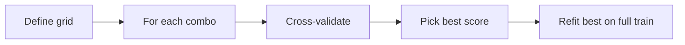
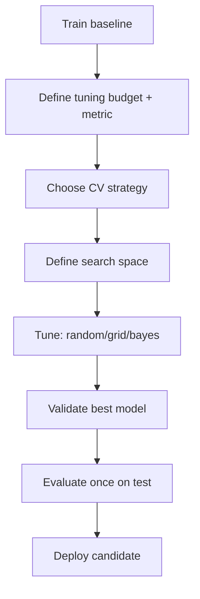
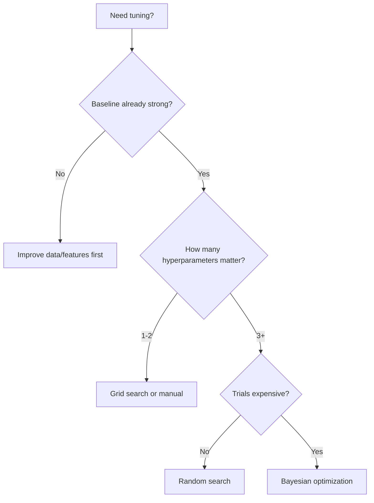

# Hyperparameter Tuning

## 1. Learning Objectives

By the end of this chapter, you should be able to:

- Clearly distinguish **model parameters** vs **hyperparameters**
- Explain when hyperparameter tuning matters and when it’s wasted effort
- Choose between **manual search**, **grid search**, **random search**, and **Bayesian optimization** (conceptually)
- Use cross-validation correctly during tuning without leaking test data
- Implement tuning with `GridSearchCV` and `RandomizedSearchCV` in sklearn
- Design sensible search spaces and manage compute cost, parallelization, and reproducibility
- Answer hyperparameter tuning interview questions with a production mindset

---

## 2. Parameters vs Hyperparameters

**Parameters** are learned from data during training.  
**Hyperparameters** are set by you and control *how* learning happens or the model’s capacity/regularization.

| Concept | Examples | Learned from data? | Where it lives |
|---|---|---:|---|
| Parameters | linear model weights, tree splits, neural net weights | Yes | `fit()` |
| Hyperparameters | `C` in logistic regression, `max_depth` in trees, `n_estimators` | No | constructor/config |

**Engineering framing:** hyperparameters are “knobs” you tune to balance:

- bias vs variance
- underfitting vs overfitting
- accuracy vs latency/cost
- stability vs flexibility

---

## 3. Why Hyperparameter Tuning Matters

Hyperparameter tuning matters when:

- your baseline model is close but not good enough
- the model family is sensitive to configuration (SVMs, boosting, neural nets)
- your metric is threshold-sensitive (e.g., precision at top-k)
- you’re optimizing for generalization, not just training score

It matters less when:

- the feature set is weak (feature engineering will help more)
- the dataset is tiny and variance dominates (tuning may overfit)
- the model is relatively robust to defaults (some linear baselines, some tree baselines)

### Engineering intuition: tuning is marginal gains after fundamentals

| Phase | Typical ROI |
|---|---|
| Problem definition, leakage prevention, correct splits | Massive |
| Feature engineering, data quality fixes | Large |
| Model family choice | Medium–Large |
| Hyperparameter tuning | Medium (sometimes large, often moderate) |
| Micro-tuning tiny knobs | Low |

**Rule:** don’t tune hyperparameters to compensate for data leakage, wrong splits, or broken labels.

---

## 4. Manual Search

Manual tuning is the default early in projects and in many real systems (especially when compute is limited).

### Advantages
- Builds intuition: you learn what matters
- Fast iteration on a few high-impact knobs
- Easy to incorporate domain constraints (latency, interpretability)
- Works well when you already know reasonable ranges

### Disadvantages
- Not systematic; easy to miss good regions
- Hard to reproduce and justify to others
- Can lead to “tuning by vibes” and overfitting to validation quirks
- Doesn’t scale to many hyperparameters

**Best use:** early-stage prototyping, narrowing ranges before automated search.

---

## 5. Grid Search

### Intuition
Grid search tries **every combination** of a predefined set of hyperparameter values.

### Workflow
1. Choose parameter grid (discrete values)
2. Train/evaluate each combo (often with cross-validation)
3. Pick the best based on chosen metric
4. Refit the best model on full training data



### Advantages
- Simple, deterministic, easy to explain
- Good when you have **1–2** hyperparameters and small candidate sets
- Great for teaching and debugging

### Disadvantages
- Explodes combinatorially (“curse of dimensionality” of tuning)
- Wastes compute evaluating unimportant dimensions at the same resolution
- Often misses good values between grid points

**Engineering rule:** grid search is rarely the best default for >2 important hyperparameters.

---

## 6. Random Search

### Why it often outperforms grid search
In many models, only a few hyperparameters really matter. Random search samples broadly and is more likely to find a good region quickly than a dense grid over many dimensions.

**Key idea:** with the same budget of trials, random search explores more unique values of each hyperparameter.

| Search type | What it does | Why it can win |
|---|---|---|
| Grid search | enumerates fixed combinations | wastes trials on unimportant parameters |
| Random search | samples combinations from distributions | covers more of the space, finds good regions faster |

### When to use random search
- You have 3+ hyperparameters
- You can define reasonable ranges/distributions
- You have a strict compute budget
- You want strong results quickly

**Practical note:** random search quality depends heavily on defining good ranges.

---

## 7. Bayesian Optimization (Concept Only)

Bayesian optimization is an adaptive search strategy:

- It builds a lightweight model of “hyperparameters → score”
- It uses past trials to choose the next most promising trial
- It balances:
  - exploration (try uncertain regions)
  - exploitation (try likely good regions)

**When it’s worth it:**
- each trial is expensive (large models, long training)
- you have a limited number of trials
- you want better sample-efficiency than random search

**When it’s not worth it:**
- trials are cheap (random search is fine)
- you can’t trust noisy metrics (high variance CV) without careful handling
- you don’t have good tooling in your stack

(Implementation often uses libraries like Optuna, Hyperopt, scikit-optimize; keep it in mind for larger systems.)

---

## 8. Cross Validation in Tuning

Tuning without cross-validation is risky if your performance depends strongly on the split.

### Why CV is used in tuning
- reduces luck from one validation split
- gives a more stable estimate of generalization
- helps avoid overfitting hyperparameters to a single split

### Which CV strategy to use
Use the CV strategy that matches deployment reality:

| Data type | CV choice |
|---|---|
| IID classification | StratifiedKFold |
| IID regression | KFold |
| Repeated entities | GroupKFold |
| Time series | TimeSeriesSplit |

**Rule:** CV does not automatically fix leakage. If your feature pipeline leaks, CV will leak too.

### Nested CV (concept)
- Inner loop: hyperparameter tuning
- Outer loop: final performance estimate

Usually too expensive for production pipelines, but interviewers may ask. Practical alternative: tune on CV, then evaluate once on a clean test set.

---

## 9. sklearn Implementation

### `GridSearchCV`

- Exhaustive search over a discrete grid
- Best when the grid is small

```python
from sklearn.model_selection import GridSearchCV
from sklearn.pipeline import Pipeline
from sklearn.preprocessing import StandardScaler
from sklearn.linear_model import LogisticRegression

pipe = Pipeline([
    ("scaler", StandardScaler()),
    ("model", LogisticRegression(max_iter=500))
])

param_grid = {
    "model__C": [0.01, 0.1, 1.0, 10.0],
    "model__penalty": ["l2"],
    "model__solver": ["lbfgs"],
}

search = GridSearchCV(
    estimator=pipe,
    param_grid=param_grid,
    scoring="roc_auc",
    cv=5,
    n_jobs=-1,
    refit=True,
    return_train_score=True
)

search.fit(X_train, y_train)

print(search.best_params_)
print(search.best_score_)
best_model = search.best_estimator_
```

### `RandomizedSearchCV`

- Samples parameter combinations from distributions
- Preferable for larger spaces

```python
from sklearn.model_selection import RandomizedSearchCV
from scipy.stats import loguniform
from sklearn.ensemble import RandomForestClassifier

rf = RandomForestClassifier(random_state=42)

param_distributions = {
    "n_estimators": [200, 400, 800],
    "max_depth": [None, 5, 10, 20],
    "min_samples_split": [2, 5, 10],
    "min_samples_leaf": [1, 2, 4],
    "max_features": ["sqrt", "log2", None],
}

search = RandomizedSearchCV(
    estimator=rf,
    param_distributions=param_distributions,
    n_iter=30,              # compute budget
    scoring="f1",
    cv=5,
    random_state=42,
    n_jobs=-1,
    refit=True
)

search.fit(X_train, y_train)
print(search.best_params_)
best_model = search.best_estimator_
```

### Key engineering tips for sklearn tuning
- Always tune **inside a Pipeline** so preprocessing is included and leak-free.
- Use the `model__param` naming convention to tune inside pipelines.
- Use `refit=True` to automatically retrain on the full training set using best params.
- Store `search.cv_results_` for debugging and audit.

---

## 10. Choosing Search Spaces

Search space design matters more than the search algorithm.

### What to tune first (common priority)
- Regularization (`C`, `alpha`, `lambda`)
- Tree depth/leaf sizes (`max_depth`, `min_samples_leaf`)
- Number of estimators (`n_estimators`)
- Learning rates / shrinkage (boosting)
- Class weights / decision thresholds (if applicable in earlier chapters)

### Use the right scale
Some parameters behave multiplicatively, not additively.

| Parameter type | Example | Better sampling |
|---|---|---|
| Multiplicative scale | `C`, learning rate | log scale (e.g., `1e-4` to `1e2`) |
| Additive/ordinal | depth, min_samples | discrete/int ranges |

**Rule:** for regularization and learning rates, search on a log scale.

### Use conditional logic mentally (sklearn won’t enforce it)
Some hyperparameters only matter when others take certain values (e.g., solver/penalty in logistic regression). Avoid generating invalid combos.

### Start wide, then zoom in
Two-phase tuning is often best:

1. coarse random search across a wide range
2. narrow search around the best region

---

## 11. Computational Cost

Hyperparameter tuning cost is roughly:

> (number of trials) × (CV folds) × (training time per model)

This can get expensive quickly.

### Cost management levers
- reduce `n_iter` (random search trials)
- reduce folds (e.g., 5 → 3) during early exploration
- use a smaller training subset for coarse tuning (then confirm on full data)
- early-stopping-capable models (if available in your stack)
- tune only the few hyperparameters that matter

**Engineering rule:** tune with a budget and stop when improvements become marginal.

---

## 12. Parallelization

Parallelization is how you make tuning practical.

### What `n_jobs=-1` does
- uses all available CPU cores (in sklearn)
- can speed up CV/trials significantly

### When parallelization doesn’t help much
- when training is already multi-threaded (some models)
- when you’re memory-bound (large datasets, huge sparse matrices)
- when you hit I/O bottlenecks

### Practical advice
- parallelize across trials/folds, but monitor memory
- on shared machines, cap jobs to avoid taking down teammates’ workloads
- reproducibility: set `random_state` in estimators and in `RandomizedSearchCV`

---

## 13. Practical Workflow



**Key workflow rules:**
- The test set is for final evaluation only.
- Your tuning metric must reflect the business decision (not a random default).
- Keep the tuning loop reproducible: seeds + versioned data + logged results.

---

## 14. Common Mistakes

| Mistake | Why it hurts | Fix |
|---|---|---|
| Tuning on the test set | invalidates final performance estimate | keep test set locked |
| Searching huge grids | compute explosion with minimal gain | use random search + budget |
| Using wrong CV strategy | overly optimistic results | group/time CV when needed |
| Not using a Pipeline | preprocessing leakage and skew | always tune the pipeline |
| Too narrow ranges | you “prove” defaults are best by never exploring | start wider |
| Too wide ranges | waste trials in nonsense regions | set sane bounds |
| Optimizing the wrong metric | good offline score, bad product outcome | choose metric aligned to decision |
| Ignoring variance | “best” params may be luck | inspect std across folds |
| No reproducibility | can’t re-run or debug | set seeds, log configs |
| Over-tuning | tiny improvements that don’t justify complexity | stop when ROI is low |

---

## 15. Rules of Thumb (20+)

1. Build a baseline before tuning.
2. Fix the split strategy before tuning (time/group leakage first).
3. Tune inside a Pipeline to prevent preprocessing leakage.
4. Random search is usually better than grid search for 3+ hyperparameters.
5. Grid search is fine for 1–2 hyperparameters with small value sets.
6. Search `C` / learning rates on a log scale.
7. Start with wide ranges, then zoom in around the best region.
8. Use a compute budget (trials × folds) and stick to it.
9. Reduce folds or use a subset for coarse tuning; confirm on full data later.
10. Track variance across folds; prefer stable configurations over fragile peaks.
11. Set `random_state` everywhere you can.
12. Tune only knobs that matter; don’t tune everything.
13. Keep the test set untouched until the end.
14. Use metrics aligned to your deployment decision (not generic accuracy).
15. If training is slow, prioritize Bayesian optimization or better search spaces.
16. Use `n_jobs` for parallelism but watch memory.
17. Validate best params on a fresh validation window (especially for time series).
18. Log `cv_results_` and best params for auditability.
19. Prefer simpler models if tuned performance is similar.
20. Don’t tune on noisy labels without addressing label quality first.
21. If improvements are <1–2% and complexity increases, consider stopping.
22. Hyperparameter tuning can’t fix missing signal—invest in features and data.

---

## 16. Real-World Applications

| Use case | What’s tuned | Why it matters |
|---|---|---|
| Fraud detection | thresholds, regularization, tree depth | controls false positives (ops cost) |
| Recommenders/ranking | learning rate, regularization, tree parameters | improves top-k quality |
| Customer churn | class weights, depth/leaf sizes | balances recall vs precision |
| Credit risk | calibration settings, regularization | stable probabilities and compliance |
| NLP classifiers | C/alpha, n-grams, vectorizer settings | big gains from feature/model config |

---

## 17. Interview Questions (No Answers)

1. What is the difference between parameters and hyperparameters?
2. Why does hyperparameter tuning matter in ML systems?
3. When is hyperparameter tuning not worth it?
4. Compare grid search and random search.
5. Why does random search often outperform grid search?
6. What is Bayesian optimization at a high level?
7. Why do we use cross-validation in hyperparameter tuning?
8. What CV strategy would you use for time series? For user-based data?
9. How do you prevent leakage during hyperparameter tuning?
10. Why should you tune inside an sklearn Pipeline?
11. How do you choose a search space for `C` in logistic regression?
12. Why is log-scale sampling useful for some hyperparameters?
13. How do you manage computational cost during tuning?
14. What does `n_jobs=-1` do and when can it be harmful?
15. How do you decide when to stop tuning?
16. What is nested cross-validation and when would you use it?
17. How do you interpret variance across CV folds?
18. What do you do if the “best” hyperparameters vary wildly across runs?
19. How do you ensure tuning results are reproducible?
20. What artifacts do you save from a tuning run?

---

## 18. Myth vs Reality

| Myth | Reality |
|---|---|
| “Grid search is the best and most thorough” | It’s exhaustive only over your grid; often wasteful and misses good values between points |
| “Bayesian optimization always wins” | It helps when trials are expensive; random search is often sufficient and simpler |
| “More tuning always improves performance” | Gains diminish quickly; feature work often beats tuning |
| “The best CV score is the best model” | Might be unstable; consider variance and robustness |
| “You can tune without worrying about leakage” | Leakage can make tuning look incredible and then fail in production |
| “Hyperparameters are purely about accuracy” | They also control stability, latency, memory, and maintainability |

---

## 19. Decision Guide

### Which tuning approach should I use?



### Practical recommendations
- **Manual search:** early exploration, debugging, narrowing ranges
- **GridSearchCV:** small discrete choices or 1–2 knobs
- **RandomizedSearchCV:** default for most tuning tasks
- **Bayesian optimization:** expensive training, limited trials, mature experimentation setup

---

## 20. Chapter Summary

- Hyperparameters are set by you; parameters are learned from data.
- Tuning matters after fundamentals: correct split, leakage prevention, and strong features.
- Manual tuning builds intuition but isn’t systematic.
- Grid search is simple but scales poorly with dimensionality.
- Random search often beats grid search because it explores more effectively under a fixed budget.
- Bayesian optimization is sample-efficient when trials are expensive.
- Use CV strategies that match deployment reality, and always tune inside Pipelines.
- Manage compute cost with budgets, parallelization, and phased search.

---

## 21. Interview Cheat Sheet

| Topic | Key lines |
|---|---|
| Params vs hyperparams | “Params learned in fit; hyperparams chosen before training.” |
| Why tune | “Controls capacity/regularization; improves generalization and operational trade-offs.” |
| Grid vs random | “Grid is exhaustive but wasteful; random explores more broadly and often finds good configs faster.” |
| Bayesian opt | “Uses past trials to pick next trials; good when each trial is expensive.” |
| CV in tuning | “Reduces split luck; must match deployment (time/group).” |
| Leakage | “Tune inside Pipeline; keep test set untouched.” |
| Compute | “Budget-based tuning; parallelize carefully.” |

---

## 22. Quick Revision

- **Hyperparameters** are knobs you set; **parameters** are learned.
- Tuning helps most after data/features/splits are correct.
- **Manual search**: fast intuition-building, not systematic.
- **Grid search**: good for small spaces; explodes with many params.
- **Random search**: default choice; often outperforms grid under fixed budget.
- **Bayesian optimization**: adaptive, sample-efficient for expensive trials.
- Use the right CV (stratified/group/time) and tune inside a Pipeline.
- Control cost: trials × folds × training time; parallelize with `n_jobs` and watch memory.
- Keep the test set sacred; log everything for reproducibility.