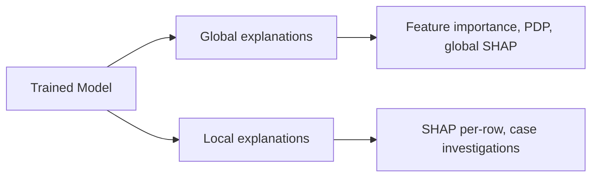
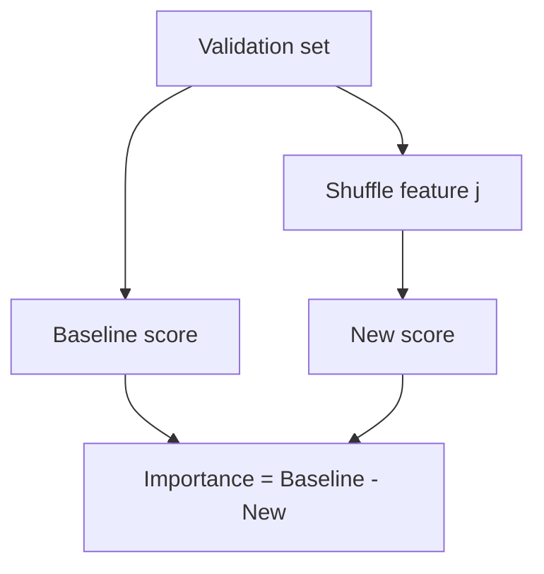
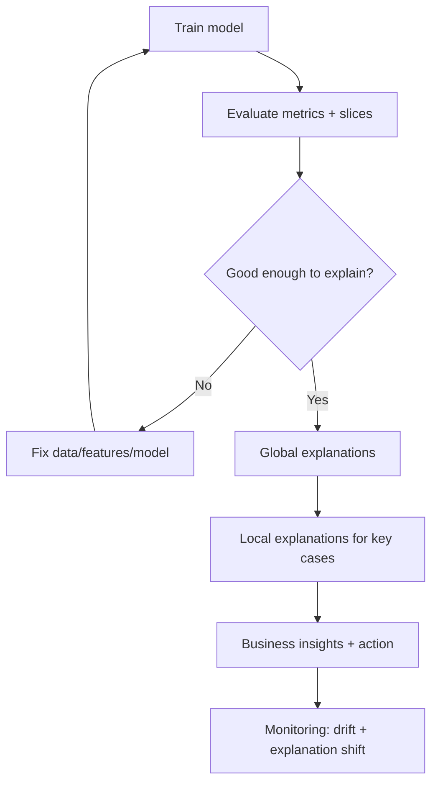
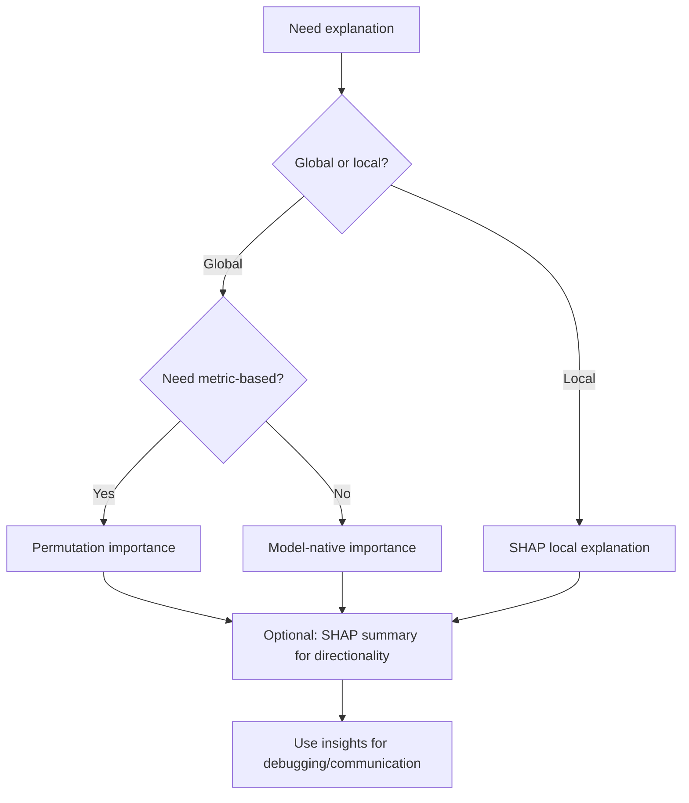

# Model Explainability

## 1. Learning Objectives

By the end of this chapter, you should be able to:

- Explain why model explainability matters in production systems (beyond “stakeholders asked”)
- Distinguish **interpretability** vs **explainability**, and pick the right level for the task
- Choose between **global** vs **local** explanations and understand what each can/can’t tell you
- Use and critique feature importance methods:
  - model-native importance (linear, trees, forests, boosting)
  - permutation importance
  - SHAP for local and global explanations
- Use Partial Dependence Plots (PDP) to understand feature effects at a high level
- Avoid common interpretation traps (correlation ≠ causation, leakage, collinearity)
- Build a practical workflow: train → evaluate → explain → decide → monitor

---

## 2. Why Explainability Matters

Explainability is an engineering tool for:

### Debugging and quality
- Detecting leakage (“Why is this future-looking feature dominant?”)
- Detecting data issues (a “missing indicator” dominates unexpectedly)
- Finding brittle behavior (model relies heavily on a proxy feature)
- Identifying spurious correlations (e.g., device_type becomes a proxy for region)

### Trust and adoption
- Business stakeholders need to understand *why* decisions happen
- Humans are more likely to use model outputs correctly if they understand limits

### Compliance and risk
- Some domains require decision justification (credit, insurance, healthcare)
- You need evidence for audits: what features drive outcomes, for whom, and when

### Monitoring and drift
- Explanation distributions can drift before accuracy metrics do
- “Top drivers changed” is often an early warning signal

**Engineering framing:** explainability is part of system reliability, not just communication.

---

## 3. Interpretability vs Explainability

These are often conflated but not identical.

| Term | Meaning (practical) | Examples |
|---|---|---|
| **Interpretability** | the model structure itself is understandable | linear/logistic regression, small decision tree |
| **Explainability** | post-hoc methods that produce explanations for a complex model | permutation importance, SHAP, PDP |

**Key trade-off:**

| Approach | Benefit | Risk |
|---|---|---|
| Use an interpretable model | transparency by design | may underperform if data is complex |
| Use a complex model + explain it | accuracy + insights | explanations can be approximate/misleading if used incorrectly |

**Interview-ready line:**
> “Interpretability is a property of the model. Explainability is a toolkit around the model.”

---

## 4. Global vs Local Explanations

### Global explanations
Explain the model’s overall behavior on a dataset.

- Which features matter most overall?
- What is the average direction of effect?

### Local explanations
Explain an individual prediction.

- Why did we predict “fraud” for this transaction?
- Which features pushed this customer into “high risk”?

| Type | Answers | Good for | Weak for |
|---|---|---|---|
| Global | “What drives the model generally?” | model debugging, stakeholder reports, feature audits | individual case decisions |
| Local | “Why this specific prediction?” | support tooling, analyst review, incident investigations | understanding full model behavior |



**Rule:** don’t use global importance to justify a single decision; don’t use one local example to describe the model globally.

---

## 5. Feature Importance (Model-Native)

“Feature importance” is not one thing. It depends on model family.

### Linear models (Linear/Logistic Regression)
**What it is:** coefficient magnitude and sign.

- Positive coefficient increases prediction (in linear sense)
- Negative decreases

**Practical requirements:**
- Scaling matters: coefficients are only comparable if features are on comparable scales (or standardized)
- Collinearity: coefficients can become unstable and counterintuitive

| Strength | Limitation |
|---|---|
| Simple, fast, sign gives direction | misleading under correlated features; depends on preprocessing |

### Decision Trees
**What it is:** how much a feature reduces impurity when splitting.

| Strength | Limitation |
|---|---|
| intuitive splits; easy to visualize small trees | importance biased toward high-cardinality features; unstable with small changes |

### Random Forests
**What it is:** averaged impurity-based importance across many trees.

| Strength | Limitation |
|---|---|
| robust, handles nonlinearity | impurity importance bias; correlated features split importance unpredictably |

### Gradient Boosting (XGBoost/LightGBM/sklearn GBDT)
**What it is:** often “gain” from splits or similar internal importance measure.

| Strength | Limitation |
|---|---|
| strong models; can reveal useful signals | different libraries define importance differently; still biased; not causal |

### “Why is impurity importance biased?”
In plain engineering terms:
- features with many possible split points (continuous, high-cardinality) get more chances to look useful
- correlated features “share” information; importance gets spread or concentrated arbitrarily

**Takeaway:** model-native importance is useful for fast intuition, not final truth.

---

## 6. Permutation Importance

### Intuition
If a feature matters, then shuffling it should break the model.

Workflow:
1. Measure baseline performance (on a validation set)
2. Shuffle one feature column (destroy its information)
3. Recompute performance drop
4. Bigger drop ⇒ more important



### Advantages
- Model-agnostic (works for any model)
- Reflects actual impact on a chosen metric (AUC, RMSE, etc.)
- Less biased than impurity-based importance in many cases

### Disadvantages
- Expensive: requires repeated scoring runs
- Correlated features: shuffling one might not hurt much because correlated features “cover” for it (importance is underestimated)
- Sensitive to evaluation set quality (must be representative and leak-free)

**Best use:** sanity-checking and validating feature importance for production decisions.

---

## 7. SHAP

SHAP is the most widely-used modern explainability tool in production ML because it provides:

- **local explanations** that sum into the prediction (additive attribution)
- **global summaries** by aggregating local explanations across the dataset

### SHAP intuition (no math)
SHAP asks:

> “How much did each feature contribute to moving the prediction away from a baseline average?”

For a single prediction:
- Start at a baseline (e.g., average model output)
- Each feature “pushes” the prediction up or down
- SHAP attributes those pushes fairly across features

### Local explanations
Per-row feature contributions (what drove *this* prediction).

**Best for:**
- analyst tooling (“why flagged?”)
- support/debugging
- model incident investigations

### Global explanations
Aggregate SHAP values across many rows to answer:
- which features are consistently influential?
- how does feature value relate to prediction direction?

### Summary plots (concept)
- show top features by average absolute SHAP value
- show distribution of SHAP impacts colored by feature value (high vs low)

**What you learn:**
- importance ranking (global)
- directionality patterns (nonlinear effects)

### Force plots (concept)
- visualize how features push an individual prediction from baseline to final
- good for explaining single cases to stakeholders/analysts

**Engineering caution:** SHAP explains the model, not reality. A SHAP explanation can be perfectly correct while the model is wrong or biased.

---

## 8. Partial Dependence Plots (PDP)

### High-level intuition
PDP answers:

> “On average, what happens to the prediction if I change feature X and keep everything else as it is?”

- You vary one feature across its range
- For each value, you compute average prediction over many samples
- Plot feature value vs average prediction

**What PDP is good for:**
- checking monotonic relationships (“does risk increase with amount?”)
- spotting saturation/threshold effects
- communicating global feature behavior

**PDP limitations (important):**
- assumes you can vary a feature independently (often false with correlated features)
- can produce unrealistic combinations (“age=5 with 20 years tenure”)
- averages can hide subgroup effects

**Rule:** use PDP as a global sanity check, not as a precise causal curve.

---

## 9. Common Interpretation Mistakes

| Mistake | Why it’s wrong | What to do instead |
|---|---|---|
| “Feature importance means causation” | importance is correlational | treat as model signal; validate with experiments |
| “Top feature is always safe to rely on” | could be leakage or proxy | run leakage checks; do ablation |
| “SHAP values are probabilities” | they’re contributions, not calibrated probabilities | treat as attribution only |
| Interpreting correlated features literally | attribution becomes unstable | group correlated features; use domain reasoning |
| Using explanations on training data only | over-optimistic, biased | explain on validation/production-like data |
| Explaining after bad evaluation | explanations of a bad model are not helpful | evaluate first; explain second |
| Ignoring preprocessing | explanations depend on engineered features | document feature transformations |
| Confusing global and local explanations | wrong conclusion for wrong scope | match explanation type to question |

---

## 10. sklearn & SHAP Implementation (Practical)

### A. Permutation importance (sklearn)

```python
from sklearn.inspection import permutation_importance

result = permutation_importance(
    estimator=clf,              # pipeline or model
    X=X_valid,
    y=y_valid,
    scoring="roc_auc",
    n_repeats=10,
    random_state=42,
    n_jobs=-1
)

importances = result.importances_mean
sorted_idx = importances.argsort()[::-1]

top = [(X_valid.columns[i], importances[i]) for i in sorted_idx[:10]]
top
```

**Best practices:**
- use a clean validation set (no leakage)
- choose the metric aligned with your business objective
- increase `n_repeats` for stability if compute allows

### B. Partial dependence (sklearn)

```python
from sklearn.inspection import PartialDependenceDisplay

PartialDependenceDisplay.from_estimator(
    clf,
    X_valid,
    features=["age", "income"],
    kind="average",
    grid_resolution=50
)
```

### C. SHAP (conceptual implementation)

SHAP usage differs by model type; keep a practical approach:

- For tree-based models: `shap.TreeExplainer` is fast and common
- For general models: `shap.Explainer` often works but can be slower

```python
import shap

# Example: tree-based model (or pipeline ending in a tree model)
model = clf  # could be a pipeline; you may need to pass transformed X for some setups

# Many teams compute SHAP on a sample for speed
X_sample = X_valid.sample(n=min(len(X_valid), 2000), random_state=42)

explainer = shap.Explainer(model, X_sample)
shap_values = explainer(X_sample)

# Global summary
shap.summary_plot(shap_values, X_sample)

# Local explanation (single row)
i = 0
shap.plots.waterfall(shap_values[i])
```

**Engineering notes for pipelines:**
- If your model is a Pipeline with complex preprocessing (one-hot), SHAP can become harder to interpret because you get importances for transformed columns.
- Two practical strategies:
  1. Explain at the transformed feature level and map back to original features (more work).
  2. Use model-specific explainers or train a simpler surrogate model for human communication (with care).

**Operational best practice:** compute SHAP on a representative sample, not full production data, unless you have the compute budget and a clear purpose.

---

## 11. Practical Workflow



**Practical outputs you want from explainability:**
- top drivers globally (with stability checks)
- explanation examples for:
  - false positives
  - false negatives
  - high-confidence predictions
- actions:
  - feature fixes
  - threshold changes
  - policy/rule adjustments
  - monitoring signals (driver drift)

---

## 12. Common Mistakes (Production)

| Mistake | Production impact | Fix |
|---|---|---|
| Building explanation dashboards without validation | “beautiful wrongness” | evaluate first; explain second |
| Relying on impurity importance only | biased feature ranking | use permutation importance / SHAP as confirmation |
| Ignoring correlated features | unstable attributions | cluster features; interpret groups |
| Not versioning explanations | can’t compare across deployments | log model version + data slice |
| Explaining on different preprocessing than production | inconsistent insights | explain on production-like pipeline |
| Using SHAP for every row in huge datasets | compute burn | sample or batch strategically |
| Using explanations as compliance evidence without governance | legal/regulatory risk | establish review process and documentation |

---

## 13. Rules of Thumb (20+)

1. Evaluate first; explain second.
2. Explainability explains the model, not causality.
3. Use global explanations for model understanding; local explanations for case review.
4. Don’t use one local explanation to describe global behavior.
5. Don’t use global importance to justify a single decision.
6. Treat model-native importance as a quick heuristic, not a source of truth.
7. Confirm important features with permutation importance or SHAP.
8. If a “future” or suspicious feature dominates, suspect leakage immediately.
9. Handle correlated features carefully—attributions can be unstable.
10. Prefer explaining on a representative validation set, not training data.
11. Use sampling for SHAP unless you have a clear reason to run it on everything.
12. Use the metric that matters for permutation importance (not default accuracy).
13. Document preprocessing so explanations are interpretable (especially one-hot).
14. For stakeholder communication, prefer simple visuals + stable, repeated insights.
15. PDPs are good for sanity checks; don’t treat them as causal curves.
16. Monitor feature drift and also monitor “top drivers drift” as an early warning.
17. Don’t use explanations to rationalize harmful outcomes; use them to detect them.
18. If explanations change drastically between model versions, investigate stability.
19. In regulated domains, prefer interpretable models when performance is comparable.
20. Build a feedback loop: explanations should drive feature and policy improvements.
21. Keep explainability tooling versioned and tested like any other production component.

---

## 14. Real-World Applications

| Application | How explainability is used |
|---|---|
| Credit risk | justify approvals/denials; audit top drivers; detect proxy discrimination |
| Fraud detection | analyst workflows: “why flagged?”; prioritize review; reduce false positives |
| Healthcare triage | decision support: highlight key risk drivers; validate against clinical reasoning |
| Customer churn | identify drivers of churn; target retention actions; explain to marketing |
| Manufacturing quality | interpret sensor drivers; detect drift; trigger maintenance or recalibration |

---

## 15. Interview Questions (No Answers)

1. Why does model explainability matter in production ML?
2. What is the difference between interpretability and explainability?
3. What’s the difference between global and local explanations?
4. How do feature importances differ between linear models and tree-based models?
5. Why is impurity-based feature importance biased?
6. What is permutation importance and how does it work?
7. What are the limitations of permutation importance with correlated features?
8. What is SHAP trying to measure intuitively?
9. How do SHAP local explanations relate to global explanations?
10. What is a SHAP summary plot and what does it tell you?
11. What is a SHAP force/waterfall plot used for?
12. What is a Partial Dependence Plot and what question does it answer?
13. What are key limitations of PDPs?
14. How would you detect feature leakage using explainability tools?
15. If a feature is top-importance, does removing it always hurt performance? Why/why not?
16. How do you explain a model built with one-hot encoding to a stakeholder?
17. How would you operationalize explainability for an analyst team?
18. What do you monitor in production besides accuracy to detect drift early?
19. Can explainability tools reveal bias? How?
20. Describe a workflow you would follow to debug a model with unexpected behavior.

---

## 16. Myth vs Reality

| Myth | Reality |
|---|---|
| “Explainability proves the model is correct” | It only describes what the model is doing, not whether it’s right |
| “Feature importance tells you what causes the outcome” | It shows association used by the model, not causation |
| “SHAP values are probabilities” | They are additive contributions relative to a baseline |
| “Permutation importance is always reliable” | Correlated features can hide true importance |
| “PDP shows the true effect of a feature” | It’s an average model response; can be misleading under correlation |
| “Complex models can always be explained perfectly” | Explanations are approximations; interpretability may be preferable in high-stakes settings |

---

## 17. Decision Guide

### Which explainability tool should I use?

| Goal | Best tool(s) | Notes |
|---|---|---|
| Fast global sanity check | model-native importance | use as initial signal only |
| Metric-based importance | permutation importance | model-agnostic, costs compute |
| Per-case explanation | SHAP local | great for analyst tooling |
| Global + directionality patterns | SHAP summary | strong for understanding drivers |
| Average feature effect curve | PDP | use carefully with correlated features |



### When to prefer interpretable models over post-hoc explainability
- high-stakes domains (credit, healthcare, legal)
- strict compliance requirements
- when performance difference is small
- when explanation must be stable and easily auditable

---

## 18. Chapter Summary

- Explainability improves reliability: debugging, trust, compliance, and monitoring.
- Interpretability is model-intrinsic; explainability is post-hoc tooling.
- Global explanations describe overall behavior; local explanations justify individual predictions.
- Model-native feature importance is quick but biased; confirm with permutation importance and/or SHAP.
- Permutation importance measures performance drop when a feature is shuffled—robust but compute-heavy and correlation-sensitive.
- SHAP provides local attributions and global summaries; it explains the model, not causality.
- PDPs give average feature response curves but can mislead when features are correlated.
- Production explainability is a workflow: evaluate → explain → act → monitor driver drift.

---

## 19. Interview Cheat Sheet

| Topic | Key lines |
|---|---|
| Why explainability | “Debugging, leakage detection, trust, compliance, monitoring drift.” |
| Interpretability vs explainability | “Interpretability is built-in; explainability is post-hoc.” |
| Global vs local | “Global: overall drivers. Local: why this prediction.” |
| Permutation importance | “Shuffle feature → measure metric drop; model-agnostic; correlation caveat.” |
| SHAP | “Attributes prediction difference from baseline across features; local + global summary.” |
| PDP | “Average prediction as a feature varies; correlation caveat.” |
| Common pitfall | “Importance ≠ causation; correlated features destabilize explanations.” |

---

## 20. Quick Revision

- Explainability is for reliability: debugging, trust, compliance, and monitoring.
- Interpretability (intrinsic) ≠ explainability (post-hoc).
- Global explanations = overall model behavior; local explanations = single prediction rationale.
- Model-native tree importances are biased; don’t rely on them alone.
- Permutation importance: shuffle a feature, measure metric drop (great sanity check, compute-heavy, correlation-sensitive).
- SHAP: per-row contributions from baseline → prediction; aggregate for global; use summary + local waterfall/force.
- PDP: average effect curve; can mislead under correlated features.
- Golden rule: explain the *model behavior*, not causality—then validate with experiments and monitoring.