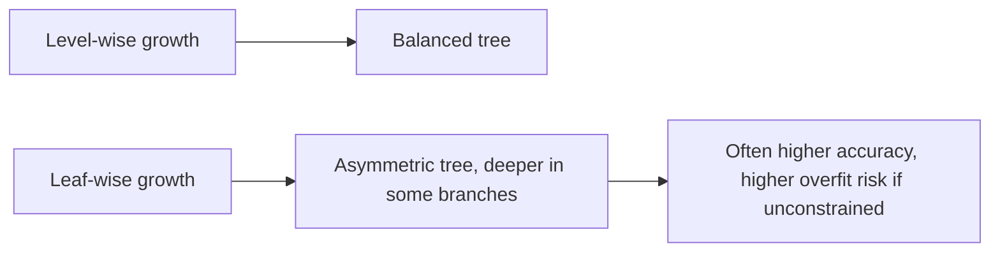
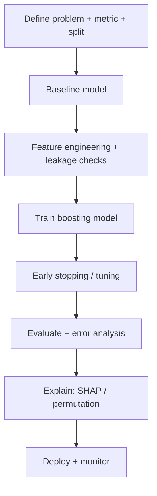
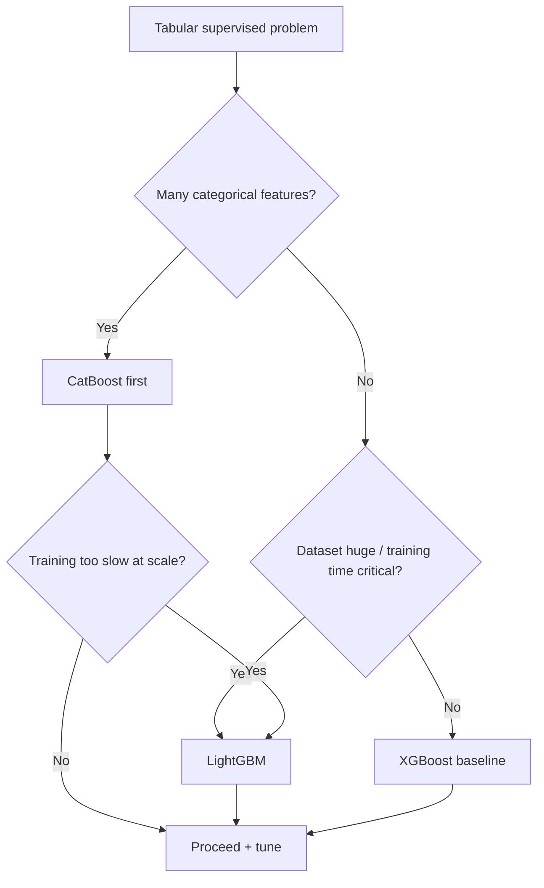

# XGBoost, LightGBM and CatBoost

---

## 1. Learning Objectives

By the end of this chapter, you should be able to:

- Explain why modern gradient boosting libraries exist and what problems they solve.
- Describe the core engineering differences between XGBoost, LightGBM, and CatBoost.
- Choose the right library for a given dataset and production constraint (speed, memory, categorical support).
- Tune the most important hyperparameters with correct intuition.
- Use sklearn-style APIs for training, evaluation, and inference.
- Avoid common pitfalls that cause overfitting, slow training, or misleading feature importance.
- Speak confidently about these libraries in ML interviews and system design discussions.

---

## 2. Why Gradient Boosting Libraries Exist

Gradient Boosting Decision Trees (GBDT) became the workhorse for tabular machine learning because they:

- Handle non-linearity naturally
- Learn feature interactions automatically
- Need little feature engineering
- Work well even with relatively small datasets
- Produce excellent predictive accuracy

However, vanilla implementations suffer from practical engineering problems.

| Problem in basic GBDT | Modern libraries solve it by |
|---|---|
| Slow training | Parallel algorithms + optimized tree construction |
| High memory usage | Histogram / quantization techniques |
| Overfitting | Strong regularization + early stopping |
| Missing values | Native missing value handling |
| Categorical features | Native support (especially CatBoost) |
| Production deployment | Stable APIs, fast inference, model export |

> **Important:** These are **NOT different algorithms**. They are highly optimized engineering implementations of the **same Gradient Boosting idea**, each tuned for different production constraints.

---

## 3. XGBoost

### Intuition

XGBoost trains trees sequentially — each new tree focuses on correcting the mistakes made by all previous trees. Its biggest strengths are:

- Excellent regularization
- Stability
- Mature ecosystem
- Predictable behavior

Think of XGBoost as: **the industry standard "safe choice."**

### Strengths

- Excellent accuracy
- Strong regularization (`reg_alpha`, `reg_lambda`)
- Handles missing values automatically
- Large ecosystem, mature documentation, very stable
- Excellent support for sparse matrices (e.g., one-hot encoded features)

### Weaknesses

- Slower than LightGBM on very large datasets
- Uses more memory
- Historically required manual categorical encoding — native support is improving but still behind CatBoost

### Common Use Cases

- Credit risk, fraud detection, churn prediction
- Recommendation systems, ranking problems
- General "strong baseline" for supervised tabular learning

### Engineering Summary

> XGBoost is the safest default when you're unsure which boosting library to use.

---

## 4. LightGBM

LightGBM was designed around one goal: **maximum speed with minimum memory.**

### The Biggest Difference — Leaf-wise Growth

Traditional tree algorithms grow **level-wise** (every node at a given depth expands together, producing a balanced tree). LightGBM grows **leaf-wise**: it always splits the leaf that reduces error the most, regardless of depth. This produces deeper, more asymmetric trees and a faster reduction in loss.



### Why It's Faster

- Histogram-based tree construction
- Efficient memory layout
- Better parallelization
- Faster split finding

Result: faster training, less RAM usage, better scalability.

### Strengths

- Extremely fast, very memory efficient
- Excellent for huge datasets
- Very accurate
- Supports categorical features

### Weaknesses

- Leaf-wise growth can overfit easily, especially on small or noisy datasets
- Requires careful tuning of `num_leaves`, `min_data_in_leaf`, `max_depth`
- More sensitive to hyperparameters than XGBoost in some settings

### Engineering Summary

> Choose LightGBM when training speed and memory become bottlenecks — but control overfitting carefully.

---

## 5. CatBoost

CatBoost was built around one major problem: **categorical features.**

Real-world datasets are full of categoricals — country, city, browser, occupation, payment method, product category. Traditional boosting libraries need these encoded first (often via one-hot). CatBoost doesn't.

### Native Categorical Handling

CatBoost transforms categories internally using carefully designed target-statistics techniques instead of one-hot encoding.

Benefits:
- No giant one-hot matrices
- Less preprocessing
- Better accuracy
- Simpler pipelines

### Ordered Boosting (Intuition)

A major issue with naive target encoding is **target leakage** — if the model uses a category's average target value that includes information from the row it's currently predicting, it has effectively "peeked into the future."

CatBoost prevents this using **Ordered Boosting**: a carefully ordered training scheme that avoids this leakage-like behavior and produces more reliable models. You don't need the implementation details for interviews — just remember:

> Ordered Boosting reduces leakage during categorical processing.

### Strengths

- Best native categorical support
- Very little preprocessing required
- Excellent defaults, strong accuracy, easy to use

### Weaknesses

- Can train slower than LightGBM
- Slightly larger model artifacts
- Numeric-only datasets reduce its relative advantage

### Engineering Summary

> If your dataset has many categorical features, CatBoost is usually the best first choice.

---

## 6. Comparison Table

| Dimension | XGBoost | LightGBM | CatBoost |
|---|---|---|---|
| Training speed | Fast | Very fast (often fastest) | Medium–Fast |
| Memory usage | Medium–High | Low (very efficient) | Medium |
| Categorical support | Limited / improving, often needs encoding | Good (needs care) | Excellent (native, core strength) |
| Missing values | Yes | Yes | Yes |
| Accuracy (tabular) | Excellent | Excellent (often top on big data) | Excellent (often top on categorical-heavy) |
| Scalability (large n) | Good | Excellent | Good |
| Hyperparameter sensitivity | Medium | High | Medium (good defaults) |
| Safe default | Yes | Yes (if you know the knobs) | Yes (especially with categoricals) |

### Quick Decision

- **Choose XGBoost** if you want a strong, stable baseline, expect sparse matrices, and value predictable behavior.
- **Choose LightGBM** if data is huge and RAM/training speed are constraints.
- **Choose CatBoost** if many categorical features exist and you want minimal preprocessing.

---

## 7. Important Hyperparameters (Shared Intuition)

These concepts exist across all three libraries — only parameter names differ slightly.

### `learning_rate` (aka `eta`)

Controls how much each new tree contributes.
- Higher → faster learning, more overfitting
- Lower → slower learning, better generalization, needs more trees

> Rule: lower `learning_rate` + more trees usually works best.

### `n_estimators`

Controls the number of boosting rounds (model capacity).
- More → higher capacity, slower training, overfitting risk
- Fewer → underfitting risk

> Best practice: use **early stopping** instead of blindly picking a huge fixed value.

### `max_depth`

Controls per-tree complexity.
- Larger → captures complex interactions, overfits easily
- Smaller → simpler, more regularized model

Typical range: **3–10** (depends heavily on data).

### `subsample`

Fraction of training rows used per tree.
- Lower → more randomness, reduces overfitting, faster training
- Too low → can underfit / become unstable

Typical range: **0.6–1.0**

### `colsample_bytree`

Fraction of features available per tree.
- Lower → less overfitting, handles correlated features better
- Too low → may miss important signals

Typical range: **0.6–1.0**

### Hyperparameter Summary

| Hyperparameter | Controls | Increase Effect | Decrease Effect |
|---|---|---|---|
| `learning_rate` | Step size | Faster learning, more overfit risk | More stable, needs more trees |
| `n_estimators` | Number of trees | More capacity | Less capacity |
| `max_depth` | Tree complexity | More overfitting | More regularization |
| `subsample` | Row sampling | Less regularization | More regularization |
| `colsample_bytree` | Feature sampling | Less regularization | More regularization |

---

## 8. Feature Importance

All three libraries expose feature importance, but it must be interpreted carefully.

### Types of Importance

- **Split count** — how often a feature was used
- **Gain** — how much loss improved when the feature was used
- **Cover** — how many samples the feature impacted

### Engineering Advice

- Use built-in importance only for quick sanity checks.
- Use **permutation importance** or **SHAP** for reliable insight.
- Watch for correlated features — importance gets split or arbitrarily assigned between them.

---

## 9. sklearn API Usage

Using sklearn-style wrappers lets these models plug into `Pipeline`, `GridSearchCV` / `RandomizedSearchCV`, and consistent `.fit()` / `.predict()` / `.predict_proba()` workflows.

### XGBoost

```python
from xgboost import XGBClassifier

model = XGBClassifier(
    n_estimators=500,
    learning_rate=0.05,
    max_depth=6,
    subsample=0.8,
    colsample_bytree=0.8,
    random_state=42,
    n_jobs=-1,
    eval_metric="logloss"
)

model.fit(X_train, y_train)
proba = model.predict_proba(X_valid)[:, 1]
```

### LightGBM

```python
from lightgbm import LGBMClassifier

model = LGBMClassifier(
    n_estimators=2000,
    learning_rate=0.03,
    max_depth=-1,  # LightGBM typically controls complexity via num_leaves instead
    subsample=0.8,
    colsample_bytree=0.8,
    random_state=42,
    n_jobs=-1
)

model.fit(X_train, y_train)
proba = model.predict_proba(X_valid)[:, 1]
```

### CatBoost

CatBoost accepts categorical feature names/indices directly — no manual encoding needed.

```python
from catboost import CatBoostClassifier

cat_features = ["country", "device_type"]

model = CatBoostClassifier(
    iterations=2000,
    learning_rate=0.05,
    depth=6,
    random_seed=42,
    loss_function="Logloss",
    verbose=False
)

model.fit(X_train, y_train, cat_features=cat_features)
proba = model.predict_proba(X_valid)[:, 1]
```

**Engineering notes:**
- Prefer early stopping when available (library-specific).
- Always set seeds (`random_state` / `random_seed`).
- In `Pipeline`s, make sure data types and categorical handling align — CatBoost typically works best on raw categoricals, before one-hot encoding.

---

## 10. Practical Workflow



**Recommended iteration strategy:**

1. Start with XGBoost or CatBoost depending on categorical load.
2. If training is too slow at scale, switch to LightGBM.
3. Tune only a few knobs first: `learning_rate`, `n_estimators`, `max_depth`, `subsample`, `colsample_bytree`.
4. Use SHAP to sanity-check the model relies on reasonable signals.
5. Deploy with monitoring for drift and feature health.

---

## 11. Common Mistakes

| Mistake | Why It Hurts | Fix |
|---|---|---|
| Huge `n_estimators` without early stopping | Overfitting + slow training | Use early stopping or tune properly |
| High `learning_rate` + deep trees | Severe overfitting | Lower LR, reduce depth |
| Ignoring categorical handling → one-hot explosion | Slow, memory-heavy | Use CatBoost or careful encoding |
| Treating feature importance as causal truth | Wrong product decisions | Confirm with permutation/SHAP + domain knowledge |
| Not setting seeds | Irreproducible models | Set `random_state` / `random_seed` |
| Tuning too many hyperparameters at once | Expensive, noisy search | Start with the key knobs |
| Random split on time-based problems | Data leakage | Use a time-based split |
| Not monitoring overfitting signs | Production surprises | Watch train vs. validation gap |

---

## 12. Rules of Thumb

1. For tabular data, gradient boosting is often the first "serious" model to try.
2. Start with XGBoost as a stable baseline if unsure.
3. Prefer LightGBM when training speed and memory are the bottleneck.
4. Prefer CatBoost when you have many categorical features and want minimal encoding work.
5. Lower `learning_rate` usually requires higher `n_estimators`.
6. Use early stopping instead of guessing `n_estimators`.
7. Keep trees relatively shallow unless you have strong evidence deeper helps.
8. Use `subsample` and `colsample_bytree` < 1.0 to reduce overfitting.
9. Always set seeds for reproducibility.
10. Don't trust built-in feature importance blindly — validate with SHAP/permutation.
11. Watch for leakage — boosting models exploit it aggressively.
12. If validation metrics look "too good to be true," suspect leakage first.
13. For high-cardinality categoricals, one-hot often hurts — prefer CatBoost or careful target/frequency encoding.
14. Monitor the training/validation gap; a large gap signals overfitting.
15. More depth is not always better — it often overfits.
16. When performance is close between libraries, choose the simplest to deploy and maintain.
17. Watch inference latency; boosting is fast, but large models can still be heavy.
18. Use consistent preprocessing pipelines to avoid train/inference skew.
19. For large datasets, start tuning with coarse random search, then refine.
20. If training time is too high, reduce features, subsample data for tuning, or switch libraries.
21. Always evaluate across segments (region/device/cohort) — boosting can amplify biases in data.
22. Prefer stability and monitoring over squeezing tiny leaderboard gains.

---

## 13. Real-World Applications

| Domain | Typical Use |
|---|---|
| Finance | Credit risk, default prediction, fraud scoring |
| Marketing | Churn prediction, propensity modeling, uplift proxies |
| E-commerce | Conversion prediction, pricing signals, demand modeling |
| Operations | SLA breach prediction, incident risk scoring |
| Healthcare | Readmission risk (with governance), triage decision support |
| Adtech | CTR prediction, ranking signals (with specialized objectives) |

---

## 14. Interview Questions

1. Why are gradient boosting tree libraries so strong on tabular data?
2. What are the main differences between XGBoost, LightGBM, and CatBoost?
3. Why is LightGBM usually faster on large datasets?
4. What does leaf-wise growth mean, and what risk does it introduce?
5. Why is CatBoost often preferred for categorical-heavy datasets?
6. What is ordered boosting (high-level), and what problem does it address?
7. How do `learning_rate` and `n_estimators` trade off?
8. What happens if `max_depth` is too large?
9. Why do subsampling (`subsample`, `colsample_bytree`) help generalization?
10. How do these libraries handle missing values?
11. How do you implement early stopping in a production training workflow?
12. How would you choose a library for a dataset with 100M rows?
13. How would you choose a library for a dataset with many high-cardinality categorical features?
14. How do you debug a boosting model that overfits?
15. Why can feature importance be misleading for boosted trees?
16. How would you explain a boosting model's predictions to stakeholders?
17. What deployment considerations matter for boosting models?
18. How do you ensure reproducibility in training?
19. What metrics would you monitor post-deployment?
20. When would you avoid gradient boosting and choose a simpler model?

---

## 15. Myth vs Reality

| Myth | Reality |
|---|---|
| "XGBoost is always best" | LightGBM or CatBoost can win depending on scale and categorical load |
| "More trees always improves performance" | Past a point, it overfits and increases latency |
| "Feature importance tells you causality" | It tells you model usage, not real-world causation |
| "CatBoost means no preprocessing" | You still need missing-value handling, leakage checks, and good splits |
| "Boosting is too slow for production" | Inference is usually fast; training speed depends on data and library |
| "Defaults always work" | Strong, but you still must validate splits, leakage, and thresholds |

---

## 16. Decision Guide



**Practical guidance:**

- **Choose CatBoost** if: lots of categorical features, you want minimal encoding complexity, you want strong defaults quickly.
- **Choose LightGBM** if: dataset is large, training speed/memory are constraints, you can manage leaf-wise overfitting risk with constraints.
- **Choose XGBoost** if: you want a stable, widely supported baseline, you expect sparse matrices (one-hot), you value predictable behavior and mature tooling.

---

## 17. Chapter Summary

- XGBoost, LightGBM, and CatBoost are industrial implementations of gradient boosted trees, optimized for speed, scale, and usability.
- XGBoost is the stable, widely adopted baseline with strong regularization and solid performance.
- LightGBM is optimized for speed and memory on large datasets via leaf-wise growth, which can overfit if unconstrained.
- CatBoost excels at categorical features via ordered boosting, designed to reduce leakage-like artifacts from categorical encoding.
- Key shared hyperparameters: `learning_rate`, `n_estimators`, `max_depth`, `subsample`, `colsample_bytree`.
- Built-in feature importance is useful but can mislead — validate with SHAP/permutation importance.
- Choose based on dataset shape (categorical load), scale, training constraints, and production maintainability.

---

## 18. Interview Cheat Sheet

| Question Theme | What to Say |
|---|---|
| Why these libraries | "Optimized GBDT implementations for speed, scale, regularization, and production usability." |
| XGBoost | "Safe strong baseline; robust regularization; mature ecosystem." |
| LightGBM | "Fast + memory efficient; leaf-wise growth gives accuracy but can overfit." |
| CatBoost | "Best native categorical handling; ordered boosting reduces leakage-like target-stat issues." |
| Key knobs | "`learning_rate` vs `n_estimators` tradeoff; depth controls complexity; subsampling regularizes." |
| Importance | "Impurity/gain importances can mislead; confirm with SHAP/permutation." |

---

## 19. Quick Revision

- **XGBoost:** stable, strong baseline, great controls, widely used.
- **LightGBM:** fastest on large data, leaf-wise growth, watch overfitting.
- **CatBoost:** best for categorical-heavy data, strong defaults, least encoding work.

**Core hyperparameters:**
- `learning_rate` ↓ → need `n_estimators` ↑ (usually better generalization)
- `max_depth` ↑ → more complexity, more overfit risk
- `subsample` / `colsample_bytree` ↓ → more regularization, often helps

**Production reminders:**
- Use correct splits (time/group) and prevent leakage.
- Use early stopping when possible.
- Don't trust built-in feature importance blindly — use SHAP/permutation for confirmation.
- Choose the library that best fits your data + constraints, not the trendiest one.