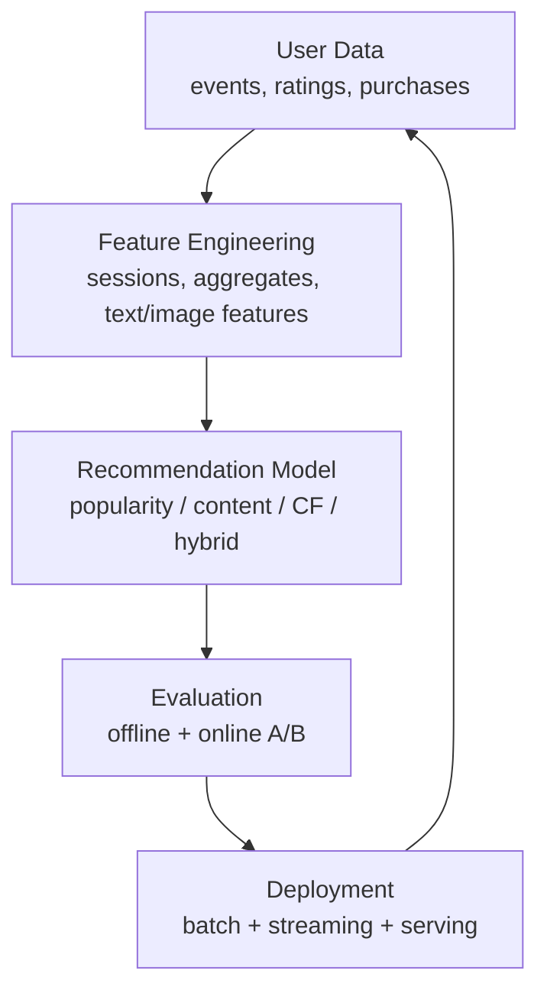

# Recommender Systems

## 1. Learning Objectives

By the end of this chapter, you should be able to:

- Explain what recommender systems are and why they’re business-critical.
- Choose among **popularity**, **content-based**, **collaborative filtering**, and **hybrid** approaches.
- Distinguish **user-based** vs **item-based** collaborative filtering and when each wins.
- Understand the high-level intuition behind **matrix factorization** and **embeddings** for recommendation.
- Handle **cold start** (new users / new items) with practical strategies.
- Evaluate recommenders with the right **offline metrics** (RMSE vs ranking metrics like Precision@K, NDCG).
- Implement practical baselines with **scikit-learn** and **Surprise**, and reason about production workflow.
- Avoid common pitfalls and answer common interview questions confidently.

---

## 2. What is a Recommender System?

A **recommender system** is a system that selects and orders items for a user to maximize some objective (e.g., clicks, watch time, purchases, satisfaction), using signals like:

- User behavior (views, clicks, purchases, ratings)
- Item attributes (text, category, price)
- Context (time, device, location)
- Social/graph signals (follows, co-visitation)

### What it is (engineering view)
A recommender is usually a pipeline that:

1. **Generates candidates** (retrieve ~hundreds/thousands from millions)
2. **Ranks candidates** (score and order)
3. **Applies business rules** (diversity, freshness, safety, constraints)
4. **Serves** results with low latency and monitors outcomes

---

## 3. Why Recommender Systems Matter

Recommenders are often the highest-leverage ML system in consumer products because they directly affect:

- **Revenue**: conversion, basket size, ads CTR
- **Retention**: session length, daily active usage
- **Discovery**: long-tail content, catalog utilization
- **User experience**: personalization reduces cognitive load

### When they’re especially valuable
- Large catalogs (e-commerce, media, app stores)
- Feeds (social, news)
- Search augmentation (“recommended for you”, “similar items”)
- Any product with repeated user decisions

### When they might not be worth it
- Very small catalogs
- Low repeat usage (one-off transactions)
- Lack of interaction data (you can still do content-based, but ROI may be limited)

---

## 4. Types of Recommenders

### Comparison Table

| Type | Uses | Best For | Pros | Cons | When NOT to use |
|---|---|---|---|---|---|
| Popularity-based | Global item counts/CTR/sales | Cold start baseline, trending | Simple, robust, fast | Not personalized, popularity bias | When personalization is required |
| Content-based | Item features + user profile | New items, explainability | Works with cold-start items, interpretable | Overspecialization, needs good features | If item metadata is poor/noisy |
| Collaborative Filtering (CF) | User-item interactions | Mature products with interaction volume | Strong personalization, captures “taste” | Cold start, bias, feedback loops | Early-stage with sparse data |
| Hybrid | Combine multiple sources/models | Most real products | Best performance and robustness | More complexity, monitoring | If you can’t support engineering/ops complexity |

---

### 4.1 Popularity Based

**What is it?**  
Recommend the most popular/trending items overall or within segments (region, category, time window).

**Why do we need it?**
- Great baseline
- Works immediately (no personalization required)
- Useful fallback for cold start and outages

**When to use**
- New users
- New product launch
- “Trending now” modules
- When personalization is uncertain

**Common mistakes**
- Using raw counts forever (ignores recency)
- Not segmenting (region/category)
- Not filtering already-consumed items

**Engineering perspective**
- Precompute daily/hourly
- Use exponential decay for recency (trending)
- Apply constraints (inventory, policy, safety)

---

### 4.2 Content Based

**What is it?**  
Recommend items similar to what a user liked based on **item attributes** (text, tags, category, price, brand).

**Why do we need it?**
- Solves **item cold start**
- Works even with limited interaction data
- Enables explainability (“because you liked X”)

**When to use**
- Catalog has strong metadata (products, articles, videos)
- Cold-start items are frequent
- Compliance requires explainability

**When NOT to use**
- Metadata is missing/low quality
- You need cross-genre discovery (content can overfit tastes)

**Limitations**
- Overspecialization (“more of the same”)
- Requires careful feature engineering and similarity choice

---

### 4.3 Collaborative Filtering

**What is it?**  
Uses patterns in **user-item interactions** to recommend items: “users like you liked…”, “items co-consumed with…”.

**Why do we need it?**
- Captures latent taste signals not in metadata
- Often best personalization once data is sufficient

**When to use**
- You have interaction volume and repeated behavior
- Items don’t have great metadata

**When NOT to use**
- Severe cold start
- Extremely sparse interactions

**Common mistakes**
- Treating implicit feedback (clicks) as explicit ratings
- Random train/test split for time-sensitive products (leaks future info)

---

### 4.4 Hybrid

**What is it?**  
Combine multiple recommenders (popularity + content + CF + business rules) to get better coverage and robustness.

**Why do we need it?**
- Better performance across segments
- Handles cold start and long tail
- Improves reliability and user trust

**Typical hybrid strategies**
- Weighted blending of scores
- Two-stage (candidate generation + ranker)
- Switching logic (cold start → content/popularity; warm → CF)

---

## 5. User-Based vs Item-Based Collaborative Filtering

### The core idea
Both use a **similarity** notion, but on different axes:

- **User-based CF**: find similar users → recommend what they liked
- **Item-based CF**: find similar items → recommend items similar to user’s history

### Comparison Table

| Aspect | User-Based CF | Item-Based CF |
|---|---|---|
| Similarity computed between | Users | Items |
| Best when | Many items, fewer users (rare) | Many users, stable item catalog (common) |
| Scalability | Harder (users change constantly) | Better (items are more stable) |
| Update frequency | High | Lower |
| Typical use in industry | Less common | More common (“similar items”) |
| Intuition | “people like you” | “items like this” |

### When item-based usually wins (practical)
- Item similarity can be precomputed and cached.
- User vectors change frequently; item vectors are more stable.

### Common mistakes
- Using cosine similarity on raw counts without normalization
- Ignoring popularity bias (popular items appear similar to everything)
- Not filtering already-interacted items

---

## 6. Matrix Factorization (High-Level Intuition)

**What is it?**  
Matrix factorization approximates the user-item interaction matrix as the product of two low-dimensional matrices:

- Each **user** gets a vector (latent factors)
- Each **item** gets a vector (latent factors)
- The score is (roughly) the dot product of user and item vectors

### Why we need it
- The user-item matrix is huge and sparse.
- Latent factors capture “taste dimensions” without explicit metadata.

### When to use
- You have enough interaction data
- You want stronger personalization than similarity-only CF
- You can train and periodically retrain a model

### When NOT to use
- Extreme cold start (few interactions per user/item)
- You need very interpretable recommendations
- You only have implicit feedback but your tooling assumes explicit ratings (unless using implicit MF variants)

### Advantages
- Strong baseline for personalization
- Efficient scoring via dot products
- Naturally leads to embeddings

### Limitations
- Cold start still hurts
- Can encode historical bias (popularity, exposure)
- Needs careful evaluation to avoid leakage

### Interview perspective
Be ready to explain:
- Why low-rank approximations help with sparsity
- Why dot products approximate preference
- What happens when user or item is new (no learned vector)

---

## 7. Embeddings in Recommendation (High-Level Intuition)

**What are they?**  
**Embeddings** are dense vectors representing users/items in a continuous space such that:

- Similar users/items are close
- User-item dot product (or distance) approximates affinity

### Why we need them
- Enable scalable retrieval (ANN: approximate nearest neighbors)
- Work across modalities (text/image embeddings)
- Enable hybrid models (content + CF in one space)

### Where embeddings come from
- Matrix factorization (classic)
- Neural recommenders (two-tower models)
- Item content encoders (text/image → vector)
- Session-based models (sequence → vector)

### When to use
- Large-scale candidate retrieval
- When latency matters and you need fast similarity search
- When you want to blend behavior + content features

### Engineering perspective
- Store item embeddings in a vector index (FAISS / ScaNN / etc.)
- Refresh periodically; manage versioning and A/B tests
- Monitor embedding drift and cold-start coverage

---

## 8. Cold Start Problem

Cold start = recommending effectively when you have little/no interaction history.

### 8.1 User Cold Start (new user)
**Problem**: No user history → CF/MF can’t infer taste.

**Practical solutions**
- **Popularity / trending** fallback
- **Contextual**: geo, device, time-of-day (careful with privacy)
- **Onboarding**: ask for preferences, choose topics, rate a few items
- **Session-based signals**: first clicks in session; re-rank quickly
- **Use content-based**: “based on what you just viewed”

**Common mistake**
- Asking for too much during onboarding (hurts conversion)

---

### 8.2 Item Cold Start (new item)
**Problem**: No interactions → CF/MF won’t recommend it (no exposure).

**Practical solutions**
- **Content-based similarity** using metadata or embeddings
- **Exploration / boosting**: allocate a small traffic budget to new items
- **Business rules**: “new arrivals”, “fresh picks”
- **Bandits**: controlled exploration to gather feedback
- **Supplier/creator quality priors** (if applicable)

**Common mistake**
- Relying purely on CF → new items never get impressions → no data → never recommended

---

## 9. Evaluation Metrics

Recommenders can be evaluated as:

- **Rating prediction** (explicit feedback): predict a rating
- **Ranking** (implicit feedback): rank items so relevant items appear in top K

Most modern systems care more about **ranking**.

### Offline vs Online
- **Offline**: quick iteration; can be misleading due to exposure bias
- **Online**: A/B tests; measures real user impact but slower and riskier

---

### 9.1 RMSE
**What it is**: Root mean squared error between predicted and actual ratings.

- Good for explicit rating datasets (e.g., MovieLens ratings).
- **Not a great metric** for top-K ranking quality.

**When to use**
- Explicit ratings are central to your product

**When NOT to use**
- Click/CTR/watch-time recommender (implicit feedback)

---

### 9.2 Precision@K
**What it is**: Of the top K recommended items, what fraction are relevant?

- Precision@K = (# relevant in top K) / K

**When to use**
- You care that the first few items are strong (limited screen space)

**Limitations**
- Doesn’t capture missing relevant items lower down
- Requires a definition of “relevant” (purchase? click? watch>30s?)

---

### 9.3 Recall@K
**What it is**: Of all relevant items, what fraction are retrieved in top K?

- Recall@K = (# relevant in top K) / (# relevant)

**When to use**
- You care about coverage of relevant set (e.g., retrieval stage)

**Limitations**
- Sensitive when relevant set is small/uncertain

---

### 9.4 MAP (Mean Average Precision) — high level
**What it is**: Measures ranking quality by averaging precision values at the ranks where relevant items occur.

**Intuition**
- Rewards placing relevant items earlier
- Useful when there are multiple relevant items per user

**When to use**
- Ranking evaluation across many users with binary relevance

---

### 9.5 NDCG — high level
**What it is**: Normalized Discounted Cumulative Gain.

**Intuition**
- Assigns **higher credit** when relevant items appear near the top
- Can handle **graded relevance** (e.g., purchase > add-to-cart > click)
- Uses a logarithmic discount by rank

**When to use**
- Ranked lists with graded outcomes or strong position bias

---

### Metric Selection Cheat Table

| Goal | Prefer metrics |
|---|---|
| Predict explicit ratings | RMSE / MAE |
| Top-K recommendation quality | Precision@K, Recall@K, MAP, NDCG |
| Candidate retrieval quality | Recall@K (high K), NDCG |
| Business impact | Online A/B: CTR, conversion, revenue, watch time, retention |

---

## 10. sklearn / Surprise Implementation

This section shows practical baselines you can actually ship as a starting point.

### 10.1 Content-Based (scikit-learn): TF-IDF + Cosine Similarity

Use when you have item text (titles/descriptions/tags). This is a strong baseline for “similar items” and item cold start.

```python
from __future__ import annotations

import numpy as np
import pandas as pd
from sklearn.feature_extraction.text import TfidfVectorizer
from sklearn.metrics.pairwise import cosine_similarity

# items: item_id, title, description (or tags)
items = pd.DataFrame({
    "item_id": [1, 2, 3],
    "text": [
        "wireless noise cancelling headphones",
        "over ear wired studio headphones",
        "mechanical keyboard tactile switches"
    ],
})

vectorizer = TfidfVectorizer(
    ngram_range=(1, 2),
    min_df=1,
    max_features=50_000,
    stop_words="english",
)

X = vectorizer.fit_transform(items["text"])  # sparse (n_items x vocab)
sim = cosine_similarity(X)  # dense (n_items x n_items) for small catalogs

id_to_idx = {item_id: i for i, item_id in enumerate(items["item_id"])}

def recommend_similar_items(item_id: int, k: int = 5) -> list[int]:
    i = id_to_idx[item_id]
    scores = sim[i].copy()
    scores[i] = -1  # exclude self
    top_idx = np.argsort(scores)[::-1][:k]
    return items["item_id"].iloc[top_idx].tolist()

print(recommend_similar_items(1, k=2))
```

**Important parameters**
- `ngram_range=(1,2)`: bigrams help capture phrases.
- `max_features`: limit memory/latency.
- For large catalogs, don’t compute full `n_items x n_items` similarity; use ANN/vector indexing.

---

### 10.2 Item-Based CF (scikit-learn): kNN on Interaction Matrix

Good for implicit feedback when you want “similar items” based on co-interactions.

```python
from __future__ import annotations

import pandas as pd
import numpy as np
from scipy.sparse import csr_matrix
from sklearn.neighbors import NearestNeighbors

# interactions: user_id, item_id, value (e.g., 1 for click/purchase; or weighted)
interactions = pd.DataFrame({
    "user_id": [10, 10, 11, 12, 12],
    "item_id": [1, 2, 2, 2, 3],
    "value":  [1, 1, 1, 1, 1],
})

user_ids = interactions["user_id"].unique()
item_ids = interactions["item_id"].unique()
u2i = {u: idx for idx, u in enumerate(user_ids)}
it2i = {it: idx for idx, it in enumerate(item_ids)}

rows = interactions["item_id"].map(it2i).to_numpy()
cols = interactions["user_id"].map(u2i).to_numpy()
data = interactions["value"].to_numpy()

# Item-user matrix for item-based similarity
M = csr_matrix((data, (rows, cols)), shape=(len(item_ids), len(user_ids)))

knn = NearestNeighbors(metric="cosine", algorithm="brute", n_neighbors=10)
knn.fit(M)

def similar_items(item_id: int, k: int = 5) -> list[int]:
    idx = it2i[item_id]
    dists, nbrs = knn.kneighbors(M[idx], n_neighbors=k+1)
    nbrs = nbrs.ravel()
    nbrs = nbrs[nbrs != idx][:k]
    return [item_ids[n] for n in nbrs]

print(similar_items(2, k=2))
```

**Engineering notes**
- Cosine distance on sparse vectors works well as a baseline.
- Consider normalization / weighting (e.g., BM25 weighting) to reduce popularity effects.
- For large scale, move to ANN over item embeddings.

---

### 10.3 Matrix Factorization with Surprise: SVD (Explicit Ratings)

Surprise is convenient for classic CF and MF on explicit rating data.

```python
from __future__ import annotations

from surprise import Dataset, Reader, SVD
from surprise.model_selection import train_test_split
from surprise import accuracy
import pandas as pd

# ratings: user_id, item_id, rating
ratings = pd.DataFrame({
    "user_id": [1, 1, 2, 2, 3],
    "item_id": [10, 11, 10, 12, 11],
    "rating":  [4.0, 5.0, 3.0, 4.0, 2.0],
})

reader = Reader(rating_scale=(1, 5))
data = Dataset.load_from_df(ratings[["user_id", "item_id", "rating"]], reader)

trainset, testset = train_test_split(data, test_size=0.2, random_state=42)

model = SVD(
    n_factors=50,   # embedding size (user/item latent factors)
    n_epochs=20,    # training iterations
    lr_all=0.005,   # learning rate
    reg_all=0.02,   # regularization (controls overfitting)
    random_state=42
)
model.fit(trainset)

preds = model.test(testset)
print("RMSE:", accuracy.rmse(preds, verbose=False))
```

**What to know**
- `n_factors`: larger can fit more nuance but may overfit / slow down.
- `reg_all`: often the first knob to tune for generalization.
- Surprise is best for **explicit ratings**; for implicit feedback, consider libraries like `implicit` or `lightfm` in real systems.

---

### 10.4 Computing Precision@K / Recall@K (Simple Offline Evaluation)

For ranking evaluation, you need:
- a **test set** of user→relevant items (held-out future interactions)
- a **candidate set** (items not yet consumed)
- a function that produces **top-K** recommendations

```python
from __future__ import annotations

from collections import defaultdict
from typing import Dict, Iterable, List, Set, Tuple

def precision_recall_at_k(
    recommended: Dict[int, List[int]],   # user -> ranked items
    relevant: Dict[int, Set[int]],       # user -> relevant items
    k: int
) -> Tuple[float, float]:
    precisions = []
    recalls = []
    for user, recs in recommended.items():
        topk = recs[:k]
        rel = relevant.get(user, set())
        if not rel:
            continue
        hit = sum(1 for it in topk if it in rel)
        precisions.append(hit / k)
        recalls.append(hit / len(rel))
    return (sum(precisions) / max(len(precisions), 1),
            sum(recalls) / max(len(recalls), 1))
```

**Engineering caution**
- If you evaluate with candidates that include items the user could never have seen, metrics can be inflated.
- Use time-based splits and realistic candidate filtering when possible.

---

## 11. Practical Workflow

A real recommender is a system, not just an algorithm.



### 11.1 User Data
Typical sources:
- Events: impressions, clicks, add-to-cart, purchases, watch time
- Item catalog: text, categories, price, availability, creator
- Context: time, locale, device
- Constraints: blocked items, age gating, inventory

**Engineering must-haves**
- A stable `user_id` / `item_id`
- Event timestamps (critical for leakage-free evaluation)
- A definition of “positive” vs “negative” signals

---

### 11.2 Feature Engineering (recommendation-specific)
Practical features include:
- Recency-weighted counts (7d clicks, 30d purchases)
- Session context (last viewed item/category)
- Item freshness / availability
- User cohort (new vs returning)
- Popularity by segment (country/category)

**Implicit feedback weighting (common)**
- purchase = 5
- add-to-cart = 3
- click = 1
- long watch = 2  
(Exact weights are product-specific; validate via experiments.)

---

### 11.3 Recommendation Model
Common architecture in practice:
- **Candidate generation**: fast retrieval (popularity, item2item, embeddings ANN)
- **Ranking**: more expensive model (GBDT / logistic regression / deep ranker)
- **Re-ranking**: diversity, freshness, business constraints

Even if you start with one-stage, design your system so you can evolve to two-stage.

---

### 11.4 Evaluation
- Offline: RMSE (explicit), Precision@K / Recall@K / NDCG (ranking)
- Online: A/B test with guardrails (latency, diversity, complaints)

**Time-based split rule**
- Train on past, test on future (avoid leaking future interactions into training).

---

### 11.5 Deployment
Typical patterns:
- **Batch**: nightly recompute popularity lists / embeddings / similarity
- **Near-real-time**: update user features or recent events
- **Serving**: low-latency retrieval and ranking (cache aggressively)

**Monitoring**
- Coverage (% users receiving personalized recs)
- Novelty/diversity (avoid filter bubbles)
- Latency and error rates
- Feedback loops and drift (popularity bias amplification)

---

## 12. Common Mistakes

1. **Wrong metric**: optimizing RMSE when the product needs top-K ranking quality.
2. **Random train/test split** on time-dependent interactions (future leakage).
3. Treating **impressions** as if they’re missing data (exposure bias ignored).
4. Not filtering items already consumed or ineligible (out-of-stock, region-locked).
5. Over-personalizing too early; no solid **baselines** (popularity/content).
6. Using click-only positives without debiasing → rewards clickbait.
7. Ignoring **position bias** (top items get more clicks because they’re shown).
8. Not handling cold start → new items never get a chance (no exploration).
9. Confusing “similar items” with “recommended items” (similarity ≠ usefulness).
10. Failing to version data/model; can’t reproduce offline metrics.
11. No monitoring of distribution shift / drift.
12. No plan for **fallbacks** (service outage = empty page).
13. Building complex deep models before fixing data quality and evaluation.

---

## 13. Rules of Thumb (20+)

1. Always ship a **popularity baseline** first; it becomes your fallback forever.
2. Use **time-based splits** for offline evaluation in behavior-driven products.
3. If you don’t log **impressions**, you’re blind to exposure bias.
4. Treat recommendation as a **system** (retrieval + ranking + rules), not a single model.
5. Optimize **top-K ranking metrics** if your UI shows a short list.
6. For “similar items”, item-based CF or content embeddings often beat user-based CF operationally.
7. Start with **simple models**, scale complexity only after data + evaluation are solid.
8. New items need **exploration budget** or they won’t get interactions.
9. Cold start is not a bug; it’s a product reality—design explicit strategies.
10. Segment popularity by **locale/category/time**; global popularity is often wrong.
11. Use **recency**: yesterday’s behavior is usually more predictive than last year’s.
12. Add **business constraints** explicitly (inventory, safety, diversity); don’t hope the model learns them.
13. Cache aggressively: per-user and per-item caches are major latency wins.
14. Separate **candidate generation** from ranking once the catalog is large.
15. Don’t compute all-pairs similarities for large catalogs; use ANN / approximate methods.
16. Treat “missing” interactions as **unknown**, not negative (unless you have impression logs).
17. Prefer item embeddings for retrieval; prefer richer models for final ranking.
18. Monitor **coverage**, not just CTR—some users may get poor/no recommendations.
19. Watch for **feedback loops**: the model shows what it already thinks will win, starving others of data.
20. Maintain **model and feature versioning**; reproducibility saves weeks.
21. Evaluate by user cohorts: new vs power users behave differently.
22. Add **diversity** constraints if you see repetitive recommendations.
23. If metadata is good, content-based is your best defense against item cold start.
24. For implicit feedback, model objective should align with it (ranking/paired loss), not rating RMSE.
25. “More data” helps only if it’s relevant and correctly logged; garbage interactions hurt.

---

## 14. Real-World Applications

- **E-commerce**: “recommended for you”, “frequently bought together”, search re-ranking
- **Streaming**: personalized home feed, “because you watched…”
- **Social media**: feed ranking, creator recommendations, follow suggestions
- **News**: personalized digest with freshness/diversity constraints
- **Jobs**: job-to-candidate matching, candidate recommendations
- **Education**: next lesson/practice recommendation (must balance mastery vs engagement)
- **Ads**: ad selection and ranking (with strict constraints and auction dynamics)
- **B2B SaaS**: next best action, template recommendations, knowledge base suggestions

---

## 15. Interview Questions (~20)

1. Popularity vs personalized recommendations: when is popularity enough?
2. Explain content-based recommendation and its failure mode (“overspecialization”).
3. User-based vs item-based CF: which scales better and why?
4. What is the cold start problem? Separate user vs item cold start and solutions.
5. Why is RMSE often a bad metric for recommenders?
6. Define Precision@K and Recall@K; what product behaviors do they reflect?
7. Explain NDCG intuitively. Why discount by rank?
8. What is matrix factorization conceptually? Why does it work on sparse data?
9. What are embeddings and why are they useful for retrieval?
10. How would you evaluate a recommender offline without leakage?
11. Why is random split dangerous for recommendations?
12. How do impressions/exposure bias affect offline evaluation?
13. How would you handle “already seen items” in evaluation and serving?
14. Describe a two-stage recommender (candidate generation + ranking). Why two stages?
15. How would you add diversity without harming relevance too much?
16. How do you recommend new items with zero interactions?
17. What monitoring would you set up in production?
18. How do feedback loops happen and how can you mitigate them?
19. How do you design a fallback strategy if the model service is down?
20. What trade-offs exist between personalization and exploration?

---

## 16. Myth vs Reality

| Myth | Reality |
|---|---|
| “Deep learning is required for good recommendations.” | Strong baselines (popularity, item2item CF, content) deliver big wins; deep models help at scale with strong infrastructure. |
| “RMSE is the main recommender metric.” | Most products care about ranking and business KPIs; use Precision@K/NDCG and online experiments. |
| “More personalization is always better.” | Over-personalization can reduce discovery, diversity, and long-term satisfaction. |
| “Cold start is solved by one trick.” | It’s a multi-pronged product + engineering problem: onboarding, content, exploration, fallbacks. |
| “If users click, they like it.” | Clicks are biased by position, thumbnails, and curiosity; define meaningful success signals. |
| “The model alone should handle business constraints.” | Constraints must be engineered explicitly (inventory, safety, fairness, freshness). |
| “Offline metrics predict online wins.” | They correlate imperfectly; A/B testing remains the final judge. |

---

## 17. Decision Guide

### Quick selection table

| Your situation | Start with | Then evolve to |
|---|---|---|
| No interaction data yet | Popularity + curated lists | Content-based + onboarding |
| Many new items daily | Content-based + exploration | Hybrid with item embeddings |
| Large user base + repeated behavior | Item-based CF or MF | Two-stage with embeddings retrieval + ranker |
| Strong metadata (text/images/tags) | Content-based similarity | Hybrid: content + CF embeddings |
| Strict latency constraints | Precomputed lists + cache | ANN retrieval + lightweight ranker |
| Need explainability | Content-based + rule-based | Hybrid with explanation layer |

### Flow (practical)

```mermaid
flowchart TD
  A{Do you have interaction history?} -->|No| B[Popularity / Trending + Content]
  A -->|Yes| C{Is feedback explicit ratings?}
  C -->|Yes| D[MF (SVD) + RMSE + ranking metrics]
  C -->|No (clicks/purchases)| E[Item2Item CF / Embeddings retrieval + ranking metrics]
  E --> F{Cold start frequent?}
  F -->|Yes| G[Hybrid: Content + Exploration + Popularity fallback]
  F -->|No| H[Hybrid: CF + Business re-ranking]
```

---

## 18. Chapter Summary

- Recommenders are systems that **retrieve and rank** items to maximize user/business outcomes.
- Practical types:
  - **Popularity**: simplest baseline and fallback
  - **Content-based**: strong for item cold start and explainability
  - **Collaborative filtering**: strong personalization when data is sufficient
  - **Hybrid**: what most real companies end up with
- **Item-based CF** often scales better than user-based in production.
- **Matrix factorization** and **embeddings** provide compact representations enabling fast scoring and retrieval.
- **Cold start** is unavoidable; solve with a mix of popularity, content, onboarding, and exploration.
- Evaluate with metrics aligned to the product: **ranking metrics** (Precision@K, NDCG) are usually more relevant than RMSE.
- Start simple, build strong logging/evaluation, then iterate toward hybrid/two-stage systems.

---

## 19. Interview Cheat Sheet

- **Popularity baseline**: must-have for cold start + fallback.
- **Content-based**: uses item features; good for new items; risk = overspecialization.
- **CF**: uses interactions; best personalization with sufficient data; risk = cold start + bias.
- **User-based vs item-based**: item-based usually more scalable/stable.
- **MF intuition**: users/items are vectors; dot product ≈ preference.
- **Embeddings**: enable ANN retrieval; core to scalable recommenders.
- **Cold start**:
  - New user → onboarding + popularity + session signals
  - New item → content similarity + exploration
- **Metrics**:
  - RMSE for explicit ratings
  - Precision@K/Recall@K/MAP/NDCG for ranking
- **Avoid leakage**: time-based split; don’t train on future interactions.
- **Production**: monitor latency, coverage, drift; have fallbacks; cache.

---

## 20. Quick Revision

- **Recommender system** = select + rank items for a user; usually retrieval → ranking → rules → serving.
- **Popularity**: best baseline, best cold-start fallback.
- **Content-based**: metadata-driven; great for item cold start; can overspecialize.
- **Collaborative filtering**: interaction-driven personalization; struggles with cold start.
- **Hybrid**: combine methods; most robust in real products.
- **Item-based CF** often beats user-based for scaling and caching.
- **Matrix factorization**: learn user/item latent vectors; dot product gives affinity.
- **Embeddings**: general latent vectors used for similarity search and ANN retrieval.
- **Cold start**:
  - user: onboarding, popularity, session-based, context
  - item: content similarity, exploration boost, “new arrivals”
- **Metrics**:
  - RMSE: rating prediction
  - Precision@K / Recall@K: top-K relevance
  - MAP / NDCG: ranking quality with position sensitivity
- **Workflow**: data → features → model → evaluation → deployment → monitoring.