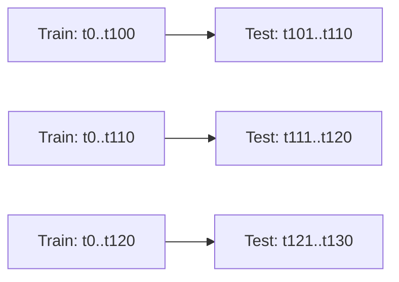
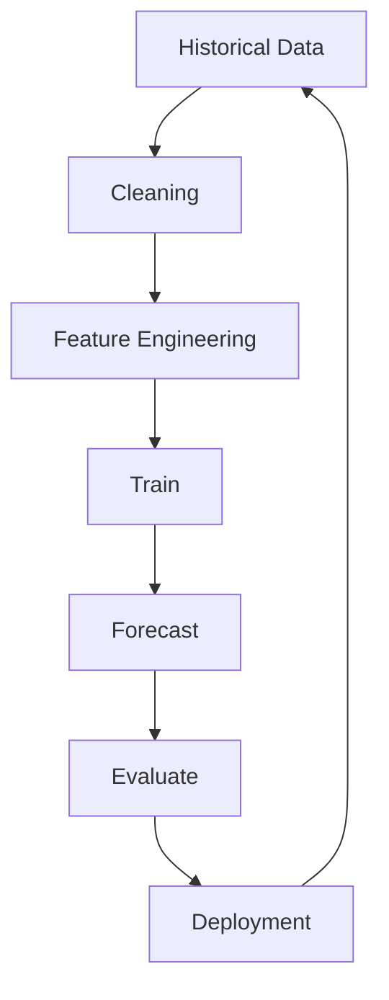

# Time Series

## 1. Learning Objectives

By the end of this chapter, you should be able to:

- Explain why time-dependent data must be handled differently than standard tabular ML data.
- Identify core time series components (trend/seasonality/noise) and why they matter for modeling.
- Split time series data correctly using **chronological splits** and **walk-forward validation**.
- Choose practical classical forecasting methods (moving averages, exponential smoothing, ARIMA intuition).
- Evaluate forecasts with **MAE**, **RMSE**, and **MAPE**, and know when each is appropriate.
- Implement baseline and classical models using **pandas**, **scikit-learn**, and **statsmodels**.
- Build a production-oriented workflow: data → features → train → forecast → evaluate → deploy.
- Avoid common pitfalls (leakage, wrong splits, wrong metrics, unstable MAPE, misleading backtests).

---

## 2. What Makes Time Series Different?

Time series data is different because **the order of observations matters** and the data often has **temporal dependence**.

### Why you can’t treat time series like ordinary tabular data

**Key differences:**

- **Autocorrelation**: yesterday influences today.
  - In tabular ML, rows are often assumed independent (or close enough).
  - In time series, adjacent rows are highly related.

- **Non-stationarity**: the data-generating process changes.
  - Trend, seasonality, regime changes, product launches, pricing changes.

- **Temporal leakage is easy**:
  - Features accidentally include future information (rolling stats computed incorrectly, using “future averages”, random split).

- **Evaluation must mimic reality**:
  - In production, you always predict the future from the past.
  - Random train/test split violates this and inflates performance.

### Engineering perspective
A time series model is typically deployed into a process that repeatedly:

- ingests new data
- updates features
- forecasts for a defined horizon
- monitors error and drift
- retrains on a schedule

---

## 3. Core Concepts (Intuitive)

### Concept Cheat Table

| Concept | What it is | Why it matters | Typical handling |
|---|---|---|---|
| Trend | Long-term increase/decrease | Affects baseline level | Detrend, differencing, models with trend |
| Seasonality | Repeating pattern with fixed period (daily/weekly/yearly) | Strong driver of demand/traffic | Seasonal features, seasonal models (Holt-Winters/SARIMA) |
| Cyclic patterns | Repeating-ish but not fixed period (economic cycles) | Harder to model than seasonality | External regressors, robust models |
| Noise | Random variation | Limits achievable accuracy | Smooth, robust metrics, uncertainty estimates |
| Stationarity | Statistical properties stable over time | Many classical models assume it | Differencing, transformations, model choice |
| Lag | Past values used as predictors | Core to forecasting | Lag features, AR terms |
| Rolling statistics | Moving mean/std/min/max over a window | Captures local context | Use past-only windows (avoid leakage) |
| Forecast horizon | How far ahead you predict (t+1, t+7, t+30) | Changes difficulty and model design | Direct vs recursive strategies |

---

### 3.1 Trend
**What is it?**  
A persistent upward or downward movement over time.

**Why we need it**
- Many business metrics grow (users, revenue) or decline (churned product).
- If you ignore trend, forecasts will lag reality.

**Common handling**
- Add a trend component (smoothing models)
- Differencing (ARIMA family)
- Add “time index” features (ML approach)

---

### 3.2 Seasonality
**What is it?**  
A pattern that repeats with a **known fixed period**, e.g.:

- hourly: traffic peaks during certain hours
- weekly: weekends differ from weekdays
- yearly: holidays and seasonal demand

**Why we need it**
- Seasonality is often the single biggest predictable component.
- It can dwarf the signal from other features.

**Common handling**
- Seasonal exponential smoothing (Holt-Winters)
- SARIMA / SARIMAX
- Calendar features (day-of-week, month) + lags

---

### 3.3 Cyclic Patterns
**What is it?**  
Repeating behavior without a strict fixed period (e.g., macroeconomic cycles).

**Why it matters**
- It’s predictable sometimes, but not as clean as seasonality.
- Often driven by external variables (interest rates, promotions).

**Common handling**
- Include external regressors (price, marketing spend)
- Use robust baselines + monitoring

---

### 3.4 Noise
**What is it?**  
Unpredictable random variation.

**Why it matters**
- Sets a ceiling on forecast accuracy.
- Encourages you to forecast **ranges** (prediction intervals) rather than a single number (when possible).

**Engineering perspective**
- Many “model improvements” are actually fitting noise.
- Prefer simpler models unless you can prove lift via backtesting/A-B.

---

### 3.5 Stationarity
**What is it?**  
A series is *stationary-ish* when its statistical properties (mean/variance) don’t change much over time.

**Why we need it**
- Many classical methods work better when the series is stable.
- Strong trends/seasonality violate stationarity.

**Practical intuition**
- If the “baseline level” keeps changing, a model trained on old data may be miscalibrated.

---

### 3.6 Lag
**What is it?**  
Past values used to predict future values (e.g., y(t-1), y(t-7)).

**Why we need it**
- Captures momentum and periodic repetition.

**Common mistakes**
- Including lag features that accidentally look into the future due to incorrect sorting or shifting.

---

### 3.7 Rolling Statistics
**What is it?**  
Aggregates computed over a sliding window, e.g. rolling mean over last 7 days.

**Why we need it**
- Captures recent local level/volatility (“what’s normal recently?”).

**Best practice**
- Rolling features must be computed using **past-only** data:
  - Use `.shift(1)` before rolling when appropriate.

---

### 3.8 Forecast Horizon
**What is it?**  
How far ahead you predict.

**Why it matters**
- The longer the horizon, the harder the problem.
- Model choice changes:
  - short horizon: lags and smoothing often excel
  - long horizon: seasonality + external drivers become more important

---

## 4. Time Series Data Splitting

### 4.1 Chronological split (the default)
Split by time:

- Train: earlier period
- Validation/Test: later period

This matches real deployment: **predict future from past**.

**Example**  
Train: Jan–Oct, Validate: Nov, Test: Dec

---

### 4.2 Why random train-test split is wrong
Random splitting mixes future data into training and past data into testing. This causes:

- **Leakage**: model learns patterns that only exist in the “future”
- **Inflated performance**: unrealistic evaluation
- **Broken features**: rolling stats and lags become inconsistent

**Rule**: If the timestamp matters, random split is almost always wrong.

---

### 4.3 Walk-forward validation (rolling backtest)
**What it is**  
Repeatedly train on a prefix of the data and validate on the next chunk.

This answers: “How would I have done if I had deployed earlier?”

#### Common variants

| Variant | Train window | Pros | Cons |
|---|---|---|---|
| Expanding window | grows over time | uses all data | slower; may include outdated regimes |
| Sliding window | fixed size | adapts to recent regimes | discards older data; tuning needed |

#### Walk-forward picture

---

## 5. Classical Forecasting Methods (Practical Intuition)

These methods are widely used in real companies because they’re:

- strong baselines
- interpretable
- data-efficient
- easy to deploy and monitor

### 5.1 Moving Average (MA)
**What is it?**  
Forecast is the average of the last *N* observations.

**Why we need it**
- Extremely strong baseline for stable series
- Smooths noise

**When to use**
- You want a quick baseline
- Series is fairly stable with low trend and weak seasonality

**When NOT to use**
- Strong trend (it will lag)
- Strong seasonality (it averages across incompatible periods)

**Limitations**
- Doesn’t adapt quickly to changes unless N is small (but then it’s noisy)

---

### 5.2 Weighted Moving Average (WMA)
**What is it?**  
Like moving average, but recent points get higher weight.

**Why we need it**
- Reacts faster to changes than simple MA

**When to use**
- There’s mild trend or regime changes
- You want simplicity but better responsiveness

**Common mistake**
- Overweighting the last point causes noisy forecasts that chase outliers

---

### 5.3 Exponential Smoothing (ES)
**What is it?**  
A weighted average where weights decay exponentially as you go back in time.

**Intuition**
- “Recent history matters more, but older history still contributes.”

**Why we need it**
- Strong baseline for many operational forecasting tasks
- Handles gradual shifts better than MA

**Variants you’ll see in practice**
- Simple Exponential Smoothing: level only
- Holt’s method: level + trend
- Holt-Winters: level + trend + seasonality

**When to use**
- Most business time series (demand, traffic) as a baseline
- Especially good when seasonality is present (Holt-Winters)

---

### 5.4 ARIMA (intuition only)
**What it is (high level)**  
ARIMA models the series using:

- **A**uto**R**egression: dependence on past values
- **I**ntegration: differencing to remove trend / make series stable-ish
- **M**oving **A**verage: dependence on past forecast errors (a correction mechanism)

**Why we need it**
- Classical, well-understood baseline for univariate forecasting
- Can be extended to seasonal (SARIMA) and with exogenous variables (SARIMAX)

**When to use**
- Univariate series (one metric) with decent history
- You need something stronger than smoothing and can afford model fitting
- You can do proper backtesting and diagnostics

**When NOT to use**
- Many related series and you need cross-series learning (ML often better)
- Frequent structural breaks (pricing changes, promotions) without exogenous features
- Extremely noisy series with little signal (you’ll overfit parameters)

**Engineering perspective**
- ARIMA is often “good enough” for a first version, but:
  - needs careful evaluation (walk-forward)
  - can be sensitive to parameter selection
  - can be expensive to fit repeatedly at scale across thousands of SKUs

---

## 6. Evaluation Metrics

Forecast metrics should match the product goal and handle scale/zeros appropriately.

### Metric Comparison Table

| Metric | What it measures | Pros | Cons | Prefer when |
|---|---|---|---|---|
| MAE | average absolute error | robust, interpretable | doesn’t penalize big misses strongly | operations, stable evaluation |
| RMSE | sqrt of mean squared error | penalizes large errors | sensitive to outliers | big misses are costly |
| MAPE | % error vs actual | scale-free, business-friendly | breaks with zeros/small values; asymmetric | positive-valued series without zeros |

---

### 6.1 MAE
**What it is**  
Average of absolute differences.

**Why it’s useful**
- Easy to interpret: “off by ~X units on average”
- Less sensitive to extreme outliers than RMSE

**When preferred**
- You want robust evaluation
- Outliers shouldn’t dominate model selection

---

### 6.2 RMSE
**What it is**  
Like MAE but squares errors before averaging (then square root).

**Why it’s useful**
- Heavily penalizes large errors
- Good when large misses are disproportionately harmful (stockouts, SLA violations)

**When preferred**
- Big errors are expensive
- You want a metric that pushes the model to avoid large misses

---

### 6.3 MAPE
**What it is**  
Mean absolute percentage error.

**Why it’s useful**
- Easy for stakeholders: “~8% error”
- Compares across series with different scales

**Major limitations**
- If actual values can be **0** or close to 0, MAPE explodes.
- Penalizes under-forecast and over-forecast differently depending on the denominator.

**When preferred**
- Demand/sales are strictly positive and not too small
- You’re comparing across many different scales and need a single percentage metric

**Engineering best practice**
- Consider a safe variant in production:
  - exclude zero/near-zero periods
  - or use sMAPE / MASE (not covered here; good to know they exist)

---

## 7. sklearn / statsmodels Implementation

### 7.1 Libraries you’ll commonly use
- **pandas**: indexing by time, resampling, rolling features
- **numpy**: numeric operations
- **scikit-learn**: metrics, simple ML models, pipelines
- **statsmodels**: exponential smoothing, ARIMA/SARIMAX
- (Optional in production) **joblib** for serialization, **pydantic** for config schemas

---

### 7.2 Example dataset shape
A practical time series table usually looks like:

| timestamp | y | exog_1 | exog_2 | ... |
|---|---:|---:|---:|---|
| 2025-01-01 | 123 | 0.10 | 5 | ... |

Where:
- `y` is the target to forecast
- `exog_*` are optional external drivers (price, promo flag, temperature)

---

### 7.3 Best practices (before coding)
- Ensure timestamps are:
  - parsed as datetime
  - timezone-consistent
  - sorted
  - free of duplicates (or aggregated properly)
- Decide the frequency (daily/hourly) and **resample** explicitly.
- Handle missing timestamps intentionally:
  - forward fill only if it makes business sense
  - otherwise keep as missing and impute carefully

---

### 7.4 Code: loading, resampling, and safe features

    from __future__ import annotations

    import numpy as np
    import pandas as pd

    # Example: daily series
    df = pd.read_csv("series.csv")  # columns: ds, y
    df["ds"] = pd.to_datetime(df["ds"], utc=True)
    df = df.sort_values("ds")

    # Set index and enforce daily frequency (choose what's correct for your product)
    s = df.set_index("ds")["y"].asfreq("D")

    # Handle missing values (choose a policy!)
    # For demand, missing could mean "zero sales" or "data missing" - don't guess blindly.
    s = s.fillna(0.0)

    # Build a feature frame (past-only)
    X = pd.DataFrame(index=s.index)
    X["y_lag_1"] = s.shift(1)
    X["y_lag_7"] = s.shift(7)

    # Rolling stats (shift first to avoid using today's value)
    X["roll_mean_7"] = s.shift(1).rolling(7).mean()
    X["roll_std_7"] = s.shift(1).rolling(7).std()

    # Calendar features
    X["dow"] = X.index.dayofweek  # 0=Mon
    X["month"] = X.index.month

    y = s

    # Drop rows with NaNs introduced by lags/rolls
    data = X.join(y.rename("y")).dropna()
    X, y = data.drop(columns=["y"]), data["y"]

**Key leakage guardrail**
- Use `shift(1)` before rolling so “today’s target” doesn’t leak into “today’s features”.

---

### 7.5 Code: chronological split + simple baseline + metrics (sklearn)

    from __future__ import annotations

    import numpy as np
    from sklearn.metrics import mean_absolute_error, mean_squared_error

    def chronological_split(X, y, test_size: int):
        X_train, X_test = X.iloc[:-test_size], X.iloc[-test_size:]
        y_train, y_test = y.iloc[:-test_size], y.iloc[-test_size:]
        return X_train, X_test, y_train, y_test

    X_train, X_test, y_train, y_test = chronological_split(X, y, test_size=30)

    # Baseline: seasonal naive (use value from 7 days ago)
    y_pred = X_test["y_lag_7"].to_numpy()

    mae = mean_absolute_error(y_test, y_pred)
    rmse = mean_squared_error(y_test, y_pred, squared=False)

    # MAPE with safety (avoid division by zero)
    denom = np.clip(np.abs(y_test.to_numpy()), 1e-8, None)
    mape = np.mean(np.abs((y_test.to_numpy() - y_pred) / denom)) * 100

    print({"MAE": mae, "RMSE": rmse, "MAPE%": mape})

**Engineering note**
- A **seasonal naive** baseline (predict last week’s value) is often surprisingly hard to beat for weekly-seasonal data.

---

### 7.6 Code: Exponential Smoothing (statsmodels)

    from __future__ import annotations

    import pandas as pd
    from statsmodels.tsa.holtwinters import ExponentialSmoothing

    # s is a pandas Series indexed by datetime with fixed frequency
    train = s.iloc[:-30]
    test = s.iloc[-30:]

    model = ExponentialSmoothing(
        train,
        trend="add",          # None, "add", "mul"
        seasonal="add",       # None, "add", "mul"
        seasonal_periods=7,   # weekly seasonality for daily data
        initialization_method="estimated",
    ).fit(optimized=True)

    forecast = model.forecast(steps=len(test))
    print(forecast.head())

**Best practices**
- Set `seasonal_periods` correctly (7 for weekly seasonality on daily data, 24 for hourly daily seasonality, etc.).
- Use walk-forward validation to confirm stability across time, not just one holdout.

---

### 7.7 Code: ARIMA / SARIMAX (statsmodels) — practical usage

    from __future__ import annotations

    import warnings
    import pandas as pd
    from statsmodels.tsa.statespace.sarimax import SARIMAX

    warnings.filterwarnings("ignore")

    train = s.iloc[:-30]
    test = s.iloc[-30:]

    # A common starting point for daily with weekly seasonality:
    # order=(p,d,q), seasonal_order=(P,D,Q,s)
    model = SARIMAX(
        train,
        order=(1, 1, 1),
        seasonal_order=(1, 1, 1, 7),
        enforce_stationarity=False,
        enforce_invertibility=False,
    ).fit(disp=False)

    forecast = model.forecast(steps=len(test))
    print(forecast.head())

**Best practices**
- Don’t “optimize parameters on the test set”. Use validation via walk-forward.
- At scale (many series), ARIMA parameter tuning can become operationally heavy.

---

### 7.8 Walk-forward validation skeleton (model-agnostic)

    from __future__ import annotations

    import numpy as np
    import pandas as pd
    from sklearn.metrics import mean_absolute_error

    def walk_forward_mae(s: pd.Series, horizon: int, step: int = 7) -> float:
        maes = []
        # start after enough history
        start = max(60, horizon + 1)

        for end in range(start, len(s) - horizon, step):
            train = s.iloc[:end]
            test = s.iloc[end:end + horizon]

            # Example: seasonal naive (replace with your model fit/forecast)
            pred = train.shift(7).iloc[-horizon:].to_numpy()
            if len(pred) != len(test):
                continue

            maes.append(mean_absolute_error(test.to_numpy(), pred))

        return float(np.mean(maes)) if maes else float("nan")

    print(walk_forward_mae(s, horizon=14, step=7))

**Engineering note**
- Walk-forward is slower, but it’s the closest offline approximation to real deployment behavior.

---

## 8. Practical Workflow

### 8.1 Historical Data
- Define target precisely (sales, requests/min, energy usage).
- Ensure consistent time granularity (hour/day/week).
- Log known drivers if possible (price, promotions, holidays, outages).

### 8.2 Cleaning
- Fix missing timestamps and duplicates.
- Handle outliers intentionally:
  - data errors (drop/fix)
  - real spikes (keep; model should learn or handle via robust methods)

### 8.3 Feature Engineering
Practical feature categories:
- Lags: t-1, t-7, t-14
- Rolling: last 7/28-day mean and std (shifted)
- Calendar: day-of-week, month, holiday flag
- Domain drivers: price, promo, temperature, marketing spend
- Regime indicators: “post-launch”, “post-price-change”

### 8.4 Train
- Use chronological splits / walk-forward
- Establish baselines first:
  - naive (last value)
  - seasonal naive (last week)
  - exponential smoothing

### 8.5 Forecast
- Decide horizon and output format:
  - single-step repeated daily
  - direct multi-step forecast
- Determine update frequency:
  - daily batch
  - hourly streaming updates (if needed)

### 8.6 Evaluate
- Use MAE/RMSE/MAPE appropriately
- Slice metrics:
  - by season (holiday vs non-holiday)
  - by recency (last month vs older)
  - by region/store/SKU (long tail vs head)

### 8.7 Deployment
- Start with batch forecasts + caching
- Add monitoring:
  - data freshness
  - missingness
  - forecast error drift
- Retraining schedule:
  - fixed cadence (weekly/monthly)
  - or triggered by drift thresholds

---

## 9. Common Mistakes

1. Using random train/test split (future leaks into training).
2. Computing rolling features without shifting (target leakage).
3. Ignoring seasonality (then wondering why error spikes weekly).
4. Evaluating only on one holdout period (not robust to regime changes).
5. Using MAPE on series with zeros/near-zeros (explodes, misleading).
6. Forecasting at wrong granularity (daily vs weekly mismatch with decision-making).
7. Forgetting to align timezones and daylight savings effects (hourly data chaos).
8. Training on uncleaned data with duplicates and missing timestamps.
9. Overfitting ARIMA parameters and celebrating a fragile backtest.
10. Shipping without a naive baseline and without monitoring.
11. Assuming “more complex model” beats strong seasonal baselines.
12. Treating stock prices as a typical forecasting task (non-stationary, reflexive; educational only).
13. Not handling holidays/promotions explicitly when they dominate demand.
14. Evaluating on data that includes periods with known data outages.
15. Ignoring prediction intervals/uncertainty when decisions require risk control.

---

## 10. Rules of Thumb (20+)

1. Always start with a **naive** and **seasonal naive** baseline.
2. Never do random split for time series forecasting.
3. Use **walk-forward validation** for realistic offline evaluation.
4. If weekly seasonality exists, include lag-7 (daily data) early.
5. Rolling features must be **past-only**: shift before rolling.
6. Prefer MAE for stable model comparison; use RMSE when big misses are costly.
7. Avoid MAPE when actual values can be zero or very small.
8. Choose forecast granularity based on the business decision cadence.
9. Don’t fight the calendar: day-of-week and holiday flags often matter more than fancy models.
10. If your forecast horizon is long, expect lower accuracy; focus on uncertainty and drivers.
11. Monitor input data quality—forecasting failures are often data pipeline failures.
12. Keep an eye on structural breaks (pricing changes, product launches, policy changes).
13. Separate “data missing” from “true zero”.
14. For thousands of series, start with scalable methods (seasonal naive / smoothing) before per-series ARIMA tuning.
15. Use sliding windows if the system changes quickly; use expanding windows if history remains relevant.
16. Backtests should cover multiple seasons (not just one month).
17. If a simple seasonal baseline beats your model, your model is not production-ready.
18. Recompute features consistently between training and inference (same code path).
19. Cache forecasts and feature computations; don’t recompute expensive fits per request.
20. Document assumptions: seasonality period, missing data policy, retrain schedule.
21. Slice errors by segment (region/SKU/store); aggregate metrics can hide failures.
22. Prefer interpretable classical models early in a product lifecycle; complexity later.
23. Always evaluate against a “do nothing” baseline (last value) to measure true value-add.
24. If exogenous variables drive the series (promos, weather), include them—or expect poor performance.
25. Forecasting is rarely “set and forget”; plan for drift and retraining from day one.

---

## 11. Real-World Applications

### Sales Forecasting
- Store/day sales, category demand
- Key challenges: promotions, holidays, stockouts (censoring demand)

### Stock Prices (educational use)
- Useful for learning evaluation and leakage pitfalls
- Not a typical “predictable” operational series; strong non-stationarity and reflexive market dynamics

### Weather
- Multi-variate, physics-driven, heavy use of domain models
- ML often supports post-processing and downscaling

### Demand Forecasting
- Inventory planning, logistics, staffing
- Often many sparse series (long tail SKUs)

### Energy Consumption
- Strong seasonality + weather dependence
- Forecasts drive cost optimization and capacity planning

---

## 12. Interview Questions (~20)

1. Why is random train/test split wrong for time series?
2. What is walk-forward validation and why is it more realistic?
3. Define trend vs seasonality. Give real examples.
4. What is stationarity and why does it matter (practically)?
5. What are lag features? What are common pitfalls when creating them?
6. How can rolling features introduce leakage?
7. Compare MAE vs RMSE. When would you prefer each?
8. Why can MAPE be misleading? How do you handle zeros?
9. What is a good baseline for weekly seasonal data?
10. How do you choose the forecast horizon?
11. What’s the difference between seasonality and cyclic patterns?
12. How do holidays and promotions affect forecasting design?
13. When would exponential smoothing be a strong choice?
14. ARIMA in one minute: what do AR, I, and MA mean intuitively?
15. How do you detect a structural break and what do you do about it?
16. How do you deploy forecasts (batch vs real-time) and why?
17. What monitoring would you set up for a forecasting model?
18. How would you evaluate a model across many SKUs with different scales?
19. How do you handle missing timestamps and missing values?
20. What’s an example of a time series feature that is valid offline but invalid online?

---

## 13. Myth vs Reality

| Myth | Reality |
|---|---|
| “You can use the same ML workflow as tabular data.” | Time dependence breaks IID assumptions; splitting and features must respect time order. |
| “ARIMA is outdated and useless.” | ARIMA/SARIMAX is still a solid baseline and often production-sufficient for univariate series. |
| “Deep learning always wins for forecasting.” | Deep models can help at scale with lots of data and infrastructure, but classical baselines often win on simplicity/robustness. |
| “More features always helps.” | Extra features can add leakage and instability; start with lags/seasonality/calendar. |
| “MAPE is the best business metric.” | MAPE fails on zeros and small values; choose metrics based on data properties and costs. |
| “A single holdout test proves performance.” | You need walk-forward across multiple periods to estimate real-world reliability. |

---

## 14. Decision Guide

### 14.1 When should ARIMA be enough?
ARIMA/SARIMAX is often enough when:

- You have a **single series** (or a small number of important series).
- The series has **stable patterns** after differencing (trend manageable).
- Seasonality is present and consistent (use SARIMA / seasonal_order).
- You can afford fitting and periodic refitting.
- You need a dependable baseline with reasonable interpretability.

**Signals ARIMA will struggle**
- Frequent regime changes
- Strong effects from external drivers you aren’t modeling
- Thousands of series where per-series tuning is costly

---

### 14.2 When should ML models be preferred?
Classic ML (e.g., linear models, tree-based models) is often preferred when:

- You have **exogenous features** that matter (price, promos, weather).
- You have **many related series** and want shared feature patterns.
- You want a unified pipeline using the same tooling as other ML systems.
- You care about operational constraints:
  - fast inference
  - consistent feature pipelines
  - easier integration with model registries/monitoring

**Practical examples**
- Demand forecasting with promo flags and holiday effects
- Energy usage with temperature and time-of-day features

---

### 14.3 When should Deep Learning be preferred? (brief)
Deep learning becomes compelling when:

- You have very large-scale forecasting (many series, lots of history).
- You need to learn complex nonlinear cross-series patterns.
- You can support the engineering cost (training infra, monitoring, retraining).

This chapter does not teach LSTMs/Transformers; treat them as future topics once baselines and data pipelines are mature.

---

### Quick decision table

| Situation | Start with | Next step |
|---|---|---|
| Minimal data, need something now | naive + seasonal naive | exponential smoothing |
| Clear seasonality | Holt-Winters | SARIMA/SARIMAX or ML with calendar + lags |
| Strong external drivers | ML with exog features | add better features, then consider more advanced models |
| Many SKUs/series at scale | seasonal naive + smoothing | ML across series; careful evaluation |
| Need interpretability and quick iteration | smoothing / SARIMAX | ML with interpretable features |

---

## 15. Chapter Summary

- Time series forecasting is different because **time order matters** and leakage is easy.
- Core concepts: trend, seasonality, cycles, noise, stationarity, lags, rolling stats, horizon.
- Splitting must be **chronological**, and **walk-forward validation** best matches deployment reality.
- Classical methods remain highly practical:
  - moving averages for quick baselines
  - exponential smoothing for robust operations
  - ARIMA/SARIMAX for stronger univariate modeling (plus seasonality/exog)
- Metrics:
  - MAE is robust
  - RMSE punishes big misses
  - MAPE is business-friendly but dangerous with zeros
- Production success relies more on **data quality, correct evaluation, and monitoring** than on fancy algorithms.

---

## 16. Interview Cheat Sheet

- Never random split time series; use chronological + walk-forward.
- Baselines:
  - naive: y(t) = y(t-1)
  - seasonal naive: y(t) = y(t-s)
- Leakage traps:
  - rolling stats without shift
  - features computed using full dataset (including future)
- Metrics:
  - MAE for robustness
  - RMSE when big errors are costly
  - MAPE only if values are positive and not near zero
- Classical methods:
  - Exponential smoothing = strong practical baseline
  - ARIMA/SARIMAX = classical univariate; can include seasonality and exogenous drivers
- Always align with reality:
  - correct frequency
  - consistent feature computation at inference
  - monitoring and retraining plan

---

## 17. Quick Revision

- Time series ≠ tabular because rows are dependent and order matters.
- Core components: **trend**, **seasonality**, **noise**; plus lags/rolling stats/horizon.
- Splits must be **chronological**; random split causes leakage.
- Use **walk-forward validation** to simulate repeated deployment.
- Start with baselines:
  - naive and seasonal naive
  - exponential smoothing (often very strong)
- ARIMA intuition:
  - AR = uses past values
  - I = differencing to stabilize
  - MA = corrects using past errors
- Metrics:
  - MAE (robust), RMSE (penalize large errors), MAPE (percentage; risky with zeros)
- Production focus: correct data frequency, leakage-free features, monitoring, retraining cadence.