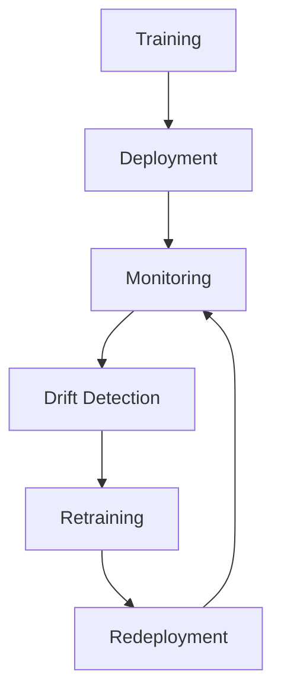

# Data Drift and Concept Drift

---

## 1. Learning Objectives

By the end of this chapter, you should be able to:

- Explain why strong offline metrics can collapse in production.
- Distinguish data drift, concept drift, and label drift with real examples.
- Recognize drift patterns: sudden, gradual, recurring.
- Design monitoring that catches drift early using:
  - feature distribution checks  
  - prediction/score monitoring  
  - delayed label performance monitoring  
- Choose practical responses: alerts, retraining schedules, incremental updates, and safe fallbacks.
- Speak confidently about drift in ML engineering interviews with a production mindset.

---

## 2. Why Models Fail in Production

A model with **95% validation accuracy** can still perform poorly after deployment because the validation environment rarely matches production reality.

### The Core Reason

Your model learns patterns from training data. In production, the data distribution and even the true relationships can change. If the production world differs from the training world, performance drops.

### Common Real-World Failure Modes (High Impact)

#### Data Changes
- New app version changes logging
- New user geography expands distribution
- Upstream service changes feature definitions

#### Behavior Changes
- Users adapt (e.g., clickbait fatigue)
- Fraudsters evolve attacks
- Competitors change pricing

#### Feedback Loops
- Recommendations alter what users see → alters future training data

#### Offline Evaluation Leakage
- Random split on time-dependent data
- Features accidentally include future information

#### Label Availability
- Labels in production arrive late (fraud chargebacks, medical outcomes)
- You optimized for a proxy label that diverges from business value

### Practical Takeaway

- Offline evaluation answers:  
  **"How did we do on historical data with this split?"**
- Production demands:  
  **"How do we do on current and future data under real constraints?"**

---

## 3. Data Drift

### What Is Data Drift?

Data drift (a.k.a. covariate drift) is when the distribution of input features changes over time.

- Training feature distribution: `P_train(X)`
- Production feature distribution: `P_prod(X)`

Data drift means:

```
P_train(X) ≠ P_prod(X)
```

### Why We Need to Care

Even if the "true rule" stays the same, the model may be forced to extrapolate into areas it never learned.

### What It Looks Like (Common Signals)

- Feature means/variances shift
- Categorical proportions change (new device type, new country)
- New values appear (new app version)
- Missingness changes (null rates spike)

### Examples

- **Fraud detection:** payment methods shift (more digital wallets), transaction amounts change.
- **Recommendations:** new catalog category introduced; content mix changes.
- **Search:** query distribution changes due to a viral event.
- **Healthcare:** new diagnostic device changes measurement ranges.
- **Ads:** traffic source changes (new campaign brings different demographics).

### Common Causes (Engineering Reality)

#### Upstream Pipeline Changes (Most Common)
- Feature definition change (e.g., "7-day clicks" → "calendar week clicks")
- Bug in joining tables
- Unit changes (seconds → milliseconds)

#### Product Changes
- New UI changes click patterns and logging
- New pricing model

#### Population Changes
- Expansion to new markets
- Onboarding changes

#### Seasonality
- Holidays, weekends, school year

### When Data Drift Is Not Automatically a Problem

- The model is robust and still performs well.
- The drift is within the model's learned region.
- Drift happens in low-importance features.

**Key idea:** Data drift is a warning sign, not proof of accuracy loss.

---

## 4. Concept Drift

### What Is Concept Drift?

Concept drift is when the relationship between features and labels changes over time.

- Training: `P_train(Y | X)`
- Production: `P_prod(Y | X)`

Concept drift means:

```
P_train(Y | X) ≠ P_prod(Y | X)
```

### Why It Matters

Even if features look "stable," the model can become wrong because the world's rules changed.

### Examples

- **Fraud detection:** fraudsters change tactics; old signals stop indicating fraud.
- **Recommendations:** user tastes shift (new trends); what predicts engagement changes.
- **Search ranking:** query intent changes ("jaguar" becomes mostly about the OS release, not cars).
- **Healthcare:** new treatment protocols change outcome probabilities for the same patient profile.
- **Autonomous vehicles:** new road signage patterns; different driving behaviors in new regions.

### Common Causes

- Strategic adversaries: fraud/spam evolves in response to detection.
- Policy and constraint changes: new regulations, new eligibility rules.
- Product changes: new features change behavior (notifications, layout).
- Macro changes: pandemics, economic changes, supply chain shocks.
- Feedback loops: model influences what data gets collected next.

### Engineering Perspective

Concept drift is harder than data drift because:

- It often requires labels to detect reliably.
- Labels are delayed or noisy.
- Fixing it usually requires retraining (sometimes with new features or a new objective).

---

## 5. Label Drift (Conceptual)

### What Is Label Drift?

Label drift is when the distribution of labels changes: `P(Y)` changes.

Example:

- Fraud rate increases from 0.2% to 1.0%.
- Click-through rate rises due to seasonal shopping.
- Disease prevalence changes across waves.

### How It Differs

Label drift can happen without concept drift.

Example: a promotion increases purchases overall, but the mapping from features to purchase propensity stays similar.

It still impacts calibration and thresholds.

If base rate changes, a fixed decision threshold can become wrong.

### Practical Note

Label drift is often detected later because it depends on label availability. It's still important because it breaks:

- alert thresholds
- class imbalance assumptions
- calibrated probabilities

---

## 6. Types of Drift

Drift pattern matters because it determines response strategy.

| Drift Type | What it looks like | Typical cause | Practical response |
|------------|-------------------|---------------|-------------------|
| Sudden | abrupt shift on a specific date | logging change, policy change, outage, launch | immediate alert + rollback + patch + retrain |
| Gradual | slow change over weeks/months | market evolution, population shift | scheduled retraining, windowed training, monitoring trends |
| Recurring | seasonal/repeating shifts | weekday/weekend, holidays, annual seasonality | seasonal features, retrain per season, maintain seasonal baselines |

### Engineering Intuition

- Sudden drift suggests system change (often a bug).
- Gradual drift suggests world change.
- Recurring drift suggests you should model seasonality or segment.

---

## 7. Detecting Drift (High Level)

Drift detection is about catching issues early with cheap signals before you have full labels.

### 7.1 Monitoring distributions (feature drift)

Monitor:

- numeric feature stats: mean, std, quantiles
- categorical proportions: top categories and "other"
- missingness/null rate
- range violations (min/max)
- embedding norms / vector magnitude stats (if using embeddings)

**Where this shines**

- Logging bugs, pipeline changes, silent schema changes

**Where it fails**

- Concept drift with stable feature distributions

---

### 7.2 Monitoring predictions and scores

Even without labels, you can monitor:

- predicted probability distribution (e.g., average risk score)
- fraction of positives above threshold
- ranking score distributions
- recommendation diversity/coverage metrics

**Why it helps**

- If the model's output distribution shifts sharply, something changed.
- Useful when labels arrive late.

**Caveat**

Output drift could be caused by feature drift, concept drift, or legitimate seasonality—needs context.

---

### 7.3 Performance monitoring (label-based)

When labels are available (immediate or delayed), monitor:

- core metrics: accuracy, precision/recall, AUROC, calibration
- business metrics: conversion, fraud loss, complaint rate
- segmentation: performance by country/device/user cohort

**Best practice**

Monitor both global and slice-level performance (many failures are localized).

---

### 7.4 Statistical tests (concept only)

Statistical tests can quantify distribution change. Common ideas:

- compare histograms / quantiles
- divergence measures (e.g., PSI, KL approximations)
- two-sample tests (e.g., KS test for numeric)

**Production stance**

- Tests are helpers, not judges.
- False positives are common at scale (many features).
- Use thresholds + alerting + human context.

### What you actually want in production

A simple, robust drift detection stack:

- Data quality checks (schema, ranges, nulls)
- Feature drift dashboards (top features + segments)
- Prediction monitoring (score distributions + threshold rates)
- Delayed label performance (rolling window metrics)
- Alert routing (who owns what, with runbooks)

---

## 8. Handling Drift

### 8.1 Retraining (most common fix)

**What it is**

Periodically retrain on more recent data (possibly with a moving window).

**When to use**

- Gradual drift
- Known seasonality
- Periodic business changes

**Engineering choices**

- Retrain cadence: daily/weekly/monthly
- Training window: last N days vs all history
- Validation: time-based split + backtests
- Safety: shadow deploy before full rollout

---

### 8.2 Incremental learning (careful)

**What it is**

Update model parameters continuously or frequently with new data.

**Pros**

- Adapts quickly
- Useful for fast-changing domains (fraud, ads)

**Cons**

- Risk of learning from biased recent data (feedback loops)
- Harder reproducibility/debugging
- Requires strong data quality guarantees

**Practical note**

Many teams prefer frequent batch retrains over true online learning because it's easier to reason about and roll back.

---

### 8.3 Monitoring + alerts

**What it is**

Use monitoring signals to trigger investigation or retraining.

**Alert types**

- Data quality alerts (schema break, null spikes): page immediately
- Drift alerts (PSI high, new categories): ticket/investigation
- Performance alerts (precision drop): escalation + rollback plan

**Key engineering addition**

A runbook for every alert: "If alert X triggers, check A/B/C, then do Y."

---

### 8.4 Threshold and calibration updates

Sometimes you don't need full retraining:

- if base rate changed (label drift)
- if costs changed (business objective shift)

You might:

- adjust decision thresholds
- recalibrate probabilities
- update post-processing rules

---

### 8.5 Fallbacks and safe degradation

When drift or data issues occur:

- serve a baseline model
- use rules-based fallback
- reduce automation and require manual review (fraud/health)

**Design goal**

Your system should fail "safe," not "silent."

---

## 9. Production Workflow



### Practical implementation notes

- Training artifact versioning: model + features + data snapshot identifiers.
- Feature pipeline parity: same transformations training vs inference (or a shared library).
- Monitoring ownership: define who is on-call for model issues vs data pipeline issues.
- Deployment strategy:
  - canary release
  - shadow mode (score but don't act)
  - rollback mechanism

---

## 10. Real-World Examples

### Fraud Detection

- **Data drift:** new payment provider changes feature distributions.
- **Concept drift:** fraudsters adapt to the model; old patterns stop working.
- **Handling:** frequent retraining, adversarial monitoring, thresholds updated for fraud rate shifts, human-in-the-loop fallback.

### Recommendation Systems

- **Data drift:** new content category changes item feature distribution.
- **Concept drift:** user preferences shift (trends) and feedback loops change what data is observed.
- **Handling:** retrain embeddings/rankers, exploration policies, segment monitoring (new users vs power users).

### Search Ranking

- **Data drift:** query mix changes due to news events.
- **Concept drift:** intent changes, new spam tactics.
- **Handling:** query cluster monitoring, fast rollback, continuous evaluation with fresh labels.

### Healthcare

- **Data drift:** new device changes measurement units or precision.
- **Concept drift:** new clinical guidelines change outcomes.
- **Handling:** strict data validation, calibration checks, governance, conservative rollouts, monitoring by hospital/site.

### Autonomous Vehicles

- **Data drift:** new region introduces different signage/road marking distributions.
- **Concept drift:** driving behavior and norms differ.
- **Handling:** extensive simulation + real-world monitoring, domain adaptation, safety gates; often requires new training data collection.

---

## 11. Common Mistakes

1. Treating drift detection as a one-time setup instead of a living system.
2. Monitoring only aggregate metrics; ignoring slices (country/device/cohort).
3. No data quality checks (schema/range/null) — drift alerts become noise.
4. Triggering retraining on every drift alert (thrash) without confirming impact.
5. No rollback plan; deploying a "fix" that makes it worse.
6. Confusing data drift with concept drift and choosing the wrong response.
7. Not tracking feature definitions and versions; can't correlate drift to a code change.
8. Ignoring feedback loops ("the model changes the data it sees").
9. Not accounting for delayed labels; performance issues are discovered too late.
10. Using statistical tests as authoritative truth; ignoring context and business seasonality.
11. Building alerts without runbooks; the team learns nothing during incidents.
12. Retraining on biased recent data (e.g., only data the model decided to show).

---

## 12. Rules of Thumb (20+)

1. Assume drift will happen; design for it from day one.
2. Always use time-based validation splits for production-like evaluation.
3. Monitor data quality before drift (schema, nulls, ranges).
4. Track feature distributions and prediction distributions separately.
5. Data drift is a warning; concept drift is often the real accuracy killer.
6. If drift is sudden, suspect a pipeline/logging change before blaming the model.
7. Set alerts on missingness spikes—they catch many silent failures.
8. Monitor performance by key segments (geo, device, new/returning users).
9. Keep a strong baseline model as a fallback.
10. Version everything: code, features, model, training data time range.
11. Build a clear incident path: detect → diagnose → mitigate → postmortem.
12. Prefer scheduled retraining unless you have a robust trigger strategy.
13. Retraining faster doesn't help if labels are delayed or data is wrong.
14. Use shadow deployments to evaluate new models safely.
15. Watch for feedback loops; they can silently worsen bias and drift.
16. Don't retrain on corrupted periods (outages, logging bugs).
17. Calibrate and revisit thresholds when base rates shift (label drift).
18. Keep drift dashboards small and actionable: top features + key slices.
19. In high-risk domains, fail safe: degrade automation when uncertainty rises.
20. Drift is often seasonal; compare against the same season last year/week.
21. A model can drift "quietly" even if features don't—monitor outcomes.
22. If only one feature drifts and it's critical, prioritize investigation.
23. If many features drift simultaneously, suspect a pipeline/system change.
24. Measure business KPIs alongside model metrics; both can reveal drift.
25. If you can't get labels, invest more in proxy signals and human review loops.

---

## 13. Interview Questions (~20)

1. Why can a model with high offline accuracy fail in production?
2. Define data drift vs concept drift.
3. Give examples of data drift in a consumer product.
4. Give examples of concept drift in fraud detection.
5. What is label drift? How does it affect thresholds?
6. How would you detect drift without labels?
7. How would you detect drift with delayed labels?
8. What monitoring would you put in place for a deployed ML model?
9. Why is monitoring only aggregate metrics risky?
10. How do feedback loops cause drift in recommender systems?
11. What's your response plan to a sudden performance drop?
12. When would you retrain vs recalibrate vs adjust thresholds?
13. How can a logging change mimic concept drift?
14. How do you do safe deployments for a model update?
15. What is walk-forward evaluation and why does it matter for drift?
16. What are common causes of drift in feature pipelines?
17. What's the difference between drift and noise?
18. How do you prevent retraining on corrupted data?
19. How do you prioritize which drift alerts to respond to?
20. How do you measure whether retraining actually fixed the issue?

---

## 14. Myth vs Reality

| Myth | Reality |
|------|---------|
| "If validation is great, production will be great." | Production changes; evaluation often misses real-world shifts and constraints. |
| "Data drift always means performance dropped." | Drift can be harmless; it's a signal to investigate and correlate with outcomes. |
| "Statistical tests will solve drift detection." | Tests help, but production drift detection is mostly monitoring + engineering judgment. |
| "More frequent retraining always fixes drift." | Retraining on biased or broken data can worsen performance; labels may be delayed. |
| "Concept drift can be detected without labels." | Sometimes via proxy signals, but reliable confirmation usually needs labels. |
| "Monitoring is an MLOps-only concern." | Monitoring is core ML engineering; models are software running in changing environments. |

---

## 15. Decision Guide

### What problem do you likely have?

| Observation | Likely issue | First action |
|-------------|--------------|--------------|
| Sudden spike in nulls / out-of-range values | data pipeline bug | investigate ETL, schema, feature joins; rollback feature change |
| Feature distributions changed, outputs changed, labels unknown | data drift (possibly) | check input sources, compare segments, validate feature computation |
| Features stable but performance drops once labels arrive | concept drift | retrain on recent data; consider new features/objective |
| Base rate changed (more positives overall) | label drift | recalibrate / adjust thresholds; confirm costs and policies |
| Drift only in one region/device | localized drift | segment-specific models or rules; investigate data coverage |

### Response strategy selection

**Low risk + fast labels (e.g., CTR):**
- monitor daily metrics, retrain frequently, canary deploy

**High risk + slow labels (e.g., fraud chargebacks):**
- strong proxy monitoring, conservative thresholds, human-in-the-loop, delayed performance checks

**Recommenders/search with feedback loops:**
- incorporate exploration, monitor distribution of exposures, evaluate with time-based splits, watch bias amplification

### When to retrain vs recalibrate vs rollback

**Rollback if:**
- sudden drift coincides with a code/logging/data change
- data quality checks fail

**Recalibrate / threshold update if:**
- label/base rate shifted but model ranking still seems good

**Retrain if:**
- performance degradation persists after data integrity is confirmed
- concept drift suspected due to new behaviors/attack patterns

---

## 16. Chapter Summary

- Production failures are often due to distribution shift, leakage in offline eval, feedback loops, or data pipeline changes.
- **Data drift** = features change (P(X) changes). Often caused by pipeline/product/population changes.
- **Concept drift** = relationship changes (P(Y|X) changes). Common in adversarial or evolving environments.
- **Label drift** = base rate changes (P(Y) changes). Breaks calibration and thresholds.
- Drift can be sudden, gradual, or recurring—pattern determines response.
- Practical drift management is mostly:
  - monitoring + alerts + runbooks
  - safe deployments and rollbacks
  - periodic retraining and validation with time-aware splits

---

## 17. Interview Cheat Sheet

- **95% validation → bad prod:** because production distribution differs; leakage; feedback loops; delayed labels.
- **Data drift:** P(X) changed. Detect via feature stats, missingness, categorical proportions.
- **Concept drift:** P(Y|X) changed. Confirm via performance once labels arrive; often needs retraining/new features.
- **Label drift:** P(Y) changed. Fix via recalibration/threshold updates.
- **Drift patterns:**
  - sudden = suspect pipeline change
  - gradual = scheduled retraining / windowing
  - recurring = seasonality; model it and monitor by season
- **Monitoring stack:**
  - data quality → feature drift → prediction drift → label-based performance
- **Always have:**
  - baselines/fallbacks
  - canary/shadow deployments
  - rollback plan
  - versioning and reproducibility

---

## 18. Quick Revision

- Models fail in production because the world changes and offline evaluation is imperfect.
- **Data drift:** feature distributions change (P(X) shifts). Often pipeline/product/population changes.
- **Concept drift:** mapping from features to label changes (P(Y|X) shifts). Often behavior/adversary changes.
- **Label drift:** label base rate changes (P(Y) shifts). Impacts thresholds and calibration.
- **Drift types:** sudden, gradual, recurring.
- **Detect drift via:**
  - feature distribution monitoring
  - prediction/score monitoring
  - label-based performance monitoring (when available)
- **Handle drift via:**
  - alerts + runbooks
  - scheduled retraining or incremental updates
  - calibration/threshold updates
  - safe deployment and rollback mechanisms