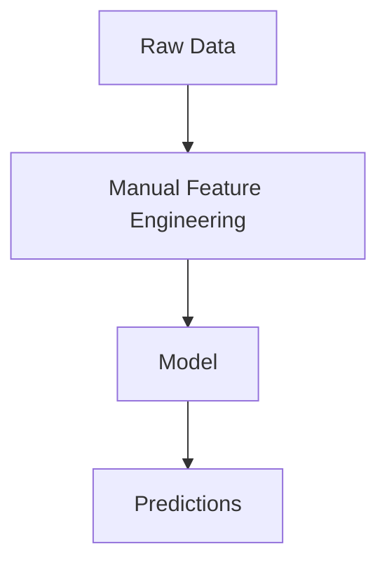
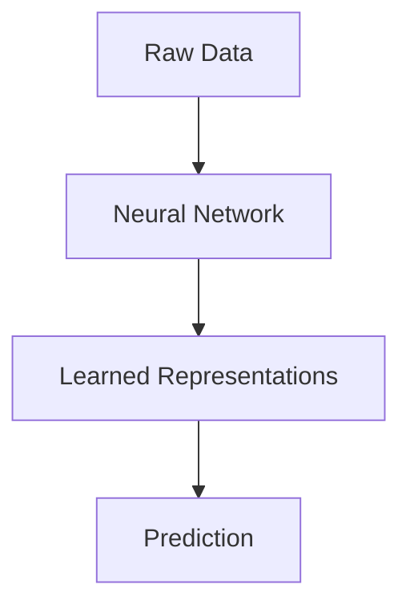
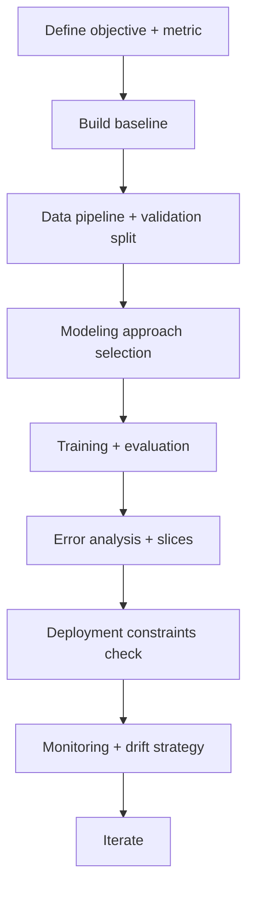

# Feature Extraction vs Representation Learning

## 1. Learning Objectives

By the end of this chapter, you should be able to:

- Clearly distinguish **feature engineering**, **feature extraction**, and **representation learning**.
- Explain how deep learning changes the ML pipeline (and what it doesn’t change).
- Reason about when classical ML (especially tree models) still wins in production.
- Articulate why deep learning replaced many hand-engineered pipelines for text, images, audio, and recommendation.
- Compare **gradient-boosted trees vs neural networks** for tabular and non-tabular data.
- Understand what skills transfer directly when moving from scikit-learn to PyTorch.
- Make practical architecture decisions in interviews and real projects without diving into NN internals yet.

---

## 2. Why This Chapter Matters

This chapter is the bridge between:

- **Classical ML** (feature engineering + simpler models)
- **Deep Learning** (learn representations automatically)

If you understand this bridge, you’ll avoid two common engineering traps:

1. **“Deep learning everywhere”**: building complex training systems for problems where XGBoost/LightGBM wins faster and more reliably.
2. **“Classical ML everywhere”**: spending months hand-engineering features for images/text when a learned representation solves it cleanly.

This chapter sets you up for Phase 3 (PyTorch) by explaining *why* representation learning became necessary and *what changes* when you move to neural networks.

---

## 3. Feature Engineering vs Feature Extraction vs Representation Learning

These terms are often used interchangeably in casual conversation, but they’re different in important engineering ways.

### Definitions (practical)

| Term | What it is | Who designs it? | Typical tools | Example |
|---|---|---|---|---|
| Feature Engineering | Creating features from raw/available data using domain knowledge | Humans | SQL, pandas, sklearn preprocessing | “7-day purchase count”, “time since last login” |
| Feature Extraction | Transforming raw data into a more useful numeric form using a fixed procedure | Mostly humans (choose method), algorithm does transform | TF-IDF, PCA, SIFT (classic vision), MFCC (audio) | TF-IDF vectors from text; PCA components |
| Representation Learning | Learning features automatically as part of training to optimize the end task | Model learns it | Neural nets, embeddings, self-supervised pretraining | Learned text embeddings for intent classification |

### How to think about them
- **Feature engineering**: “I know what signals matter; let me compute them.”
- **Feature extraction**: “I’ll apply a general transform that usually works, then model.”
- **Representation learning**: “I’ll let the model learn the right features from data.”

### What changes operationally
- Feature engineering/extraction tends to produce:
  - stable features
  - simpler training
  - easier debugging
- Representation learning tends to produce:
  - higher ceiling performance for complex data
  - more training complexity (data, compute, monitoring)
  - less direct interpretability (but there are tools)

---

## 4. Traditional Machine Learning Pipeline

### The classic workflow

### What “manual feature engineering” really includes
- Data cleaning: missing values, outliers
- Encoding: one-hot, target encoding (carefully), scaling
- Domain aggregates: counts, ratios, time windows
- Feature selection: remove leakage, reduce redundancy
- Feature extraction: TF-IDF/PCA when helpful

### Why this pipeline is still valuable
- Often faster to build for tabular data
- Easier to debug and explain
- Works well with small and medium datasets
- Strong baselines are extremely competitive

---

## 5. Deep Learning Pipeline

### The deep learning workflow (high level)

### Key shift
Instead of hand-designing most features, you provide:

- raw-ish inputs (tokens, pixels, waveforms, IDs)
- a model architecture that can learn patterns
- large enough data + compute

The model learns intermediate representations that are useful for the final task.

### What “learned representations” mean in practice
- Text: embeddings capture semantics (“refund” close to “return”)
- Images: internal features capture edges → textures → objects
- Recommenders: user/item embeddings capture taste similarity

You don’t directly specify these features; the training process discovers them.

---

## 6. Why Deep Learning Replaced Many Classical Pipelines

Deep learning didn’t “win” because it’s trendy. It won because it solves recurring engineering problems at scale.

### 6.1 Automatic feature learning
Classical pipeline pain:
- feature engineering becomes a long iterative process
- performance improvements slow down over time
- features are brittle across domains/products

Deep learning:
- learns useful features directly from raw inputs
- reduces reliance on manual feature discovery (not to zero, but significantly)

### 6.2 Scalability with data
Many deep models improve as you add:
- more training data
- more compute
- better pretraining

Classical feature engineering often hits a ceiling: you can’t hand-design your way to understanding complex unstructured patterns.

### 6.3 Complex data (unstructured inputs)
For:
- text
- images
- audio
- video
- graphs
- sequences

Classical ML needs heavy feature extraction. Deep learning learns features end-to-end and usually achieves higher ceiling performance.

### 6.4 End-to-end learning
End-to-end systems can optimize the objective directly:
- fewer “hand-off” artifacts between feature extraction and model
- less mismatch between what features encode and what the model needs

**Engineering reality**
End-to-end training also increases system coupling: a small data format change can break everything. You trade modularity for performance ceiling.

---

## 7. When Classical ML Still Wins

Deep learning is not the default best answer. Classical ML wins often because it’s cheaper, faster, and more reliable.

### Cases where classical ML often dominates

#### Small datasets
- Deep learning can overfit quickly.
- Tree models and regularized linear models are data-efficient.

#### Tabular data
- Most business problems are tabular: churn, pricing, risk, ops forecasting features.
- Gradient boosting is very hard to beat.

#### Explainability requirements
- Regulated environments (credit, healthcare) may require clearer reasoning.
- Linear/logistic + monotonic constraints (in boosting libs) can help.

#### Low latency / low resource
- Simple models can run in microseconds and are easy to embed.
- Deep models may require accelerators or careful optimization.

#### Limited compute / limited MLOps maturity
- Classical ML is easier to train, deploy, and monitor.
- Deep learning adds complexity: GPUs, checkpoints, large artifacts, drift sensitivity.

### Practical heuristic
If your inputs are mostly:
- numeric
- categorical
- aggregated signals  
...start with classical ML.

If your inputs are:
- text/images/audio
- raw event sequences
- high-dimensional sparse tokens  
...representation learning tends to shine.

---

## 8. Tree Models vs Neural Networks

### Why gradient boosting dominates tabular datasets
Gradient-boosted decision trees (GBDT) like XGBoost/LightGBM/CatBoost are often best-in-class for tabular because they:

- handle mixed feature types well (numeric + categorical with strategies)
- capture nonlinear interactions without extensive feature engineering
- are robust to monotonic transformations and scaling
- work well on medium-sized datasets
- train fast and are easy to iterate on
- provide strong baselines and decent interpretability tooling

### Why neural networks often underperform on tabular (in practice)
- tabular data often has:
  - limited sample sizes relative to feature complexity
  - noisy, non-smooth patterns
  - important “if-else” style interactions (trees model this naturally)
- NNs need:
  - careful normalization/architecture
  - lots of tuning
  - often more data to win

### Comparison table (engineering view)

| Dimension | GBDT (XGBoost/LightGBM/CatBoost) | Neural Networks |
|---|---|---|
| Tabular performance | Often best | Sometimes competitive; often worse without large data |
| Unstructured data | Poor without feature extraction | Strong (learn features) |
| Feature scaling | Not required | Often required |
| Handling missing values | Usually good | Must be handled explicitly |
| Training infra | Simple CPU | Often GPU + more complexity |
| Latency | Very good | Varies; can be higher |
| Interpretability | Better tooling (SHAP etc.) | Harder; indirect techniques |
| End-to-end learning | Limited | Core strength |

**Interview perspective**
A strong answer is not “trees are better.” It’s:
- “For tabular data with limited sample size, boosting is a strong default baseline. For raw unstructured inputs, representation learning becomes necessary.”

---

## 9. Transition to PyTorch

This section is about mindset and workflow changes, not neural network details.

### What will change?

#### You move from “fit/predict” to “define/train”
In sklearn, training is a one-liner:
- define model
- `.fit(X, y)`
- `.predict(X)`

In PyTorch, you’ll explicitly manage:
- model definition (layers/modules)
- forward pass
- loss computation
- optimization loop
- batching and data loaders
- GPU/CPU device placement
- checkpoints and training logs

#### You’ll deal with tensors and shapes
A major practical skill becomes:
- understanding tensor shapes
- debugging dimensionality mismatches
- ensuring consistent preprocessing/tokenization

#### Training becomes an engineering system
You’ll care more about:
- reproducibility (seeds, deterministic ops where possible)
- experiment tracking
- compute cost
- mixed precision / batching strategies
- model versioning and artifact size

### What remains the same?

The fundamentals of good ML engineering carry forward:

- problem framing and success metrics
- leakage-free evaluation and correct splits
- baselines and ablations
- data quality and monitoring
- deployment constraints (latency, memory, throughput)
- drift detection and retraining strategy

### What knowledge carries forward?

From classical ML chapters, these skills transfer directly:

- feature thinking: what signals exist and how they could leak
- evaluation: choosing metrics aligned to product goals
- regularization mindset: overfitting is still the enemy
- error analysis: slicing, cohort analysis
- production discipline: versioning, monitoring, fallbacks

**Practical framing**
Deep learning changes *how features are obtained*, not the need for rigorous evaluation and production reliability.

---

## 10. Practical Engineering Workflow

A practical workflow that works for both classical ML and deep learning:

### How this applies to the “feature vs representation” decision
- Start with:
  - simple engineered features + strong baseline model (often boosting)
- Add feature extraction when:
  - you have text and need a quick win (TF-IDF + linear)
- Move to representation learning when:
  - feature extraction hits a ceiling
  - you need to learn from raw unstructured data
  - the product justifies the compute/complexity

### Production-oriented checklist
- Can you compute features consistently online?
- Are features stable across versions?
- Do you have a fallback when embeddings/model aren’t available?
- How will you monitor input drift when features are learned?
  - often you monitor embedding norms, score distributions, and downstream KPIs

---

## 11. Common Mistakes

1. Treating representation learning as “no feature work needed.”
   - You still need good data, labeling, splits, and careful preprocessing.
2. Skipping baselines and going straight to deep learning.
3. Using deep learning for small tabular datasets where boosting is stronger and faster.
4. Not accounting for inference constraints (latency/memory) early.
5. Assuming “end-to-end” automatically improves performance.
6. Ignoring leakage because “the network will figure it out.”
7. Building a brittle preprocessing pipeline (tokenization/version mismatches).
8. Confusing feature extraction (fixed transform) with representation learning (learned).
9. Failing to monitor model inputs because “they’re embeddings now.”
10. Underestimating the engineering cost: training time, GPUs, deployment, monitoring.
11. Over-indexing on benchmarks instead of product metrics and reliability.
12. Forgetting explainability requirements until late in the project.

---

## 12. Rules of Thumb (20+)

1. Start with the simplest model that can plausibly solve the problem.
2. Always build and record a baseline before switching paradigms.
3. For tabular business data, gradient boosting is a strong default.
4. For text classification, TF-IDF + linear model is a strong baseline.
5. For image/audio, classical features can work, but representation learning usually has higher ceiling.
6. Feature engineering is about encoding domain knowledge; it remains valuable in any pipeline.
7. Feature extraction is fast when a fixed transform matches the domain (e.g., TF-IDF).
8. Representation learning is best when the “right features” are hard to hand-design.
9. End-to-end learning trades modularity for performance ceiling—plan for coupling.
10. Deep learning increases operational complexity; justify it with measurable lift.
11. If labels are scarce, classical models often win; alternatively leverage pretrained representations (later topic).
12. If you can’t serve the model within latency budgets, it’s not production-ready.
13. Inference cost matters more than training cost in many products.
14. Monitor input drift; learned representations can drift too.
15. Keep preprocessing deterministic and versioned; mismatches cause silent failure.
16. If your team lacks GPU/ML infra maturity, start with classical ML first.
17. For structured categorical features, boosted trees often capture interactions efficiently.
18. If performance is limited by data quality, model complexity won’t help much.
19. Don’t confuse “more parameters” with “more accuracy.”
20. If you need strong explainability, prefer simpler models or interpretable constraints.
21. Use error analysis to decide whether feature work or representation learning is needed.
22. Prefer approaches that reduce feature brittleness across product changes.
23. When moving to representation learning, invest in reproducibility and experiment tracking early.
24. Representation learning shines when you have scale (data + compute) or strong pretrained signals.
25. The goal is not deep learning—it’s a reliable system that improves the product.

---

## 13. Real-World Examples

### Example 1: Spam / Toxicity Detection (Text)
- Classical: TF-IDF + logistic regression
  - fast, interpretable top tokens, strong baseline
- Representation learning: learned embeddings inside a neural model
  - better semantics, handles paraphrases, higher ceiling

### Example 2: Product Recommendations
- Classical: popularity + item-item collaborative filtering + engineered features
- Representation learning: user/item embeddings learned from interactions
  - scalable retrieval, better personalization, supports ANN search

### Example 3: Fraud Detection (Tabular)
- Classical: boosted trees on engineered transaction features (counts, recency, velocity)
- Representation learning: sometimes used for sequence patterns, but boosting remains common due to robustness and interpretability needs

### Example 4: Image Quality / Defect Detection
- Classical: handcrafted features (edges, textures) + SVM
- Representation learning: learned visual features generally outperform with enough labeled data

### Example 5: Search Ranking
- Classical: engineered relevance signals + boosted trees
- Representation learning: learned query/document representations improve semantic matching (often hybrid systems)

---

## 14. Interview Questions (~20)

1. Define feature engineering vs feature extraction vs representation learning.
2. Why did deep learning replace many classical pipelines for vision and NLP?
3. Give a practical example of feature extraction that is not representation learning.
4. When would you choose TF-IDF + linear model over deep learning?
5. Why do boosted trees often outperform neural networks on tabular data?
6. What are the operational costs of representation learning systems?
7. What remains the same when moving from sklearn to PyTorch?
8. What changes when moving from “fit/predict” to custom training loops?
9. How would you decide whether deep learning is justified for a product?
10. What is end-to-end learning and what are its trade-offs?
11. How do you ensure preprocessing consistency between training and inference?
12. What are common sources of leakage in feature engineering pipelines?
13. How does representation learning affect interpretability?
14. How would you build a baseline for a text classification problem?
15. How do you monitor drift when using embeddings?
16. Why can a simple model beat a complex one in production?
17. How would you approach small-data problems with unstructured inputs?
18. Explain why model complexity can increase brittleness.
19. What’s a safe rollout strategy when switching to a new representation?
20. How do feedback loops affect learned representations in recommenders?

---

## 15. Myth vs Reality

| Myth | Reality |
|---|---|
| “Deep learning removes the need for feature engineering.” | It reduces manual feature creation for unstructured data, but data quality, labeling, and careful preprocessing still matter a lot. |
| “Representation learning always outperforms classical features.” | Not on small datasets or many tabular tasks; baselines can win. |
| “Trees are old-fashioned.” | GBDT is state-of-the-art for many tabular production problems. |
| “End-to-end is always better.” | It can improve performance but increases coupling and operational risk. |
| “PyTorch is only for researchers.” | Many production teams use PyTorch; it’s an engineering tool when used with discipline. |
| “If you have enough data, accuracy will be perfect.” | Noise, label quality, and changing distributions cap performance. |

---

## 16. Decision Guide

### Choose your approach by input type + constraints

| Situation | Start with | Move to representation learning when |
|---|---|---|
| Tabular data (business metrics, transactions) | Gradient boosting + engineered features | you have strong reason (very large scale, complex interactions, multi-modal inputs) |
| Text classification (support tickets, reviews) | TF-IDF + linear model | you need semantic understanding (paraphrases, multilingual, context) and can justify complexity |
| Image/audio/video | classical feature extraction + simple model (baseline) | almost always, once you have enough data/compute and production needs justify |
| Recommenders (user-item interactions) | popularity + item-item CF | you need scalable retrieval and better personalization (embeddings) |

### Constraints-driven choices

**Prefer classical ML if**
- dataset is small/medium
- strict latency requirements
- limited compute/infra
- high explainability requirements
- team wants rapid iteration with low operational risk

**Prefer representation learning if**
- inputs are unstructured or high-dimensional
- feature extraction is brittle or too costly
- you have enough data/compute (or later: pretrained representations)
- end-to-end optimization yields clear business lift

### Practical “AR-like” question for this chapter: When is manual feature work enough?
Manual features are usually enough when:
- you can clearly describe what signals drive the outcome
- you can compute those signals reliably online
- performance is already close to business needs
- improvements mostly come from data quality and better labels, not architecture

Representation learning is worth it when:
- you can’t write down the features that matter
- the raw input contains rich structure (language, pixels, sequences)
- the model needs to generalize beyond obvious patterns (semantics)

---

## 17. Chapter Summary

- **Feature engineering** is manual, domain-driven feature creation.
- **Feature extraction** applies a fixed transform (e.g., TF-IDF, PCA) to produce useful numeric features.
- **Representation learning** learns features as part of model training, enabling strong performance on complex/unstructured data.
- Deep learning replaced many classical pipelines because it learns features automatically, scales with data/compute, and supports end-to-end optimization.
- Classical ML still wins often: small data, tabular tasks, low latency, explainability, limited compute.
- Gradient boosting is a dominant default for tabular problems.
- Moving to PyTorch changes training mechanics (loops, tensors, infra), but core ML engineering principles remain.

---

## 18. Interview Cheat Sheet

- Distinctions:
  - Feature engineering: manual domain features
  - Feature extraction: fixed transform (TF-IDF/PCA)
  - Representation learning: features learned during training (embeddings)
- Deep learning wins on unstructured data because it learns hierarchical features end-to-end.
- Classical ML wins on tabular/small data because boosting is data-efficient and robust.
- Trees vs NNs on tabular:
  - boosting usually stronger baseline
  - NNs need more tuning/data to win
- PyTorch transition:
  - changes: training loop, tensors, infra complexity
  - same: metrics, splits, baselines, debugging, monitoring

---

## 19. Quick Revision

- Feature engineering = manual domain features.
- Feature extraction = fixed transform to numeric features (TF-IDF, PCA).
- Representation learning = model learns features (embeddings) while learning the task.
- Deep learning became necessary mainly for unstructured/high-dimensional inputs and scalable end-to-end learning.
- Classical ML still often best for tabular, small datasets, explainability, low latency, limited compute.
- Gradient boosting dominates many tabular datasets in real companies.
- PyTorch changes *how you train*, not *what good ML engineering looks like*.