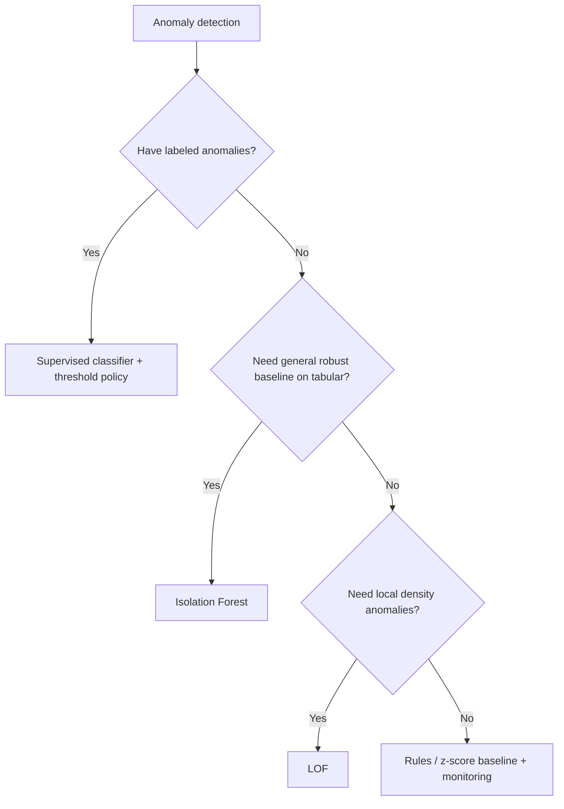
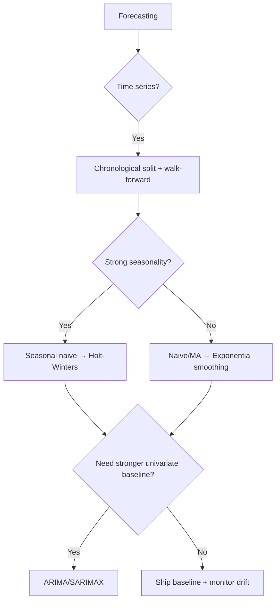
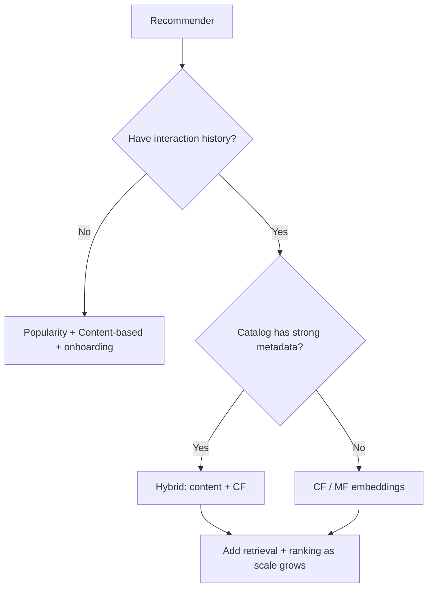
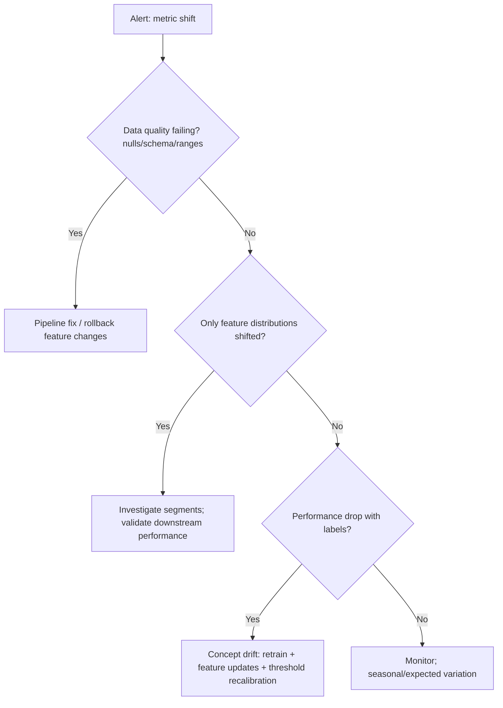

# Advanced Machine Learning Revision

## 1) One-page Phase Summary

### What Phase 2 made you “production-ready” at

- **Dimensionality reduction**: choose between PCA-style (structure preservation) vs t-SNE/UMAP (visualization / neighborhood structure), avoid misuse in modeling.

- **Clustering**: select algorithm based on cluster shape, density, noise, and scalability; validate clustering without labels using sanity + stability + downstream utility.

- **Anomaly detection**: treat as “rare + costly + shifting”; prefer robust baselines and thresholding aligned to operations; expect delayed labels and drift.

- **Feature engineering**: prevent leakage, build time-aware features, encode categories safely, keep training/serving parity.

- **Workflow discipline**: baselines → correct splits → tuning → evaluation → error analysis → deployment constraints → monitoring → retrain.

- **Hyperparameter tuning**: tune with correct validation (time-based when needed), avoid test leakage, optimize business-shaped metrics.

- **Explainability**: interpret predictions to build trust/debug (global vs local), avoid misleading explanations, bake into ops (reason codes, audits).

- **Boosting (XGBoost/LightGBM/CatBoost)**: default winners on tabular; understand key knobs and pitfalls (overfit, leakage, categorical handling).

- **Recommenders**: always ship popularity baseline; evaluate with ranking metrics (Precision@K/NDCG), manage cold start, think “candidate generation + ranking”.

- **Time series**: chronological split + walk-forward; strong baselines (seasonal naive, exponential smoothing); choose metrics carefully (MAPE traps).

- **Drift**: data drift vs concept drift vs label drift; monitor inputs + outputs + delayed performance; have retraining and rollback playbooks.

- **Feature extraction vs representation learning**: understand why deep learning is needed for unstructured data; know when classical ML still wins (tabular, small data, latency, explainability).

---

## 2) Algorithm Comparison Tables

### 2.1 Dimensionality Reduction (Advanced)

| Method | Primary use | Preserves | Fit/Transform on new data? | Key hyperparameters | Common production use | Common mistakes |

|---|---|---|---|---|---|---|

| PCA (and variants) | compression, denoising, speedup | global variance | Yes | `n_components` | preprocessing for modeling, visualization | treating PCA plots as “true clusters” |

| t-SNE | 2D/3D visualization | local neighborhoods | Not reliably (usually refit) | `perplexity`, `learning_rate`, `n_iter` | exploratory visualization only | using it for clustering/metrics; comparing distances globally |

| UMAP | visualization + sometimes features | local + some global | Yes (more feasible than t-SNE) | `n_neighbors`, `min_dist`, `n_components` | visualization; embedding features (carefully) | assuming stable embeddings across retrains without checks |

### 2.2 t-SNE vs UMAP (Fast Recall)

| Dimension | t-SNE | UMAP |

|---|---|---|

| Speed | slower | often faster |

| Global structure | weak | better (still not perfect) |

| Transform new points | awkward/uncommon | supported and used |

| Stability across runs | sensitive | can still vary; generally better |

| Best use | “what clusters might exist?” | visualization + possible downstream embedding |

### 2.3 Clustering (Advanced)

| Method | Cluster shape | Noise handling | Needs `k`? | Scales well | Key hyperparameters | When to pick |

|---|---|---:|---:|---:|---|---|

| K-Means | spherical-ish | poor | Yes | good | `n_clusters` | quick baseline, well-separated blobs |

| GMM | elliptical + soft | moderate | Yes | moderate | `n_components`, `covariance_type` | overlapping clusters, probabilistic membership |

| DBSCAN | arbitrary shape | strong | No | moderate | `eps`, `min_samples` | density clusters + outliers expected |

| Hierarchical (agglom.) | varies | moderate | not initially | poor→moderate | `linkage`, `distance_threshold` | interpretability, dendrogram, small datasets |

### 2.4 GMM vs DBSCAN (Interview-ready)

| Dimension | GMM | DBSCAN |

|---|---|---|

| Model type | probabilistic mixture | density-based |

| Assignments | soft (probabilities) | hard + noise label |

| Needs #clusters | yes | no |

| Handles outliers | not explicit | explicit (noise points) |

| Assumptions | Gaussian components | density separation |

| Typical failure | wrong component count/covariance | `eps` sensitivity; varying densities |

### 2.5 Anomaly Detection

| Method | Best for | Handles high-dim | Outputs | Key hyperparameters | Typical pitfalls |

|---|---|---:|---|---|---|

| Isolation Forest | general tabular anomalies | yes | anomaly score | `n_estimators`, `contamination`, `max_samples` | wrong contamination; ignoring drift |

| One-Class SVM | boundary of “normal” | limited (scales poorly) | decision function | `nu`, `kernel`, `gamma` | slow; fragile tuning |

| Local Outlier Factor (LOF) | local density anomalies | moderate | local score | `n_neighbors`, `contamination` | not ideal for streaming; sensitive to scale |

| Z-score / rules | simple monitoring | yes | thresholds | thresholds | too rigid; misses complex anomalies |

### 2.6 Explainability Tools

| Tool | Scope | Works best for | Cost | Key cautions |

|---|---|---|---:|---|

| Permutation importance | global | any model | medium | correlated features mislead |

| SHAP | global + local | trees strong; general possible | higher | slow; correlated features; explanation ≠ causality |

| PDP / ICE | global trend | low interaction features | medium | misleading with correlated features |

| Feature importance (GBDT) | global | boosting | low | bias toward high-cardinality features |

### 2.7 Boosting Libraries

| Library | Strength | Categorical handling | Speed | Notes |

|---|---|---|---:|---|

| XGBoost | strong baseline, stable | requires preprocessing | fast | great default; mature ecosystem |

| LightGBM | very fast on large data | supports categories (config-dependent) | very fast | leaf-wise growth; can overfit if unconstrained |

| CatBoost | excellent with categoricals | best-in-class | fast | strong default when many categoricals |

### 2.8 Recommendation Systems (Practical)

| Type | Cold start user | Cold start item | Personalization | Typical role |

|---|---:|---:|---:|---|

| Popularity | strong | medium | none | baseline/fallback/trending |

| Content-based | medium | strong | medium | new items; explainability |

| Collaborative filtering | weak | weak | strong | personalization when data rich |

| Hybrid | strong | strong | strongest | production default |

### 2.9 Time Series (Practical)

| Method | Needs seasonality config | Handles trend | Best for | Common trap |

|---|---:|---:|---|---|

| Seasonal naive | yes (period) | no | strong baseline | wrong seasonality period |

| Moving average | no | weak | smoothing | lagging behind changes |

| Exponential smoothing (Holt-Winters) | yes | yes | ops forecasting | wrong seasonal period; poor backtest |

| ARIMA/SARIMAX | optional | yes | univariate + some seasonality | parameter fiddling; leakage via random split |

### 2.10 Drift Types (Operational)

| Drift type | What shifts | Typical signals | First response |

|---|---|---|---|

| Data drift | `P(X)` | feature distribution, missingness | check pipeline/logging; dashboards |

| Concept drift | `P(Y|X)` | performance drop after labels arrive | retrain; add features; change objective |

| Label drift | `P(Y)` | base rate changes | recalibrate/threshold update |

---

## 3) Decision Trees (Fast Selection Guides)

### 3.1 Need visualization / dimensionality reduction?

```mermaid

flowchart TD

A[Goal?] --> B{Visualization only?}

B -->|Yes| C{Need stable embedding / transform new points?}

C -->|Yes| D[UMAP]

C -->|No| E[t-SNE]

B -->|No| F{Need compression / speedup for modeling?}

F -->|Yes| G[PCA (or variants)]

F -->|No| H[Skip DR; focus on features/model]

```

### 3.2 Need clustering?

```mermaid

flowchart TD

A[Clustering goal] --> B{Know expected #clusters k?}

B -->|Yes| C{Clusters overlap / elliptical?}

C -->|Yes| D[GMM]

C -->|No| E[K-Means baseline]

B -->|No| F{Expect noise/outliers + arbitrary shapes?}

F -->|Yes| G[DBSCAN]

F -->|No| H[Try hierarchical (small data) or estimate k then K-Means/GMM]

```

### 3.3 Need anomaly detection?



### 3.4 Need forecasting?



### 3.5 Need explainability?

```mermaid

flowchart TD

A[Explainability need] --> B{Need local explanations per prediction?}

B -->|Yes| C[SHAP (or local surrogate) + reason codes]

B -->|No| D{Need global model understanding?}

D -->|Yes| E[Permutation importance + PDP/ICE]

D -->|No| F[Use simpler model / documented policy]

```

### 3.6 Recommender selection?



### 3.7 Drift response?



---

## 4) Rules of Thumb (50+)

1. Always ship a **baseline** first (and keep it forever for fallback).

2. Use **time-based splits** whenever time/order matters (forecasting, behavior logs).

3. Random train/test split is a common hidden form of **leakage** in time-dependent data.

4. If you can’t reproduce a result, you don’t have a model—you have a rumor.

5. Prefer **simple** models until data + evaluation + monitoring are solid.

6. t-SNE is mainly for **visualization**, not downstream modeling.

7. UMAP is usually the better default for embeddings you may reuse/transform.

8. Don’t interpret 2D embedding distances as real metric distances.

9. If your DR/clustering result changes every run, you don’t have a stable insight yet.

10. For clustering, “looks good” is not validation; check stability + downstream utility.

11. DBSCAN is great for noise, but sensitive to `eps`.

12. GMM gives soft assignments—useful when boundaries are fuzzy.

13. K-Means is a baseline; don’t over-trust spherical clusters.

14. Evaluate anomaly detection with operational metrics (review rate, capture rate), not accuracy.

15. Isolation Forest is a robust anomaly baseline for tabular data.

16. For anomaly thresholds, align to **human review capacity** and business cost.

17. Don’t compute rolling features without shifting—classic leakage.

18. Feature definitions must be versioned; “same name” doesn’t mean “same meaning”.

19. Train/serve skew kills models quietly—use shared preprocessing pipelines.

20. Boosted trees are the default winner on tabular until proven otherwise.

21. CatBoost is a strong default when you have many categorical variables.

22. LightGBM is very fast; constrain it to avoid overfitting.

23. Hyperparameter tuning without correct validation is just overfitting automation.

24. Don’t tune on the test set. Ever.

25. Measure and compare against a seasonal naive baseline in time series.

26. Walk-forward validation is the closest offline approximation to real forecasting.

27. MAPE is dangerous around zeros/small values.

28. Use MAE for robustness; RMSE when big errors are costly.

29. In recommenders, offline RMSE rarely reflects product success; use ranking metrics.

30. Always filter already-consumed/ineligible items in recommenders.

31. Popularity baseline is not optional in recommender systems.

32. Cold start is inevitable—design explicit strategies for new users/items.

33. Embeddings enable fast retrieval (ANN); scoring is often dot products.

34. Separate recommender stages: retrieval → ranking → re-ranking constraints.

35. Drift is expected in production; monitoring is part of the model.

36. Data drift is a warning; concept drift is often the real accuracy killer.

37. Sudden drift usually indicates pipeline/logging changes—check those first.

38. Monitor null rates; they catch many silent failures early.

39. Monitor both feature distributions and prediction score distributions.

40. Segment monitoring (geo/device/cohort) catches localized failures.

41. Keep rollback plans and older models available.

42. Explainability is for debugging and trust; it’s not causality.

43. Permutation importance can lie with correlated features—interpret carefully.

44. SHAP is powerful but can be expensive; budget for it operationally.

45. Optimize for business metrics and constraints, not leaderboard metrics.

46. A model’s job is to improve the system; sometimes threshold/policy beats retraining.

47. If labels are delayed, build proxy monitoring and shadow evaluation.

48. For tabular + small data, deep learning is often a bad first choice.

49. Representation learning shines when you can’t hand-design features (text/images/sequence).

50. End-to-end learning increases coupling; enforce strict data contracts.

51. Feature engineering remains valuable even with representation learning.

52. If you can’t compute features reliably online, don’t use them.

53. Always compare gains vs complexity (latency, cost, maintenance).

54. Error analysis beats more tuning: understand failure modes first.

55. Backtests should cover multiple seasons/regimes, not one convenient window.

56. Monitor for feedback loops in recommenders and fraud systems.

57. Keep an incident runbook for every alert—alerts without actions are noise.

58. Retraining faster doesn’t help if your data pipeline is broken.

59. Use canary/shadow deploys for safety.

60. If your model’s score distribution shifts sharply, investigate before celebrating.

---

## 5) Common Interview Mistakes

1. Saying “accuracy” for imbalanced problems (fraud/anomalies) instead of PR-AUC, recall@precision, cost.

2. Recommenders: focusing on RMSE instead of ranking metrics (Precision@K/NDCG).

3. Time series: proposing random train/test split.

4. Treating t-SNE/UMAP plots as proof of cluster correctness.

5. Not mentioning baselines (popularity for recsys; seasonal naive for forecasting; logistic regression baseline).

6. Confusing data drift (inputs) with concept drift (relationship) and giving wrong mitigation.

7. Over-indexing on hyperparameter tuning without discussing leakage, evaluation, or monitoring.

8. Claiming SHAP “explains the true reason” (confusing correlation with causation).

9. Ignoring deployment constraints (latency, feature availability, retraining cadence).

10. Not addressing cold start in recommender design.

11. Missing training/serving skew and feature versioning issues.

12. Not discussing segmentation/slice evaluation and monitoring.

13. DBSCAN: not explaining `eps` sensitivity and varying density limitation.

14. GMM: not explaining soft assignments and covariance choices.

15. MAPE: forgetting the zero/near-zero issue.

---

## 6) Top 100 Interview Facts (one-liners)

1. Random splits are usually wrong for time-dependent data.

2. Walk-forward validation best matches real forecasting deployment.

3. Seasonal naive is a hard-to-beat baseline for seasonal time series.

4. MAE is robust; RMSE punishes large errors.

5. MAPE breaks near zero values.

6. t-SNE is primarily for visualization, not modeling.

7. UMAP often preserves more global structure than t-SNE.

8. UMAP can transform new points more naturally than t-SNE.

9. PCA is useful for compression and denoising.

10. PCA preserves variance directions, not label separation.

11. K-Means assumes roughly spherical clusters.

12. K-Means requires choosing `k`.

13. GMM models clusters as Gaussian components.

14. GMM provides soft cluster probabilities.

15. GMM needs the number of components.

16. DBSCAN finds clusters by density connectivity.

17. DBSCAN labels low-density points as noise.

18. DBSCAN does not require choosing `k`.

19. DBSCAN is sensitive to `eps`.

20. DBSCAN struggles with varying density clusters.

21. Clustering “validation” often means stability + utility, not accuracy.

22. Isolation Forest isolates anomalies with random splits.

23. Isolation Forest is a strong general anomaly baseline for tabular data.

24. LOF detects local density anomalies.

25. One-Class SVM can be slow and sensitive in high dimensions.

26. Anomaly detection threshold should align with review capacity/cost.

27. Feature leakage is the fastest way to get fake performance.

28. Rolling features must be past-only (shift before rolling).

29. Feature definitions must be versioned to avoid silent changes.

30. Training/serving skew is common when preprocessing differs online vs offline.

31. Boosted trees are often state-of-the-art for tabular data.

32. CatBoost is especially strong with categorical features.

33. LightGBM is fast but can overfit without constraints.

34. XGBoost is a robust default baseline.

35. Hyperparameter tuning must not touch the test set.

36. Optimize metrics aligned to business constraints, not generic metrics.

37. Explainability is for trust/debugging, not proof of causality.

38. Permutation importance can be misleading with correlated features.

39. SHAP provides global and local attributions but can be expensive.

40. Data drift is change in `P(X)`.

41. Concept drift is change in `P(Y|X)`.

42. Label drift is change in `P(Y)`.

43. Sudden drift often indicates a pipeline/logging change.

44. Gradual drift suggests scheduled retraining/windowing.

45. Recurring drift often reflects seasonality.

46. Monitoring should include data quality + outputs + delayed performance.

47. Prediction distribution shifts can be detected without labels.

48. Performance monitoring needs labels; labels may be delayed.

49. Recommenders are typically retrieval + ranking + re-ranking.

50. Popularity baseline is essential in recommenders.

51. Content-based recommendation helps item cold start.

52. Collaborative filtering needs interaction history.

53. Hybrid recommenders are standard in production.

54. Item-based CF often scales better than user-based CF.

55. Matrix factorization learns user/item latent vectors.

56. Embeddings enable scalable ANN retrieval.

57. Cold start exists for both users and items.

58. User cold start: popularity + onboarding + session context.

59. Item cold start: content similarity + exploration boosts.

60. Offline recommender metrics often correlate imperfectly with online KPIs.

61. Precision@K measures relevance concentration in top K.

62. Recall@K measures coverage of relevant items in top K.

63. NDCG rewards placing relevant items earlier.

64. MAP averages precision at relevant positions.

65. RMSE is for rating prediction, not ranking quality.

66. In fraud, accuracy is meaningless under heavy imbalance.

67. In imbalanced classification, PR-AUC is more informative than ROC-AUC.

68. Threshold selection is often more important than tiny AUC changes.

69. Cost-sensitive decisions need cost-aware thresholds.

70. Calibration matters when probabilities drive policy.

71. Feature engineering still matters in deep learning pipelines.

72. Feature extraction uses fixed transforms (TF-IDF, PCA).

73. Representation learning learns features during training.

74. Deep learning replaced hand features for unstructured data due to automatic feature learning.

75. Classical ML still wins on small tabular datasets.

76. Latency and compute constraints often favor classical models.

77. End-to-end learning increases system coupling.

78. Monitoring is part of ML engineering, not optional MLOps extras.

79. Baselines provide fallback and sanity for production incidents.

80. Segment metrics catch issues hidden in aggregates.

81. “Looks good on a plot” is not validation.

82. Always check null rate spikes before blaming models.

83. Retraining won’t fix broken feature pipelines.

84. Shadow deploy reduces risk: score but don’t act.

85. Canary deploy reduces blast radius.

86. Keep rollback plan and previous model ready.

87. Data contracts prevent silent schema changes.

88. Drift alerts need runbooks; otherwise they create noise.

89. Frequent retraining can amplify feedback loops if data is biased.

90. Recommendation feedback loops can amplify popularity bias.

91. Diversity/freshness constraints are often required in recommenders.

92. Exponential smoothing is a strong baseline in ops forecasting.

93. Moving averages lag behind trend changes.

94. ARIMA requires careful time-aware evaluation.

95. Overfitting in time series often comes from leakage and non-stationarity changes.

96. If seasonal baseline beats your model, your model isn’t ready.

97. Compare models on the same time windows and cohorts.

98. Test set should be used once at the end.

99. Feature importance ≠ feature causality.

100. Production success is usually data + evaluation + monitoring, not fancy algorithms.

---

## 7) Final 5-Minute Revision (read last)

### The “don’t fail the interview” checklist

- **Splits**: time-dependent → chronological/walk-forward; never random.

- **Baselines**:

- recsys: popularity + seasonal/trending

- time series: naive + seasonal naive

- tabular: logistic regression + GBDT baseline

- **Metrics**:

- recommender ranking: Precision@K / NDCG (not RMSE)

- imbalanced detection: PR-AUC / recall@precision / cost

- forecasting: MAE/RMSE; MAPE only if safe

- **t-SNE/UMAP**: visualization tools; don’t treat plots as proof; UMAP is more reusable.

- **Clustering**:

- K-Means = baseline (spherical)

- GMM = elliptical + soft

- DBSCAN = density + noise, `eps` sensitive

- **Boosting**: default for tabular; know key knobs and overfit risks.

- **Explainability**: global vs local; SHAP/permutation; correlated features mislead; explanation ≠ causality.

- **Drift**:

- data drift = `P(X)` change

- concept drift = `P(Y|X)` change

- label drift = `P(Y)` change

Monitor data quality + prediction distributions + delayed performance; have retrain + rollback.

- **Recommenders**: candidate generation + ranking + constraints; cold start has explicit strategies.

- **Representation learning**: needed for unstructured data; classical ML still wins on tabular/small data/latency/explainability.

### “If they ask for a system design answer”

1. Define objective + constraints + metric.

2. Establish baseline.

3. Correct split and leakage guards.

4. Train + tune on validation only.

5. Evaluate + error analysis + slices.

6. Deployment plan: artifact, inference, monitoring, retrain, rollback.

---