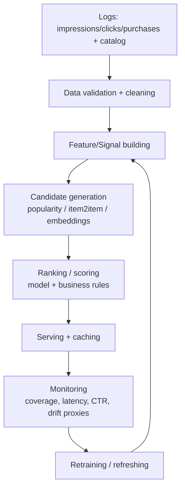

# Recommendation Systems Cheat Sheet

## Comparison Tables

### 1) Recommender Types (What to use when)

| Approach | What it uses | Personalization | Cold start (user) | Cold start (item) | Pros | Cons | Best use cases |
|---|---|---:|---:|---:|---|---|---|
| Popularity-based | global counts/CTR/sales (often time-windowed) | None | Strong | Medium | simplest, robust, cheap, great fallback | popularity bias, no personalization | new product, cold start, trending modules, fallback |
| Content-based | item metadata (text/tags/category/price) + user profile | Medium | Medium | Strong | works for new items, explainable, controllable | overspecialization, needs good metadata | similar items, cold-start items, compliance explainability |
| Collaborative filtering (CF) | user-item interactions | High | Weak | Weak | strong personalization; captures hidden taste | cold start; feedback loops; sparse data | mature products with interaction volume |
| Hybrid | blend of multiple signals/models | High | Strong | Strong | best overall robustness and coverage | more complexity | most real production systems |

---

### 2) User-based vs Item-based CF

| Dimension | User-based CF | Item-based CF |
|---|---|---|
| Similarity computed between | users | items |
| Scalability | harder (users change constantly) | better (items more stable) |
| Typical production use | less common | common (“similar items”) |
| Strength | “people like you” framing | stable caching + fast retrieval |
| Common pitfall | user similarity becomes noisy/sparse | popularity bias (popular items similar to everything) |

---

### 3) Matrix Factorization / Embeddings (High level)

| Concept | Intuition | What you get | Why it matters in production | Limitations |
|---|---|---|---|---|
| Matrix factorization | user-item matrix ≈ user vectors × item vectors | user/item latent vectors | fast scoring via dot product; strong CF baseline | cold start, bias, needs enough data |
| Embeddings | represent users/items in a vector space | vectors good for similarity + retrieval | enables ANN retrieval + scalable candidate generation | drift/versioning; less interpretable |

---

### 4) Metrics: Rating vs Ranking

| Problem framing | Typical signals | Metrics to prefer | Notes |
|---|---|---|---|
| Rating prediction | explicit ratings (1–5) | RMSE | can be misleading for top-K recommendations |
| Ranking / feed | clicks, purchases, watch time | Precision@K, Recall@K, MAP, NDCG | usually closer to product needs |

---

## Decision Trees

### 1) Which recommender approach should I start with?

```mermaid
flowchart TD
  A[Start: need recommendations] --> B{Do you have interaction history?}
  B -->|No| C[Popularity baseline + basic filters]
  C --> D{Do items have good metadata?}
  D -->|Yes| E[Content-based similarity + onboarding]
  D -->|No| F[Segmented popularity + curated modules]
  B -->|Yes| G{Do you have many new items?}
  G -->|Yes| H[Hybrid: content + popularity + exploration]
  G -->|No| I{Need fast scalable retrieval?}
  I -->|Yes| J[Embeddings (MF/CF) + ANN retrieval + ranker]
  I -->|No| K[Item-based CF as strong baseline]
```

---

### 2) Metric choice decision

```mermaid
flowchart TD
  A[How is relevance defined?] --> B{Explicit ratings?}
  B -->|Yes| C[RMSE (plus ranking sanity checks)]
  B -->|No| D[Ranking metrics: Precision@K/Recall@K/NDCG]
  D --> E{Is relevance graded? purchase > click}
  E -->|Yes| F[NDCG]
  E -->|No| G[Precision@K / MAP]
```

---

## Engineering Rules (30+)

1. Always ship a **popularity baseline** first; keep it forever as fallback.
2. Popularity should be **time-windowed** (trending) and often **segmented** (locale/category).
3. Always **filter out already-consumed** items (and ineligible items).
4. Don’t optimize **RMSE** if your UI is a top-K ranked list; use ranking metrics.
5. Use **Precision@K** when screen space is limited and top results matter most.
6. Use **Recall@K** when evaluating candidate retrieval quality (high K).
7. Use **NDCG** when ranking position matters and/or relevance is graded.
8. Offline metrics can mislead; plan for **online A/B** as final judge.
9. If you lack interaction data, **CF will disappoint**; start with popularity/content.
10. If you launch new items frequently, content-based or exploration is mandatory or new items never get exposure.
11. Item-based CF typically scales better than user-based CF in production due to item stability and caching.
12. Use **hybrid** when you need coverage across cold start and mature users.
13. Treat recommenders as a **system**: candidate generation → ranking → business rules.
14. Cache aggressively (per-user/per-item) for latency.
15. Don’t compute full all-pairs similarity for large catalogs; use embeddings + approximate methods.
16. Cold-start user: use popularity + onboarding + session signals; don’t ask too much upfront.
17. Cold-start item: use content similarity + “new arrivals” + exploration boost.
18. Measure **coverage** (% users who get meaningful recs), not just CTR.
19. Watch for **feedback loops**: the model changes what data is collected next.
20. Always keep business constraints explicit (inventory, policy, safety, freshness).
21. Segment evaluation: new users vs power users; cohorts behave differently.
22. Recency matters: recent interactions often predict better than old history.
23. Popularity bias is real; add diversity/freshness constraints if lists become repetitive.
24. Ensure you can reproduce experiments: version data/model/features.
25. Don’t assume clicks = satisfaction; define meaningful relevance (purchase, watch time).
26. Log **impressions** if possible; otherwise offline evaluation is biased by exposure.
27. Use time-based splits for behavior data where future leakage is possible.
28. Treat “missing interactions” as unknown, not negative, unless you have impression logs.
29. Matrix factorization gives fast scoring (dot products) but still needs cold-start strategies.
30. Embedding refresh cadence should match catalog churn and drift; version embeddings and roll out safely.
31. Use fallback strategies for outages: cached lists + popularity.
32. For “similar items” modules, item-based CF or content similarity are reliable first picks.
33. Don’t ship a recommender without monitoring (latency, coverage, score distribution, drift proxies).
34. Hybrid blending can be simple at first (weighted sum / switching logic) and improved later.
35. Align recommendation objective with business goal (retention vs conversion vs discovery).

---

## Production Workflow

### Minimal production architecture (practical)



### Key production components
- **Candidate generation**: retrieve hundreds/thousands quickly.
- **Ranking**: score candidates; can be simple initially.
- **Re-ranking**: apply constraints (diversity, freshness, safety).
- **Serving**: caching + low latency.
- **Monitoring**: output distribution, coverage, business KPIs; drift signals.
- **Fallbacks**: popularity lists when model is unavailable.

---

## Common Mistakes

1. Using RMSE as the primary metric for a ranking product.
2. Random train/test splits on time-dependent behavior logs (leakage).
3. No cold-start plan (new users/items get bad or empty recs).
4. Not filtering already-seen or ineligible items (bad UX).
5. Over-personalizing early; ignoring strong baselines.
6. Treating clicks as pure positives without considering position bias and curiosity clicks.
7. Ignoring exposure bias (no impression logs → biased training/evaluation).
8. No exploration budget → new items never get impressions.
9. No monitoring of coverage/diversity → filter bubble and repetitive results.
10. Deploying without fallback strategy (outage = empty feed).
11. Computing all-pairs similarity on large catalogs (blows up compute/memory).
12. Not versioning models/embeddings/features (can’t reproduce or roll back).

---

## Interview Facts

- Popularity baseline is essential: fast, robust, and a permanent fallback.
- Content-based is best for **item cold start** and explainability but can overspecialize.
- Collaborative filtering captures taste from interactions but struggles with cold start and sparsity.
- Hybrid systems are the production standard because they handle coverage and robustness.
- Item-based CF scales better than user-based CF because items are more stable for caching.
- Matrix factorization learns user/item vectors; scoring is often a dot product.
- Embeddings enable ANN retrieval for large catalogs.
- Ranking metrics (Precision@K, NDCG) are usually more aligned than RMSE.
- Offline metrics don’t guarantee online wins; A/B tests are the final judge.
- Cold start has two types: new user vs new item; solutions differ.
- Feedback loops can amplify popularity bias; diversity/freshness constraints help.

---

## Metrics Cheat Sheet

### RMSE
- Use for: explicit rating prediction tasks.
- Avoid for: top-K ranking and implicit feedback products.

### Precision@K
- Measures: fraction of top K that are relevant.
- Use when: limited screen space; top results matter most.

### Recall@K
- Measures: how many of the relevant items were retrieved in top K.
- Use when: evaluating candidate generation or retrieval coverage.

### MAP (high level)
- Measures: average precision at ranks where relevant items appear.
- Use when: multiple relevant items per user; binary relevance.

### NDCG (high level)
- Measures: position-sensitive ranking quality; supports graded relevance.
- Use when: rank position matters a lot and/or outcomes are graded (purchase > click).

### Quick mapping: product → metric
| Product surface | Good offline metrics |
|---|---|
| “Top picks” carousel | Precision@K, NDCG |
| Candidate retrieval service | Recall@K (high K), NDCG |
| Explicit ratings app | RMSE (plus ranking checks) |
| Feed ranking | NDCG + online KPIs |

---

## When should I use each recommendation approach?

### Popularity-based
Use when:
- no user history / new product
- you need a robust fallback
- you need trending modules

Avoid when:
- personalization is core to UX and you have sufficient data

### Content-based
Use when:
- strong item metadata exists
- new items are frequent
- explainability is required

Avoid when:
- metadata is poor/noisy
- you need cross-domain discovery beyond metadata similarity

### Collaborative Filtering
Use when:
- interaction volume is sufficient
- personalization is a key differentiator
- metadata is weak or incomplete

Avoid when:
- extreme cold start or sparsity
- you can’t support feedback loop risks and drift monitoring

### Hybrid
Use when:
- you’re building a serious production recommender
- you need coverage for new users/items and strong personalization for warm users

Avoid when:
- you can’t support added complexity yet (start simpler, then evolve)

---

## One-page Revision

### Core components
- **Popularity**: baseline + fallback; segment and add recency.
- **Content-based**: metadata similarity; great for item cold start and explainability.
- **CF**: interaction-driven personalization; strong when data is mature.
- **Hybrid**: combine methods; common in production.

### CF choices
- **Item-based CF** often preferred for scalability and caching.
- **User-based CF** less common operationally.

### MF + embeddings
- MF learns user/item vectors; score ≈ dot product.
- Embeddings enable scalable retrieval (ANN) and hybridization.

### Cold start
- New user: popularity + onboarding + session signals.
- New item: content similarity + exploration + “new arrivals”.

### Evaluation
- Explicit ratings: RMSE.
- Ranking products: Precision@K, Recall@K, MAP, NDCG (often NDCG).
- Offline ≠ online; plan A/B tests and monitoring.

### Production mindset
- System: retrieval → ranking → constraints → serving.
- Log impressions when possible; monitor coverage/diversity/latency/score distribution.
- Always have fallbacks and a retraining/refresh plan.